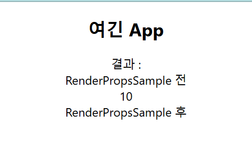

1. # Render Props
   일반 state값을 전달하는 것이 아니라 JSX 또는 함수를 전달하는 경우 Render Props라고 합니다.   

   RenderPropsSample라는 컴포넌트를 정의한 후 이 컴포넌트를 App에서 사용을 하는 예제입니다.   

   ```javascript
      -RenderPropsSample-

      import React from 'react';

      const RenderPropsSample = ({children}) => {

         return (
            <div>결과 : {children(5)}</div>
         )
      }

      export default RenderPropsSample;
   ```

   ```javascript
      -App-

      import './App.css';
      import RenderPropsSample from './RenderPropsSample';

      function App() {
         return (
            <div className="App">
               <h2>여긴 App</h2>
               <RenderPropsSample>
               { (p) => (
                     <>
                     <div>RenderPropsSample 전 </div>
                     { p*2 }
                     <div>RenderPropsSample 후 </div>
                     </>
                  ) 
               }
               </RenderPropsSample>
            </div>
         );
      }

      export default App;

   ```

   RenderPropsSample컴포넌트를 App에서 가져다 사용하는데 RenderPropsSample의 return에서 children자리에 함수 
   ```
      { (p) => (
            <>
            <div>RenderPropsSample 전 </div>
            { p*2 }
            <div>RenderPropsSample 후 </div>
            </>
         ) 
      }
   ```
   가 들어가고 매개변수 5가 p에 입력됩니다.

   

