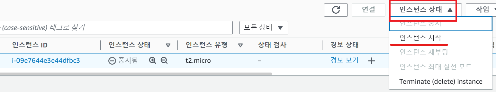
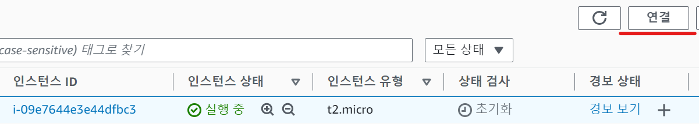
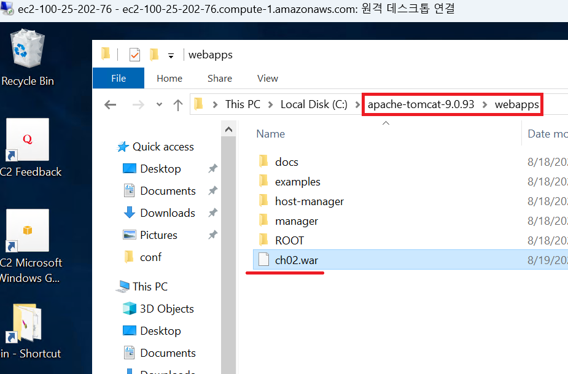
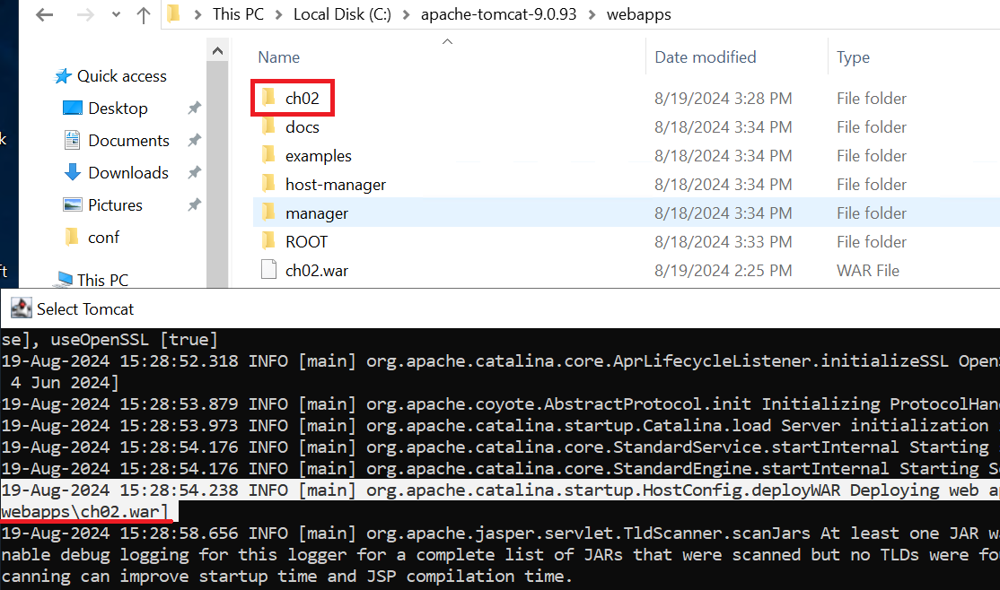

1. # AWS에 배포하기
   WAR파일을 생성합니다 -> EC2를 실행시킵니다 -> tomcat폴더 안에 webapps폴더안에 WAR파일을 붙여넣습니다. tomcat이 실행되면 webapps에 있는 war파일을 압축을 풀고 실행을 합니다. -> 로컬 컴퓨터에서 EC2에서 실행 중인 프로젝트의 주소를 입력합니다.   

   STS에서 war파일을 생성했습니다.   

   사용하지 않을 때는 중지시켜 놓는 것이 사용량도 절약하고 요금면에서 안정하기 때문에 중지시켰습니다. 다시 시작합니다.   
   EC2대시보드 -> 인스턴스 -> 인스턴스 상태를 시작으로 변경   
      

   인스턴스를 선택하고 들어가서 연결을 누릅니다.   
      

   인스턴스 연결 화면이 나타나는데 기존에 "원격 데스크톱 파일 다운로드"로 파일을 다운받아 접속했어도 __중지 후 새로 시작하면 IP가 새로 생성__ 되기 때문에 원격 데스크톱 파일을 새로 다운받아야 합니다. 암호는 기존 암호를 그대로 사용합니다.   
      

   EC2서버의 톰캣 폴더의 webapps폴더에 ch02.war파일을 복사해서 오른쪽 마우스 클릭해서 paste를 선택하고 붙여넣습니다.   
      

   톰캣이 실행되면서 ch02.war 압축을 풀어서 ch02란 폴더가 생겼는 것을 확인할 수 있습니다.   
      

   이제 로컬에서 EC2 서버에 접속합니다.   
   
