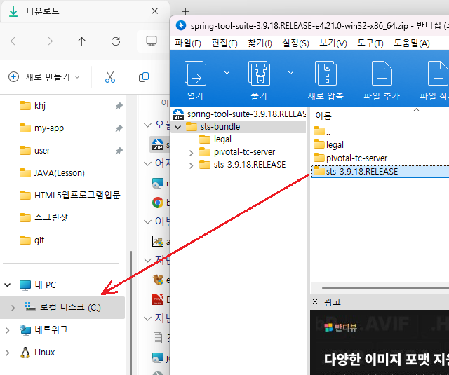
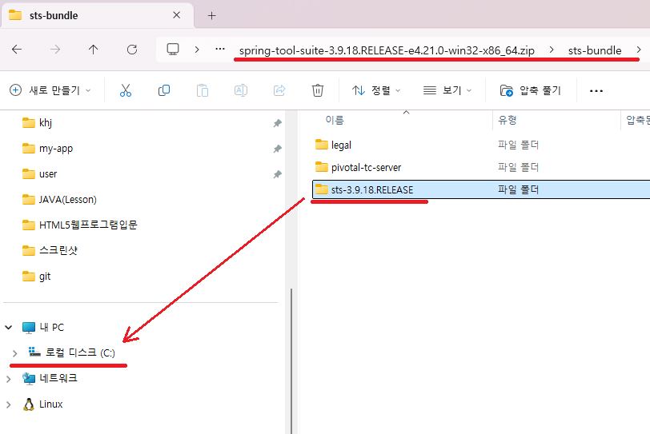
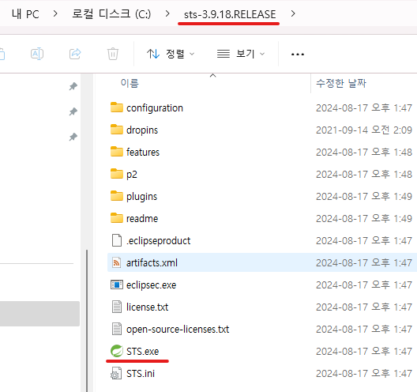
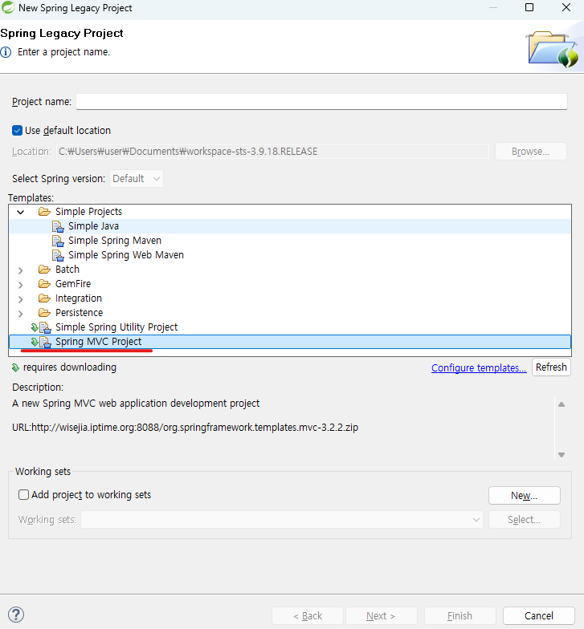
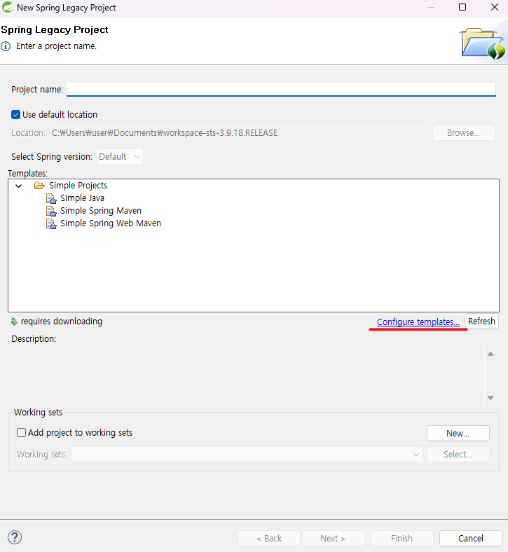
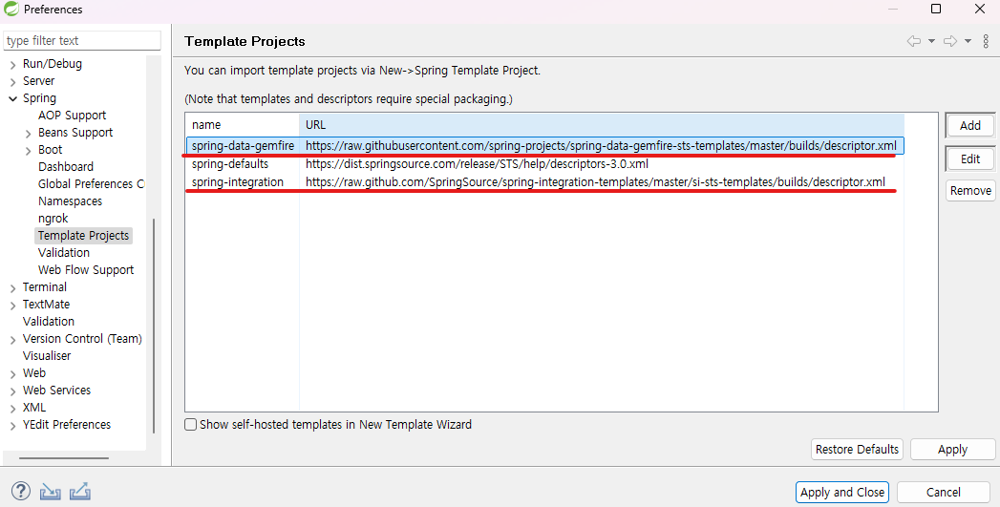
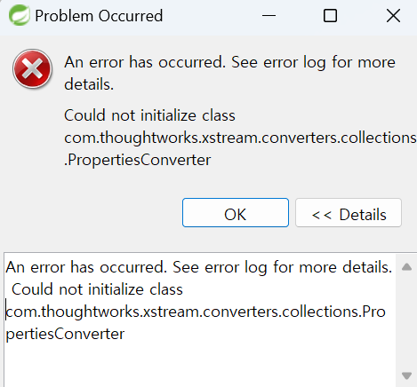
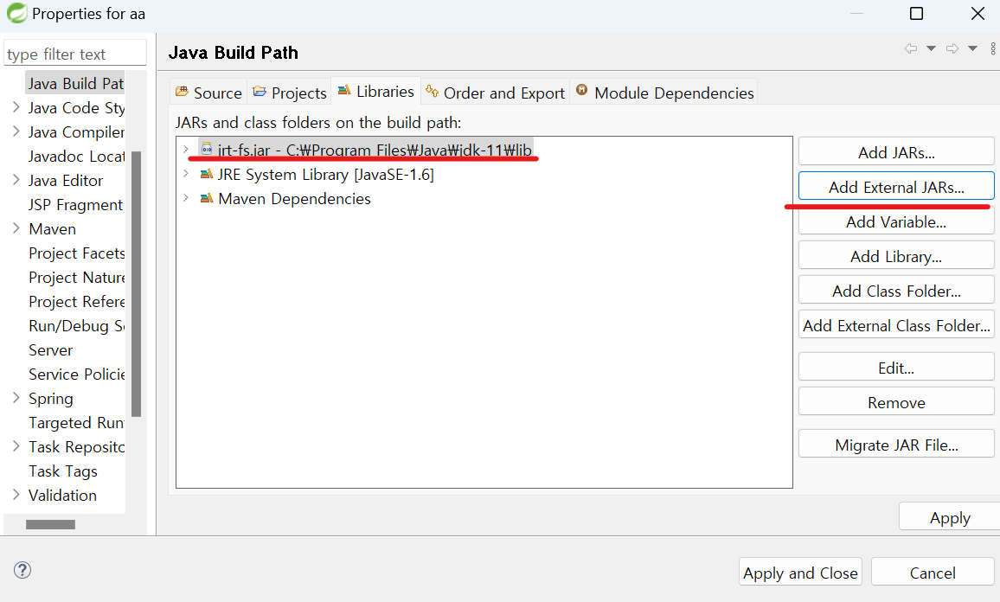

1. # 설치
   <a href="https://github.com/spring-attic/toolsuite-distribution/wiki/Spring-Tool-Suite-3">https://github.com/spring-attic/toolsuite-distribution/wiki/Spring-Tool-Suite-3</a>   
   STS3를 다운 받습니다.   

   다운 받으면 spring-tool-suite-3.9.18.RELEASE-e4.21.0-win32-x86_64.zip란 압축파일이 생깁니다.   

      

   오른쪽 마우스를 클릭해 연결 프로그램에서 "Window 탐색기"를 클릭해 내부로 들어가면 sts-bundle이란 폴더가 나옵니다. 다시 해당 폴더 안으로 들어가면 sts-3.9.18.RELEASE란 폴더가 있는데 해당 폴더를 바로 C드라이브로 드래그&드롭하면 압축이 해제됩니다.   
      

   sts-3.9.18.RELEASE란 폴더가 C드라이브에 생기고 실행은 STS.exe로 하면됩니다.   
      

1. # 프로젝트 생성
   Create new spring Starter Project와 Spring Legacy Project가 있는데   
   Create new spring Starter Project는 __스프링 부트 프로젝트__ 를 생성하고,   
   Spring Legacy Project는 __스프링 프로젝트__ 를 생성합니다.   

   Spring Legacy Project를 선택합니다.   

   Spring MVC Project를 선택합니다.   
      

   Spring MVC Project가 화면에 없는 경우   
   1)Configure templates 목록 삭제   
   Configure templates를 선택합니다.   
      

   spring-data-gemfire와 spring-integration 2개 파일을 remove로 제거를 합니다.   
      

   2)xml 파일 추가   
   STS3의 workspace경로\.metadata\.plugins\org.springsource.ide.eclipse.commons.content.core 를 선택합니다.   
   ex)C:\Users\user\Documents\workspace-sts-3.9.18.RELEASE\.metadata\.plugins\org.springsource.ide.eclipse.commons.content.core   
   해당 경로에 https-content.xml을 넣습니다.   

   이제 Spring MVC Project 메뉴가 보이면 클릭을 하고,   
   제일 상단에 Project name을 입력하고 Next버튼을 누릅니다.   

   만약   
      
   다음과 같은 error가 발생한다면 jdk11로 버전을 맞춰줘야 합니다. sts3과 jdk11이 호환되기 때문입니다.   

   cmd창에서 자바 버전을 확인해 봅니다.   
   ```
     C:\Users\natis>java -version
      java version "11.0.23" 2024-04-16 LTS
      Java(TM) SE Runtime Environment 18.9 (build 11.0.23+7-LTS-222)
      Java HotSpot(TM) 64-Bit Server VM 18.9 (build 11.0.23+7-LTS-222, mixed mode)
   ```   
   다음과 같이 11버전이 아니라면 jdk11을 설치해야 합니다.   
   <a href="https://www.oracle.com/kr/java/technologies/javase/jdk11-archive-downloads.html">https://www.oracle.com/kr/java/technologies/javase/jdk11-archive-downloads.html</a>   
   해당 경로로가서 jdk11을 다운 받습니다.   

   jdk11을 설치하면 해당 경로에 설치가 됩니다.   
   ```
      C:\Program Files\Java\jdk-11.0.15.1\
   ```   

   프로젝트 생성 후 느낌표가 나타나면 Build path에서 C:\Program Files\Java\jdk-11\lib경로의 jrt-fs.jar을 첨부합니다.   
      