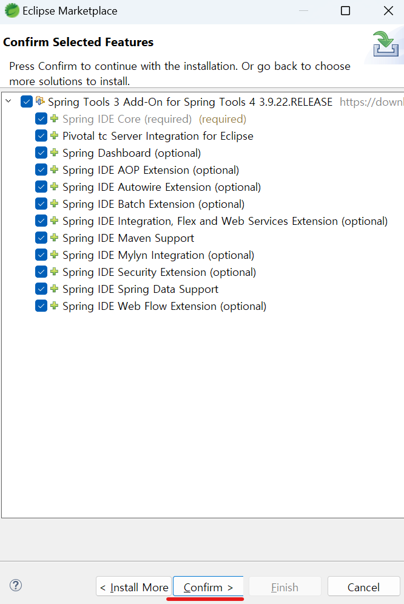

1. # 설치
   STS4는 스프링 프레임워크에 최적화된 IDE입니다. 이클립스에서도 플러그인을 설치하여 스프링 환경을 구성할 수 있지만, STS는 애초 스프링 개발에 최적화된 플랫폼을 목적으로 설계되었으므로 좀 더 특화된 스프링 개발 애플리케이션 환경을 제공합니다.   

   -다운 받기   
   <a href="https://spring.io/tools">https://spring.io/tools</a>   
   현재 OS가 윈도우기 때문에 윈도우 버전을 다운 받았습니다.   

   -압축풀기
   다운받으면 spring-tool-suite-4-4.24.0.RELEASE-e4.32.0-win32.win32.x86_64.self-extracting.jar란 압축 파일이 생깁니다. 압축을 풀면 
      
   다음과 같이 4개의 파일이 생기는데 여기서 contents.zip 파일을 선택해서 압축을 한번더 풀어줍니다.   
   그럼 contents란 폴더가 생성되고 내부에 sts-4.24.0.RELEASE 폴더가 더 있습니다. 이 폴더 안에서 SpringToolSuite4.exe 파일을 실행해서 STS4가 실행되는데, 저는 경로를 쉽게 하기 위게 C드라이브로 가져왔습니다.   
      

1. # STS4에서 spring MVC Porject만들기
   스프링 프로젝트를 만들기 위해서 Spring Legacy Project를 선택해야 합니다. STS4에서는 해당 메뉴가 없기 때문에 찾아보고 없으면 STS3 플러그인을 설치해야 합니다.      

      
   File 메뉴에서 Other를 선택합니다.   

      
   legacy로 검색을 합니다. 
   
   검색했는데 목록에 없는 경우.

   기존 STS3에서는 Spring Legacy Project - 스프링 프로젝트, Create new Spring Starter Project - 스프링 부트 프로젝트 이렇게 2개의 프로젝트 환경을 전부 제공했었지만 STS4에서는 스프링 부트 환경을 더 강화하기 위해 Legacy Project 메뉴를 없앴기 때문에 STS3 플러그인을 따로 설치해줘야 합니다.   

   Help -> Eclipse MarketPlace에서 spring으로 검색하면 여러 플러그인 파일들이 뜨는데 여기서 
      
   Spring Tools 3 Add-On for Spring Tools 4 를 선택합니다.   

      
   모든 항목을 선택 후 Confirm을 선택합니다.   

   플로그인 설치 후에 에러가 발생합니다.   
      

   STS4에서는 더 이상 STS3를 지원하지 않습니다. 그렇기 때문에 플러그인을 설치하면 다음과 같은 error발생합니다. 만약 Spring MVC project를 만드는 것이 목적이라면 지원이 끊긴 STS3 IDE를 설치해야합니다.   

   

