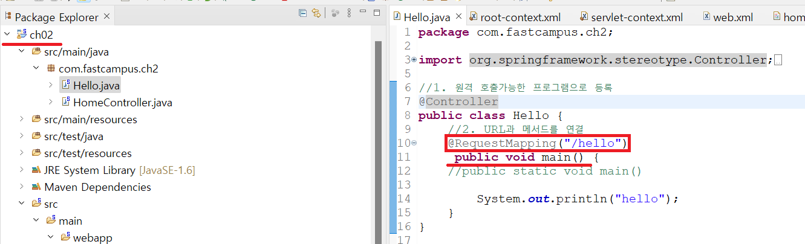

1. # 원격 실행
   브라우저에서 서버로 명령을 전달하고 서버에 있는 명령이 실행되는 원격으로 이루어지는 과정입니다. 서버와 클라이언트 간에 명령을 주고 받을 수 있는 원격 실행이 가능한 이유는 WAS와 같은 웹애플리케이션 서버가 있기 때문에 가능합니다. 먼저 프로그램을 WAS에 등록을 시키고, 그 다음 URL과 프로그램을 연결해야합니다.   
   
   1)프로그램 등록 : @Controller 이용      
   2)URL과 프로그램 연결 : @RequestMapping이용   

   ```java
      @Controller //1. 프로그램 등록
      public class Hello {
         
         @RequestMapping("/hello")  //2. URL과 main() 연결
         public void main(){        //hello 주소와 main을 연결
            System.out.println("Hello");
         }
   }
   ```   
   예를 들어 `http://111.222.333.444:8080/ch2/hello` 다음과 같은 주소로 위를 호출 할 때 URL의 마지막 hello라는 주소값이 RequestMapping 주소값과 같습니다. http://111.222.333.444:8080는 주소와 포트번호입니다. ch2는 Context root입니다.   
   메소드 main이란 이름은 중요하지 않습니다. RequestMapping 아래에 있는 메소드가 주소이름과 맵핑됩니다. main이란 이름대신 다른 이름으로 사용해도 됩니다.   

1. # 주소 체계
   ```
      http://localhost/ch2/hello
      http://127.0.0.1/ch2/hello
   ```   
   ch2는 spring MVC project명, hello는 Mapping주소가 됩니다.   
      

1. # static
   public void main()에서 static이 아니여도 실행이 가능한 이유?   
   static이 없는 인스턴스 메서드는 객체를 생성후 호출이 가능한데 지금 static없이 실행이 되었다는 것은 이미 객체가 생성되었다는 것을 뜻 합니다. 
   
   그럼 누가 객체를 생성했는가?   

   WAS인 톰캣이 객체를 생성합니다. 그리고 해당 메서드를 호출하게 됩니다.  

   ```java
      public class Hello {
	
         int iv = 10;   //인스턴스 변수
         static int cv = 20; //static 변수
         
         //2. URL과 메서드를 연결
         @RequestMapping("/hello")
         public void main() {	//인스턴스 메서드 - iv, cv 모두 사용 가능
            System.out.println("hello");
            System.out.println(iv);
            System.out.println(cv);
         }
         
         public static void main2() { //static메서드 - cv만 사용 가능
            //System.out.println(iv); error
            System.out.println(cv);
         }
      }
   ```   
   인스턴스 메서드는 인스턴스 변수와 static 변수 모두 사용할 수 있지만, static 메서드는 static 변수만 사용할 수 있습니다.   
   public static void main()과 같이 __static을 붙여도 실행됩니다.__ 톰캣이 객체를 생성한 상태에서 static을 붙여 호출한 것입니다. static을 붙여도 실행은 되는데 이왕이면 인스턴스 변수와 static 변수 모두 사용할 수 있는 인스턴스 메서드로 선언을 한 것입니다.   

   
1. # private
   public void main() -> private void main()으로 수정해도 실행 됩니다.   
   웹서버에서 실행할 때는 private라도 상관없지만 다른 클래스에서 접근할 땐 private이면 역시 실행이 안됩니다. 웹에서 호출이 가능한 이유는   
   Reflection API를 사용하기 때문입니다. - 클래스 정보를 얻고 다를 수 있는 강력한 기능 제고   
   java.lang.reflect패키지를 제공   

   ```java   
      public void main(String[] args) throws Exception {
         //Hello hello = new Hello();
         
         //Reflection API를 사용 - 클래스 정보를 얻고 다를 수 있는 강력한 기능 제고   
         //java.lang.reflect패키지를 제공   
         //Hello클래스의 Class객체(클래스의 정보를 담고 있는 객체)를 얻어온다.
         //클래스 파일(*.class)이 메모리에 올라갈 때, 클래스 파일 마다 Class 객체가 하나씩 생성
         Class helloClass = Class.forName("com.fastcampus.ch2.Hello");
         Hello hello = (Hello)helloClass.newInstance();	//class객체가 가진 정보로 객체 생성
         Method main = helloClass.getDeclaredMethod("main");
         main.setAccessible(true); //private인 main()을 호출가능하게 한다.
         
         main.invoke(hello);	//hello.main() 호출한 것과 같은 기능
      }
   ```
