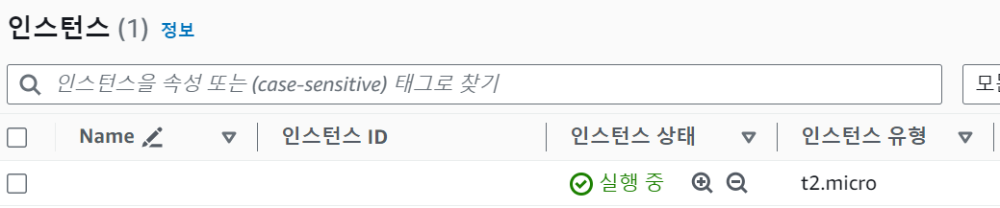
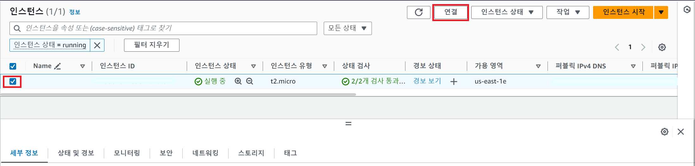
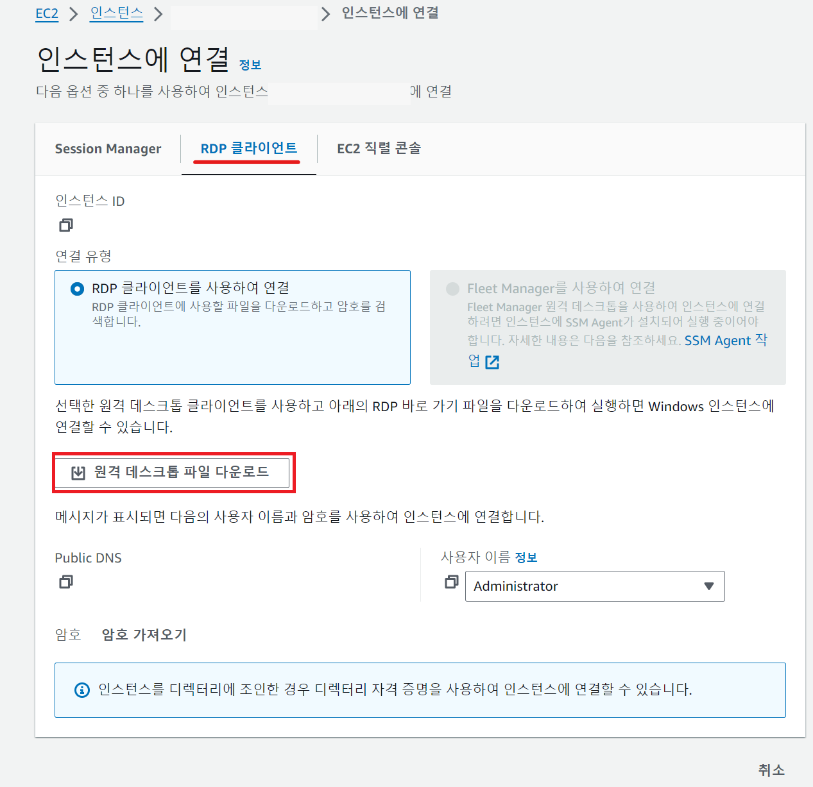
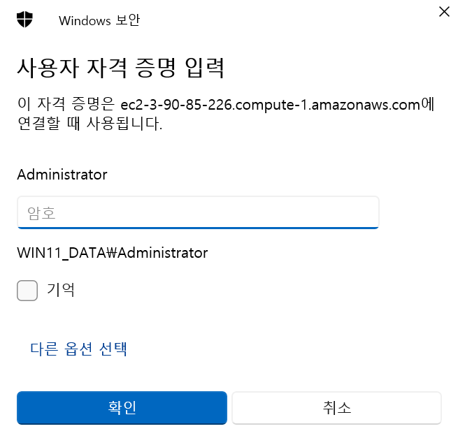
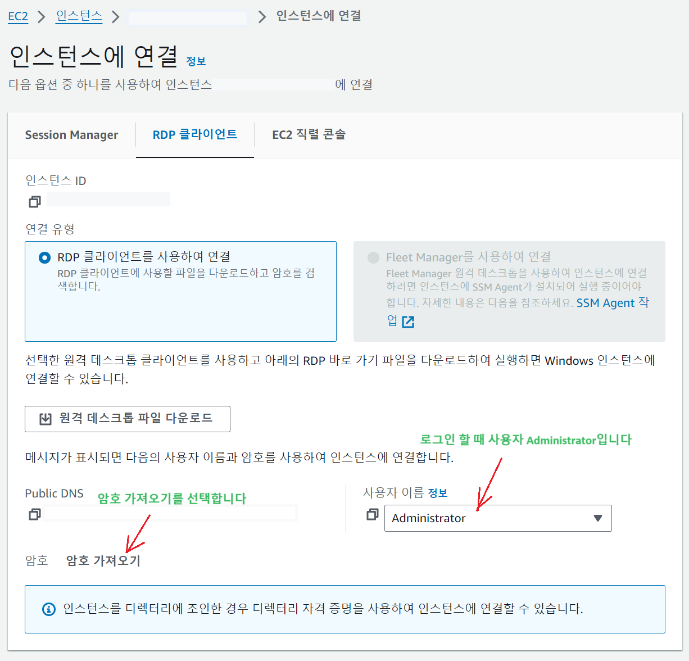
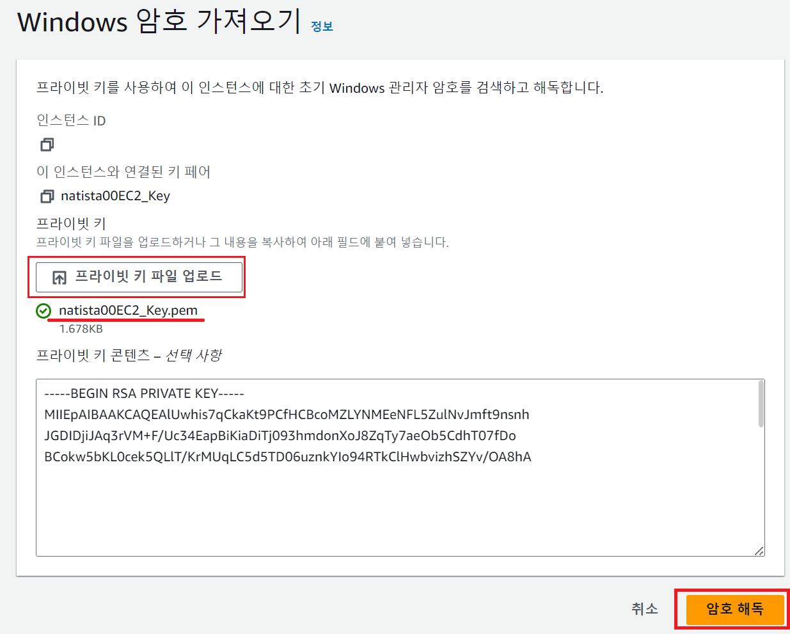
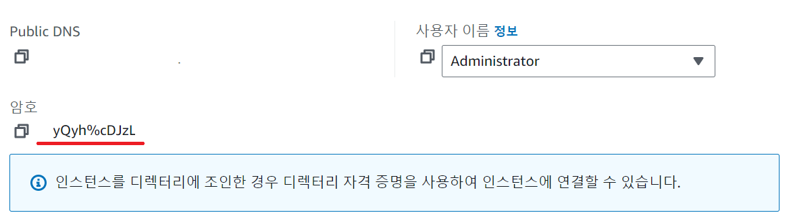

1. # AWA란?
   Amazon이 제공하는 Cloud Service입니다. 관리가 쉽고 빠르고 유연한 확장성, 보안이 장점입니다. 필요할 때만 사용하고, 사용한 만큼만 비용을 지불합니다.   

   Amazon EC2 - 크기 조정이 가능한 컴퓨팅 용량을 클라우으에서 제공하는 웹 서비스   
   
   Amazon S3 - 확장성, 가용성, 내구성을 가진 데이터 저장 공간을 제공   
   저장공간이 부족하면 더 늘리 수 있다 : 확장성   
   여러 서버에서 하나의 저장공간에 접속할 수 있다 : 가용성   
   데이터가 손상되면 복구를 해준다 : 내구성   

   Amazon RDS - 관계형 DB 관리 서비스. 관계형 DB(MySql, Oracle)를 모니터링, 주기적 백업을 제공   
   EC2에 인스턴스를 생성하고 오라클이나 MySQL을 설치할 수도 있지만, 그렇게 되면 자신이 DB관리를 다 해야하기 때문에 RDS서비스를 이용하면 모니터링과 주기적인 백업을 제공하기 때문에 많은 관리가 필요하지 않다. RDS를 Oracle이나 MySql로 생성하게됩니다.   

   on-Premise : 서버를 직접 운영하는 방식   
   Serverless : 서버 작업을 서버내부가 아닌 클라우드 서비스로 처리   
   Region : 데이터 센터가 물리적으로 존재하는 곳   
   CDN(Content Delivery Network) : 정적 리소스를 빠르게 제공할 수 있게 전세계의 캐시서버에 복제해주는 서비스

   EC2에서 인스턴스를 생성   
   인스턴스 : VM 가상컴퓨터   
   인스턴스 1개 생성 - 가상 컴퓨터 1개 생성   
   인스턴스 2개 생성 - 가상 컴퓨터 2개 생성   
   인스턴스에다가 windows와 톰캣 설치. 인스턴스는 컴퓨터니깐 OS를 설치해서 사용   

   EBS(Elastic Block Store) : 가상 블록 스토어 서비스입니다. 하드 디스크와 비슷한 가상 저장 공간   
   인스턴스는 가상 컴퓨터이고 EBS는 가상 하드디스크 입니다.   

1. # EC2생성
   AWS에 가입한 후 EC2화면입니다. 일단 리전이 미국 동부(버지니아 북부)인데 리전을 서울로 변경하겠습니다.   
      

   오른쪽 상단에서 리전을 서울로 변경 후 밑에 인스턴스 시작을 선택합니다.   
      

   OS이미지를 window2019로 선택했습니다. 프리 티어 사용 가능이란 표시가 있습니다.   
      

   하단으로 내려 인스턴스 유형을 선택합니다. t2.micro 버전만 프리 티어가 가능하기 때문에 이 버전을 선택했습니다.   
      

   다시 하단으로 내려 키 페어를 생성합니다. 새 키 페어 생성을 선택합니다.   
      

   계정이름과 EC2란 이름을 혼합해서 페어 키 이름을 정했습니다. 하단에 키 페어 생성 버튼을 선택합니다.   
      

   키 페어 이름의 pem파일이 다운로드 됩니다. 다운받은 pem파일은 이후 EC2를 원격으로 접속할 때 암호를 생성해야하는데 이때 사용됩니다.   
      

   다시 하단으로 내리면 스토리지 구성이 나오는데 프리 티어는 30GB의 EBS(가상 하드디스크)를 제공한다는 문구가 나옵니다. 30G이상을 사용하면 요금을 지불해야 합니다.   
      

   프리 티어 조건으로 월별 인스턴스 750시간, EBS 30G까지 허용이 됩니다.  오른쪽 하단에 인스턴스 시작을 선택합니다.   
      

   인스턴스를 생성한다는 알림이 나타나고 다음과 같이 생성이 끝나고 인스턴스를 시작했다는 문구가 나타납니다.   
      

   EC2페이지로 이동하면 현재 실행 중인 인스턴스 목록이 나타납니다.   
      

1. # 인스턴스에 접속하기

   인스턴스 앞에 체크박스에 체크를 하고 상단에 연결을 선택합니다.   
      

   RDP 클라이언트를 선택하고 "원격 데스크탑 파일 다운로드"를 누릅니다. 원격 데스크탑 파일은 원격 서버에 연결할 수 있는 정보가 담긴 파일로 바로가기와 유사합니다. 앞으로 원격 서버에 연결할 때 이 파일을 더블 클릭하면 됩니다.    
      

   다운 받은 실행 파일을 더블클릭하면 Administrator라는 사용자가 나오고 암호를 입력하라고 뜹니다.   
      

   이제부터 암호를 생성하겠습니다. 암호를 생성하기 위해서는 앞서 EC2 인스턴스를 만들면서 키 페어를 생성했는데, 이때 다운받은 pem파일이 필요합니다.   

   원격 프로그램으로 로그인 할 때 이름은 사용자 이름 정보의 Administrator입니다. 암호 가져오기를 선택합니다.   
      

   프라이빗 키 파일 업로드를 선택해서 앞서 다운받은 pem파일은 선택합니다. natista00EC2_Key란 키 페어 이름이 보입니다. pem파일을 가져오면 밑에 텍스트 박스에 암호나 쭉 나타납니다. 하단에 암호 해독을 선택합니다.   
      

   암호 해독을 선택하면 앞서 나타났던 화면으로 이동이 되면서 보이지 않던 암호가 보입니다. 이 암호를 복사해서 원격 프로그램에 입력하면 됩니다.   
      

