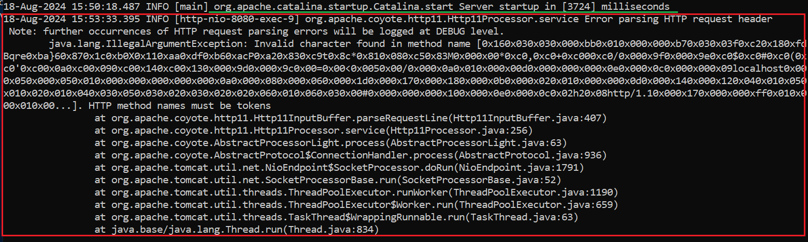

1. # org.apache.coyote.http11.Http11Processor.service Error parsing HTTP request header
org.apache.coyote.http11.Http11Processor.service Error parsing HTTP request header
 Note: further occurrences of HTTP request parsing errors will be logged at DEBUG level.

   

https://localhost:8080을 하든데 https에서 s를 없애면 됩니다.   
```
   http://localhost:8080
```