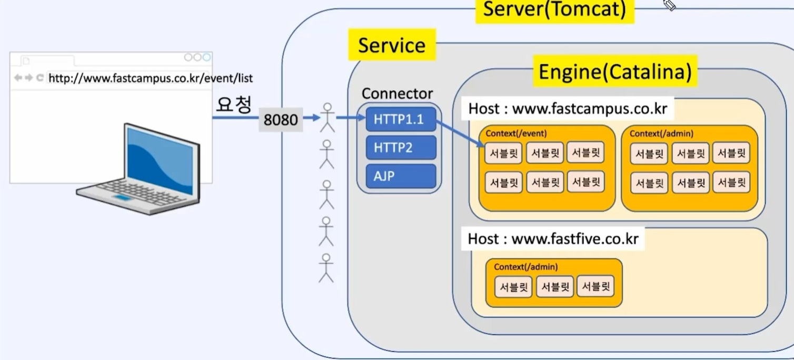

1. # 서버와 클라이언트

   서버와 클라이언트는 역할에 따른 분류입니다.   

   웹 브라우저 - 클라이언트 프로그램   
   자신의 컴퓨터 - 클라이언트 컴퓨터   

   톰캣 = 서버 프로그램  
   서버 - 서버 컴퓨터   

1. # 서버의 종류
   Email server - Email 서비스를 제공하는 서버   
   File  server - File을 제공하는 서버   
   Web server - 브라우저를 통해 할 수 있는 모든 서비스를 제공하는 서버   

   1대의 pc에 Email server, File server, Web server가 있을 때 클라이언트의 ip주소만으로는 어떤 서버를 요청하는 알 수 없습니다. 그래서 필요한 것이 port번호 입니다.   

   http의 포트번호 80번은 대표포트 번호로 생략이 가능합니다.   
   포트 번호는 약 6만개(65535)로 0~1023번까지는 예약 번호입니다.   

1. # WAS
   Web server는 web을 서비스 합니다. WAS는 Web Application Server의 약자로 Web Application을 제공하는 것입니다.   
   그럼 Web Application이 뭐지?   
   프로그램입니다. 서버에 프로그램을 설치해 놓고 클라이언트가 설치된 프로그램을 사용하도록 제공합니다. 프로그램을 클라이언트에도 설치할 수 있지만 서버에 설치가 가능하도록 하는 것이 WAS의 역할입니다. 자바 프로젝트와 같은 프로그램을 서버에서 실행하도록 할 수 있습니다.   

   업데이트시 예전엔 프로그램을 클라이언트에 설치를 해서 프로그램이 설치된 모든 컴퓨터를 직접 업데이트를 다 해줘야했습니다. WAS가 설치되어 있는 경우 웹에 설치된 프로그램 하나만 업데이트틀 하면 클라이언트는 업데이트된 파일을 다운만 받으면 됩니다.      

1. # Tomcat 내부 작동
      
   서버는 Tomcat이고, 톰캣 엔진의 이름이 Catalina입니다.   
   톰캣 내부에 스레드 풀이라고 항상 클라이언트의 요구를 받을 스레드 모임이 있고 그 안에서 스레드들이 실행 중 입니다. 클라이언트의 Protocol에 따라 나눠서 처리를 해야하는데 이를 해결해주는 것이 스레드 안에 Service이고 이 Service안에 Connector가 분류를 합니다.   
   ```
      http://www.koreamovie.co.kr/reserve/list
   ```   
   다음과 같은 url이 있을 때 http를 Service 안에 Connector가 Protocol에 따라 분류를 하게 됩니다. 분류를 한 후 나머지 url부분을 톰캣 엔진인 Catalina에 전달합니다.   
   주소 나머지 부분을 호스트라고하는데 www.koreamovie.co.kr/reserve/list여기에 해당합니다. 하나의 톰캣에 호스트는 여러개의 호스트 처리가 가능합니다. Catalina라는 톰캣 엔진에서 이 처리가 이루어집니다.   
   하나의 호스트에 여러개의 Context가 존재합니다. Context하나가 하나의 Web Application이 됩니다. 즉, 하나의 자바 프로젝트가 됩니다.    
   __Context = Web Application = 자바 프로젝트__   
   Context안에 여러개의 서블릿이 존재합니다. Servlet에서 let이란 작다는 뜻입니다. "작은 서버" 프로그램이 서블릿입니다. 프로젝트를 이루는 작은 서버 프로그램이 서블릿인데 MVC 자바 프로젝트에는 컨트롤러가 이에 해당합니다.     
   __서블릿도 해당 url이 있습니다.__ http://www.koreamovie.co.kr/reserve/list 여기에서 list에 해당하는 Controller를 찾아가게되는데 이 Controller가 서블릿입니다. 서블릿의 주소는 list가 됩니다.   
   __서블릿 ≒ Controller__   

   

