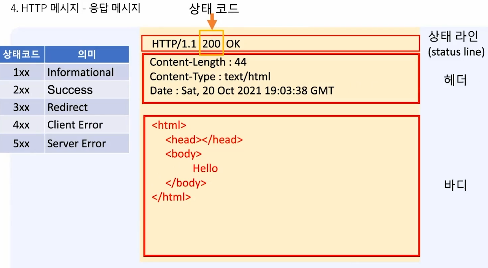
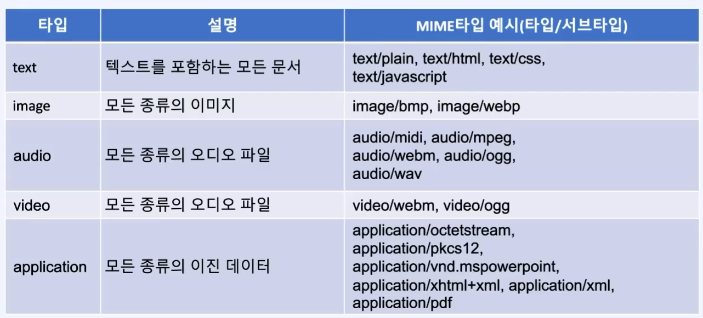
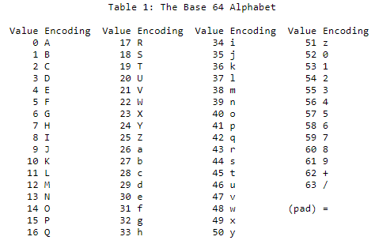

1. # HTTP(Hyper Text Transfer Protocol)
   HTTP는 Hyper Text Transfer Protocol입니다. Text를 전송하는 통신 규약입니다.   

   1.텍스트 기반의 프로토콜이기 때문에 단순하고 읽기 쉽습니다.   
   
   2.상태유지를 하지 않습니다. 여기서 상태란 기존 클라이언트를 말합니다. 같은 클라이언트가 HTTP로 접속을 해도 HTTP 정보에는 클라이언트에 대한 정보가 없기 때문에 이를 보안하기 위해 __쿠기__ 와 __세션__ 을 사용합니다.   

   3.커스텀 헤더 추가가 가능합니다. 서버와 클라이언트가 약속만 되면 원하는 내용을 HTTP프로토콜에 추가해서 주고 받을 수 있습니다. 확장이 가능합니다.    

   HTTP 프로토콜의 응답 메시지입니다. 클라이언트의 요청에 따라 서버에서 처리를 하고 응답을 하는 메시지 방식입니다.       
      
   가장 상단에 상태라인이 있습니다. HTTP 1.1 이라는 것을 선언합니다. 옆에 상태코드 200이 있습니다. 옆에 OK는 상태 코드에 대한 결과입니다.   

   상태코드 값   

      |  상태코드  |   의 미  |
      |:---------:|:--------:|
      |  1xx  |  Informational  |
      |  2xx  |  Success  |
      |  3xx  |  Redirect(재요청)  |
      |  4xx  |  Client Error  |
      |  5xx  |  Server Error  |   
      
   상태코드    
   200번대이면 성공입니다.   
   300번대는 다른 URL로 요청을 보내라는 의미입니다.   
   400번대는 클라이언트 측에서 발생한 요청 에러입니다.   
   500번대는 서버 측에서 발생한 응답 에러입니다.   
   100번대는 HTTP 1.0에서는 없다가 1.1에서 추가된 상태코드로 서버와 클라이언트 간의 정보교환이 목적입니다.   

   404 Not Found 에러는 클라이언트 측에서 요청을 잘못 했다는 의미입니다. 

   해더과 바디 사이에 빈줄이 있습니다. 헤더가 몇 줄이 될지 알 수 없기 때문에 헤더와 바디의 구분을 위해 빈줄을 넣었습니다.

1. # GET과 POST
   
   |    GET    |    POST   |
   |:---------:|:---------:|
   |1)서버의 리소스를 가져오기 위해 설계|1)서버에 데이터를 올리기 위해 설계|
   |2)Query String을 통해 데이터를 전달(소용량)|2)전송 데이터 크기의 제한이 없음(대용량)|
   |3)URL에 데이터 노출되므로 보안에 취약|3)데이터를 요청 메시지의 body에 담아 전송|
   |4)데이터 공유에 유리|4)보안에 유리, 데이터 공유에 불리|
   |ex.검색엔진에서 검색 단어 전송에 이용|ex.게시판에 글쓰기, 로그인, 회원가입|   

   HTTP + TLS(암호화) = HTTPS   
   SSL의 새로운 버전이 TLS   

1. # 텍스트 파일과 바이너리 파일
   바이너리 파일 : __문자__ 와 __숫자__ 가 저정되어 있는 파일   
   텍스트 파일 : __문자__ 만 저장되어 있는 파일   

   바이너리 파일 : 데이터를 있는 그대로 읽고 쓴다.   
   테스트 파일 : 숫자를 문자로 변환 후 쓴다.   

   |  파일 종류   |         쓰 기        |         읽 기        |
   |:-----------:|:--------------------:|:--------------------:|
   |   바이너리   |문자 → 문자<br>숫자 → 숫자|문자 → 문자<br>숫자 → 숫자|
   |   텍스트   |문자 → 문자<br>숫자 → 문자|문자 → 문자(쓰기할 때부터 문자밖에 없다)|

   숫자 → 문자   
   숫자 : 12 → 문자 : '1' , '2'   
   숫자 int 4byte  → 문자 char 2개로 2byte   

1. # MIME(Multipurpose Internet Mail Extensions)
   브라우저에서 이미지와 동영상을 볼 수 있는데 HTTP는 Text기반 프로토콜인데 어떻게 이것이 가능한가?   
   MIME을 명시해줘서 브라우저가 명시된 데이터 타입에 맞게 해석을 해줍니다.   

   MIME란 텍스트 기반 프로토콜에 바이너리 데이터를 전송하기 위해 고안 변환 명령어로 HTTP의 Content-Type 헤더에 사용합니다. HTTP의 Content-type에 데이터 타입을 명시   

      

   사용 예)   

   ```java
      response.setContentType("text/html");
   ```   
   HTTP의 Content-Type를 설정하는 명령어입니다. text/html의 데이터 타입을 명시해줘야 브라우저가 데이터를 받았을 때 해석을 똑바로 할 수 있습니다.   
   
1. # Base64
   이미지나 동영상을 브라우저로 전송할 때 MIME을 명시하는 방법과 Base64로 인코딩하는 방법 2가지가 있습니다.   
   Base64 문자표는 바이너리 데이터를 텍스트 데이터로 변환할 때 사용하게 됩니다. 64진법으로 '0'~'9', 'A'~'Z','a'~'z','+','/' 모두 64개입니다.   

   '0'~'9' : 10개   
   'A'~'Z' : 26개   
   'a'~'z' : 26개   
   '+','/' : 2개   

      
   
   아스키코드가 2에 7승으로 128개입니다. 여기에는 특수문자도 포함되어있어서 변환시 지원되지 않는 경우가 발생할 수 있습니다. 한글os에서 제공하는 이미지를 아랍어os에서 변환시  만약 아랍어os에는 특수 문자를 포함하지 않다면 인코딩시 문제가 발생할 수 있습니다. 그래서 아스키코드에서 1bit를 더 뺀 2에 6승 64개를 가장 기본이 되는 코드라고 해서 base라는 이름을 붙이고 64개의 기본적인 문자라는 의미로 ase64라고 했습니다. 어느나라 언어든 가장 기본이 되는 64개의 알파벳은 가질 수 있기 때문입니다.   

1. # Base64 인코딩하기
   


