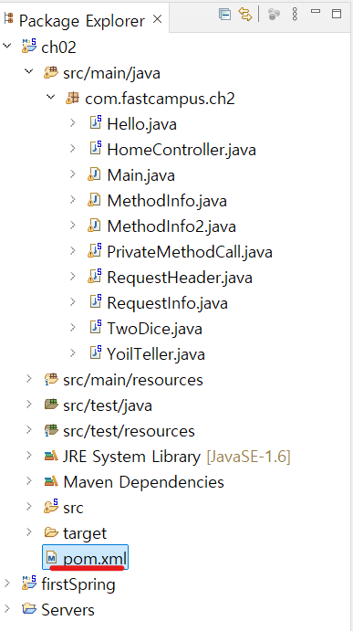
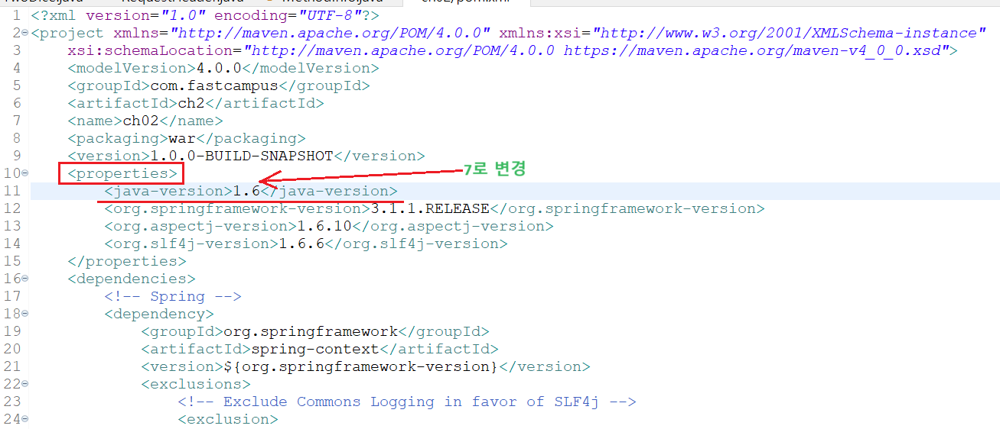
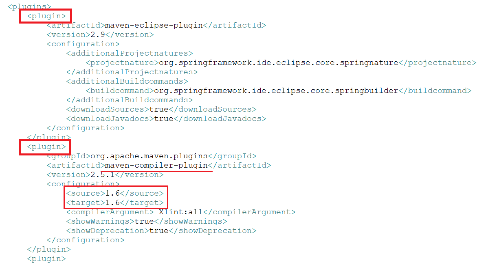
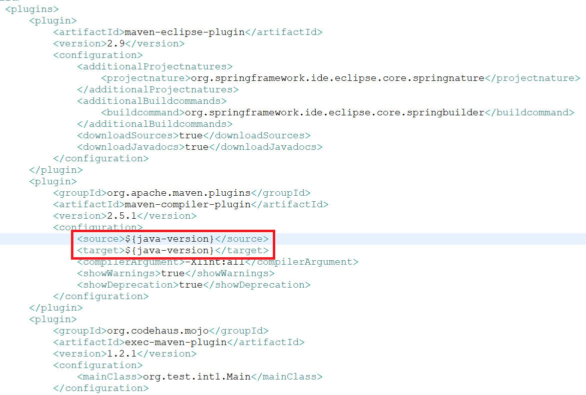
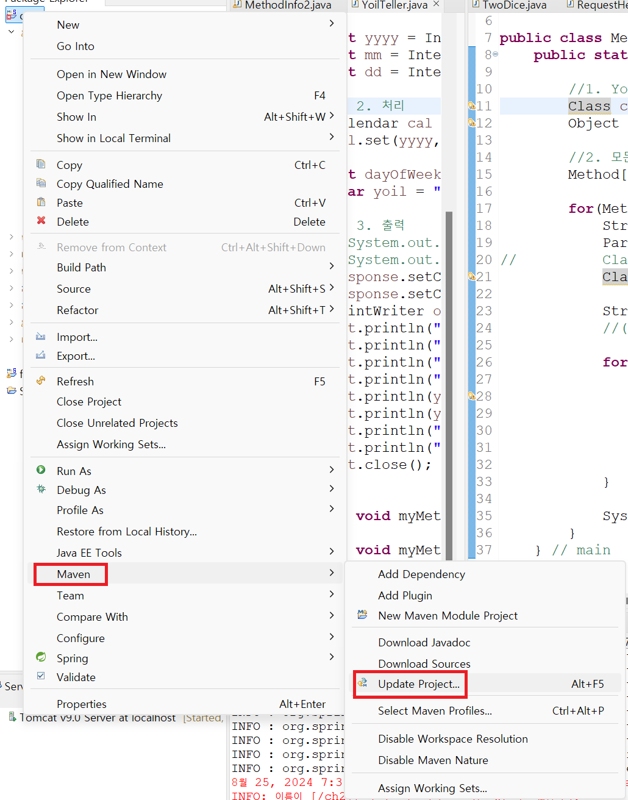
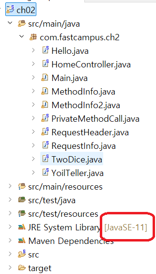
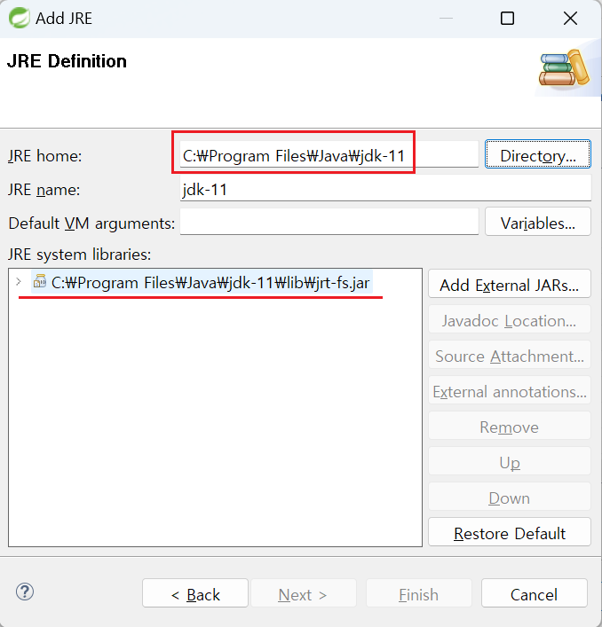

1. # JDK버전 변경
    STS3에서 JRE버전을 변경하는 방법은 2가지입니다.   
    1)pom.xml 수정   
    2)Build Path   

    2)같은 경우는 이클립스 같은 maven이 적용되지 않는 환경에서 유효한 변경입니다. maven 빌드 환경에서 2)번과 1)번의 설정이 있을 시 1)번 설정을 우선합니다. pom.xml파일은 maven설정 파일입니다. Build path로 JDK버전을 변경해도 Update Project를 수행하면 pom.xml파일에 있는 maven 설정을 불러오기 때문에 maven에 설정되어 있는 JDK버전으로 다시 변경이 됩니다.   

1. # pom.xml에서 JDK버전 변경

    pom.xml파일 선택   
       

    properties항목에서 java-version 1.6을 7로 변경
       

    properties에 있는 항목은 속성값으로 변수로도 사용가능합니다. 

    하단에 maven의 plugin 버전도 바꿔줘야 합니다.   
       
    plugin 항목의 source와 target 버전 2개를 다음과 같이 변경합니다.   

    java-version을 변수로 사용해서 다음과 같이 적용하면 상단에 java-version만 변경해도 자동 변경이 됩니다.   
       

    프로젝트 위에서 오른쪽 마우스 클릭 후 Maven -> Update Project... 를 수행합니다.   
       

    JavaSE-11로 변경되었습니다.   
       

2. # Build Path에서 변경
    
    프로젝트 위에서 오른쪽 마우스 → Properties → Java Build Path → Libraries 탭 → Add Library → JRE System Library → Installed JREs... → Add → Standard VM → JRE home에서 Directory... 버튼선택 → C:\Program Files\Java\jdk-11 경로를 설정하면 자동으로 하단의 JRE-name 과 JRE system libraries에 목록이 나타남   

       