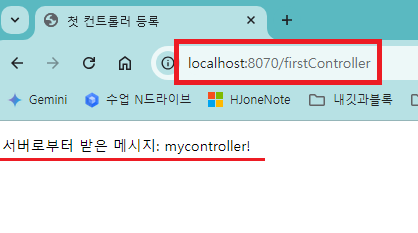

1. # static, templates디렉토리

   __static 디렉토리__   
   정적 리소스 저장: HTML, CSS, JavaScript, 이미지 파일 등 변경되지 않는 콘텐츠를 저장하는 곳입니다.   
   직접 접근 가능: 웹 서버에 배포된 후에는 별도의 서버 사이드 로직 없이 클라이언트에서 직접 요청하여 사용할 수 있습니다.   
   캐싱: 브라우저에서 캐싱되어 웹 애플리케이션의 성능을 향상시킬 수 있습니다.   
   사용 예: 부트스트랩 CSS 파일, jQuery JavaScript 파일, 로고 이미지 파일, favicon.ico 파일   

   __templates 디렉토리__   
   동적 콘텐츠 생성: Thymeleaf, Freemarker 등의 템플릿 엔진을 사용하여 동적으로 생성되는 HTML 페이지를 저장하는 곳입니다.   
   서버 사이드 처리: 컨트롤러에서 전달된 데이터를 기반으로 템플릿 엔진이 HTML 코드를 생성합니다.   
   데이터 바인딩: 템플릿 내에서 변수를 사용하여 데이터를 동적으로 표시할 수 있습니다.   
   사용 예: 사용자 정보를 보여주는 HTML 페이지, 데이터베이스에서 가져온 목록을 보여주는 HTML 페이지, 사용자 입력을 받아 처리하는 HTML 폼   

1. # Controller생성

   프로젝트 생성시 thymeleaf를 선택하고 생성을 해줘야 Controller에서 제대로 인식을 합니다.   
      

   thymeleaf를 선택하고 프로젝트를 생성하면 pom.xml파일에 다음과 같은 dependency가 생깁니다. 이 부분이 있어야 합니다.   
      

   패키지안에 MyController라는 클래스를 만들고 다음과 같이 Controller와 GetMapping을 지정합니다.   
      
   ```java
      package com.example.controllerexercise;

      import org.springframework.stereotype.Controller;
      import org.springframework.ui.Model;
      import org.springframework.web.bind.annotation.GetMapping;

      @Controller
      public class MyController {

         @GetMapping("/firstController")
            public String hello(Model model) {
               model.addAttribute("data", "mycontroller!");
               return "first";
            }
      }
   ```   

   src/main/resources 디렉토리에 static과 templates가 있는데 controller로 등록하기 위해선 tymeleaf가 참조하는 디렉토리인 templates에 first.html파일을 생성합니다.   
      
   static은 주소창에서 직접 접근할 때 사용할 html파일이 저장됩니다.   

   주소창에 http://localhost:8070/firstController로 GetMapping을 한 firstController를 입력하면 Constroller가 처리 후 first를 리턴하게 되는데 프레임워크가 최종적으로 만들 땐 first.html이 됩니다. templates 디렉토리에 있는 first.html파일이 실행된 화면입니다.   
      

1. # 포트 설정

   application.properties파일에 포트를 설정합니다.   
   ```
      server.port=8070
   ```   

      