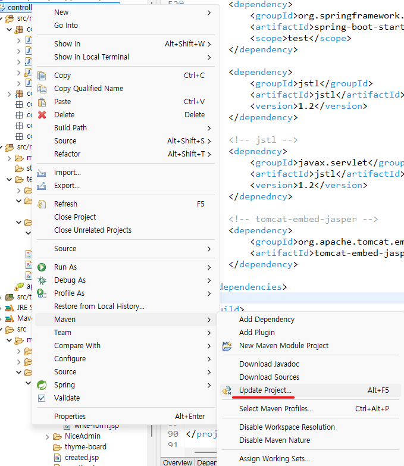
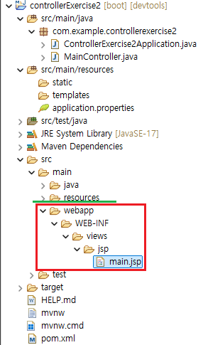
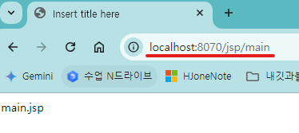
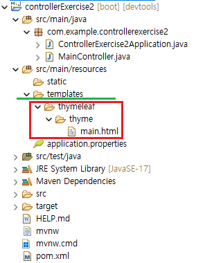

1. # 스프링 부트에서 jsp경로 인식
    스프링부트는 jsp의 복잡성과 취약성을 이유로 공식적으로 jsp를 지원하지 않습니다. jsp보다는 thymeleaf 사용을 권장하기 때문에 부가적인 설정을 통해 jsp를 사용하는 환경을 만들어야 합니다.   

1. # jsp사용하기   

    1)pom.xml파일 설정   
        스프링부트에서 jsp를 사용하기 위해서 jstl라이브러리와 jsp파일을 자바서블릿으로 변경하는 엔진인 jasper가 톰캣에 있는데 이를 이용하기 위해서 pom.xml파일에서 dependencies 내부에 다음을 추가합니다.   
        ```java
            <dependencies>
            ...
                <!-- jstl -->
                <depnedncy>
                    <groupId>javax.servlet</groupId>
                    <artifactId>jstl</artifactId>
                    <version>1.2</version>
                </depnedncy>
                            
                <!-- tomcat-embed-jasper -->
                <dependency>	
                    <groupId>org.apache.tomcat.embed</groupId>	
                    <artifactId>tomcat-embed-jasper</artifactId>
                </dependency>
            <dependencies>
        ```   
        이후 Maven -> Update Project를 수행   
           

    2)application.properties 파일 수정
        ```cs
            spring.application.name=controllerExercise

            server.port=8070

            #view resolver
            spring.mvc.view.prefix=/WEB-INF/views/
            spring.mvc.view.suffix=.jsp
            
        ```   
        이후에 컨트롤러에서 읽어들일 주소를 return 하면 prefix로 WEB-INF/views/ 경로가 추가되고 suffix에 있는 .jsp 확장자가 추가됩니다.   

    3)폴더추가
        webapp폴더는 기본 외부폴더이기 때문에 스프링에서 자동 인식합니다. spring.mvc.view.prefix=/WEB-INF/views/ 로 설정했기 때문에 webapp폴더 안에 WEB-INF와 views 폴더를 각각 만들어줍니다. 그리고 화면에 띄울 main.jsp파일을 생성합니다.   
           

    4)Controller 생성
        ```java
            @Controller
            public class MainController {

            @GetMapping("/jsp/main")
            public String mainController() {
                return "jsp/main";
            }
        ```   
        주소창에 "jsp/main"을 입력합니다. GetMapping에 맵핑된 주소를 입력하면 return 폴더경로의 /WEB-INF/views/jsp/에 있는 main.jsp가 반환됩니다.   
           
        
1. # thymeleaf와 함께 사용하는 경우
    thymeleaf를 사용하는 환경에서 jsp를 사용하는 환경을 만듭니다.   

    1)application.properties에 thymeleaf설정을 추가 됩니다.
    ```cs
        #thymeleaf
        spring.thymeleaf.prefix=classpath:templates/
        spring.thymeleaf.suffix=.html
        spring.thymeleaf.view-names=thymeleaf/*
    ```   
    view-names는 가장 앞에 thymeleaf란 값이 나오면 templates폴더의 html파일을 읽습니다. view-names설정을 통해 jsp파일인지 html파일인지 구별하게 됩니다.      

    2)폴더 추가   
    thymeleaf가 설정이 되면 templates폴더에 있는 파일을 읽어옵니다. templates폴더에 thymeleaf/thyme/ 폴더를 만들고 main.html파일을 생성합니다.   
       

    3)Controller 생성   
    ```java
        @Controller
        public class MainController {

            @GetMapping("/jsp/main")
            public String mainController() {
                return "jsp/main";
            }
            
            //----- 추가된 내용 -----//
            @GetMapping("thyme/main")   
            public String mainController2() {
                return "thymeleaf/thyme/main";
            }
        }
    ```   
    thyme/main를 주소창에 입력하면 thymeleaf/thyme/main.html 파일을 읽어들이는데 가장 앞에 thymeleaf로 html파일인 것을 sts4가 판단할 수 있습니다.   


    


