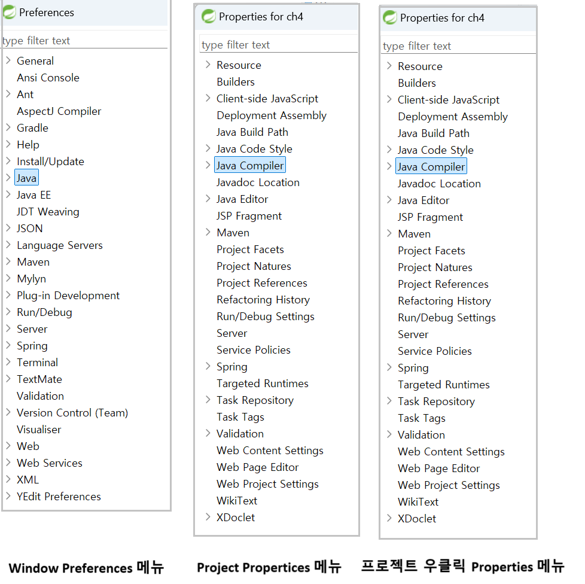

1. # Compiler Version 변경

   1)Window → Preferences → Java → Compiler → Compiler Compliance level 변경   

   2)Project → Properties → Java Compiler → Compiler Compliance level 변경   
   또는
   Explorer 창의 프로젝트명 위에서 우클릭 → Properties → Java Compiler → Compiler Compliance level 변경   

      
