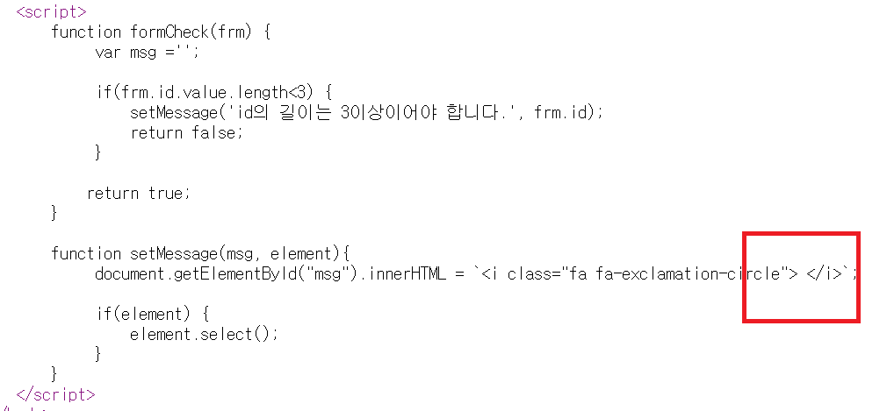

1. # Templateliteral과 EL

   ```javascript
       function setMessage(msg, element){
            document.getElementById("msg").innerHTML = `<i class="fa fa-exclamation-circle"> ${msg}</i>`;

            if(element) {
                element.select();
            }
       }
   ```   
   `${msg}` 부분이 el과 표현이 똑같습니다. jsp에 EL과 js의 템플릿리터럴 표기가 똑같기 때문에 서버에서 넘겨준 값을 브라우저가 제대로 처리를 못 합니다.   
   EL은 jsp형식으로 서버에서 작동을 하고, 템플릿리터럴은 js형식으로 브라우저에서 동작합니다.   

   서버에서 먼저 동작이 일어나고 그 결과를 브라우저가 받아서 출력하게 됩니다. 서버가 먼저 동작을 하게 되는데 이때 `${msg}`의 결과를 이미 빈문자열로 처리를 해버립니다.   

       
    다음은 소스보기를 한 화면인데 서버에는 `{msg}` 값이 없으니깐 빈문자열로 처리가 된 것을 알 수 있습니다.   

   해결방법   
   1)   
   ```javascript
      function setMessage(msg, element){
         document.getElementById("msg").innerHTML = `<i class="fa fa-exclamation-circle"> ${'${msg}'}</i>`;

         if(element) {
               element.select();
         }
      }
   ```   
   msg를 문자열로 한번더 감싸주면 됩니다. 서버쪽에서 EL이 먼저 해석하고 나면 `${msg}`만 남게 됩니다.   