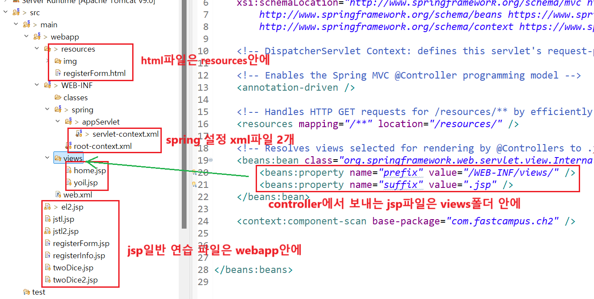

1. # html, jsp파일 폴더 위치
        

1. # resources 경로 삭제

   webapp/resources 안에 파일이 있는 경우 url경로에 resources를 입력해야 하지만 간단할 설정으로 이를 없앨 수 있습니다.   

   webapp/WEB-INF/spring 안에   
   servlet-context.xml파일과 root-context.xml파일 2개가 있습니다. 2개다 spring설정 파일입니다.   

   servlet-context.xml - web관련 설정파일   
   root-context.xml - non-web관련 설정파일   

   servlet-context.xml파일   
   ```
      <resources mapping="/resources/**" location="/resources/" />
   ```   
   여기에서 mapping안에 resources를 지워주면 됩니다.   
   ```
      <resources mapping="/**" location="/resources/" />
   ```   
   삭제 전 : http://localhost/ch2/resources/registerForm.html   
   삭제 후 : http://localhost/ch2/registerForm.html   


