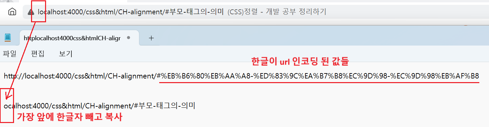

1. # Spring에서 한글 깨짐 처리

   src - main - webapp - WEB-INF - web.xml파일에 붙여넣습니다.
   ```
      <!-- 한글 변환 필터 시작 -->
      <filter>
         <filter-name>encodingFilter</filter-name>
         <filter-class>org.springframework.web.filter.CharacterEncodingFilter</filter-class>
         <init-param>
            <param-name>encoding</param-name>
            <param-value>UTF-8</param-value>
         </init-param>
         <init-param>
            <param-name>forceEncoding</param-name>
            <param-value>true</param-value>
         </init-param>
      </filter>
      
      <filter-mapping>
         <filter-name>encodingFilter</filter-name>
         <url-pattern>/*</url-pattern>
      </filter-mapping>
      <!-- 한글 변환 필터 끝 -->
   ```   

1. # url을 메모장에 복사했을 때 한글 깨짐

       