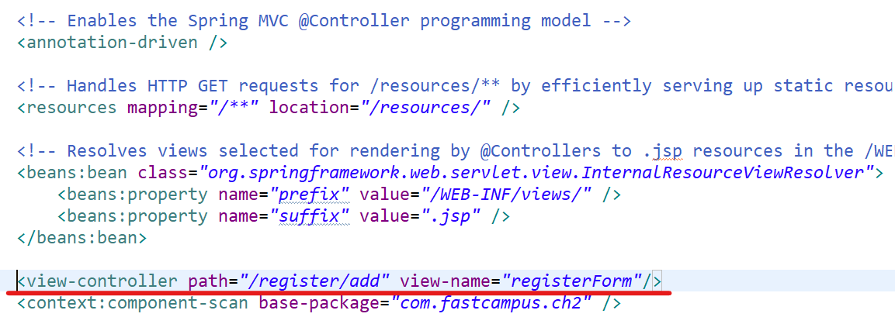

1. # post방식으로만 받을 수 있게 제한
   ```java
      @RequestMapping(value="/register/save", method=RequestMethod.POST)
      public String save(){
         return "registerInfo";
      }
   ```   
   "method=RequestMethod.POS" method방식을 POST로만 제한하는 명령어입니다. method형식을 주기 위해서 앞에 value형식도 같이 줘야합니다.   

   method방식이 다르면 mapping주소가 같아도 충돌이 나지 않습니다.   
   ```java
      @RequestMapping(value="/register/save", method=RequestMethod.POST)
      public String save(){
         return "registerInfo";
      }

      @RequestMapping(value="/register/save", method=RequestMethod.GET)
      public String save(){
         return "registerInfo";
      }
   ```   
   mapping값이 register/save로 동일하더라도 충돌이 나지 않습니다.   

   method는 배열로도 사용할 수 있습니다.   
   ```java
      @RequestMapping(value="/register/save", method= {RequestMethod.GET, RequestMethod.POST})
   ```   
   배열로 2개를 넣으면 get과 post 2가지 방식을 다 허용한다는 의미입니다.   

   위에 명령어가 길기 때문에 이를 줄인게 PostMapping입니다.   
   ```java
      @PostMapping("/register/save")
      public String save(){
         return "registerInfo";
      }
   ```   
   PostMapping은 post방식으로 데이터를 받을 수 있게 제한합니다.   

   마찬가지로 get방식으로만 제한하는 것이 GetMapping입니다.   
   ```java
      @GetMapping("/register/add")
      public String save(){
         return "registerForm";
      }
   ```   
   
   =>RequestMapping을 사용하기 편하게 나눈것이 PostMapping과 GetMapping입니다.   

   PostMapping과 GetMapping에 공통으로 들어가는 앞에 경로를 클래스에 붙는 RequestMapping으로 따로 뽑을 수 있습니다.   
   ```java
      @PostMapping("/register/save")
      @GetMapping("/register/add")

      //register경로를 클래스에 RequestMapping으로 따로 뽑을 수 있음 =>

      @Controller
      @RequestMapping("/register")
      public class RegisterController{

         @PostMapping("/save")
         public String save(){
            return "registerInfo";
         }
         
         @GetMapping("/add")
         public String save(){
            return "registerForm";
         }
      }
   ```   
   하나의 클래스에 하나의 기능을 담당하게 만들어 RequestMapping으로 설정하고  해당 기능의 하위 주소들을 메소드로 맵핑하면 됩니다.    
   지금은 "등록"에 관련된 클래스를 만들어서 이것을 "/register"라는 주소로 RequestMapping을 했고, "등록"에 관련된 기능을 하는 "/save"와 "/add" 주소들은 모두 메소드로 맵핑을 합니다.   

   @WebServlet ≒ @RequestMapping   

1. # view-controller에 추가
   다음과 같은 코드가 있는 경우   
   ```java
      @GetMapping("/register/add")
      public String save(){
         return "registerForm";
      }
   ```   
   save란 메소드는 "/register/add"와 "registerForm"을 연결만 해줍니다. 이 연결을 view-controller에서 할 수 있습니다.   

   servlet-context.xml : spring에 웹관련 설정파일   
   root-context.xml : spring관련 설정파일   

   servlet-context.xml파일을 선택합니다.   

   다음을 추가합니다.   
   ```jsp
      <view-controller path="/register/add" view-name="registerForm"/>
   ```   

      

   <span style="color:red">view-controller등록은 get요청만 허용합니다.</span>

