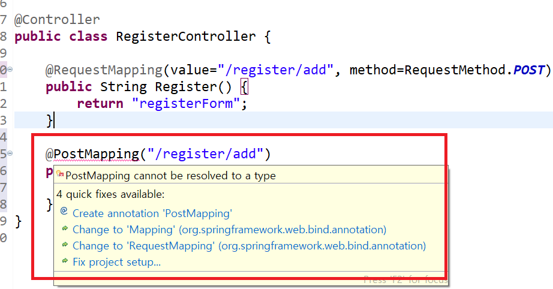
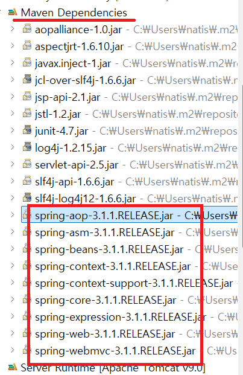

1. # post방식으로만 받을 수 있게 제한
   ```java
      @RequestMapping(value="register/save", method=RequestMethod.POST)
      public String save(){
         return "registerInfo";
      }
   ```   
   "method=RequestMethod.POS" method방식을 POST로만 제한하는 명령어입니다. method형식을 주기 위해서 앞에 value형식도 같이 줘야합니다.   

   위에 명령어가 길기 때문에 이를 줄인게 PostMapping입니다.   
   ```java
      @PostMapping("/register/save")
      public String save(){
         return "registerInfo";
      }
   ```   
   PostMapping은 post방식으로 데이터를 받을 수 있게 제한합니다.   

1. # PostMapping error 수정
   
      
   다음과 같이 PostMapping 어노테이션에 빨간줄이 가고, 마우스를 올린 메뉴에도 어노테이션을 추가하는 목록이 없다면 스프링 업데이틀 해줘야 합니다. PostMapping가 스프링 4.3버전부터 나오기 시작했기 때문에 그 이전 버전이라면 업데이트를 해줘야 합니다.   

      
   다음과 같이 spring버전이 3.1 이기 때문에 스프링 업데이를 해줘야 합니다.   

   pom.xmml 선택   

   
