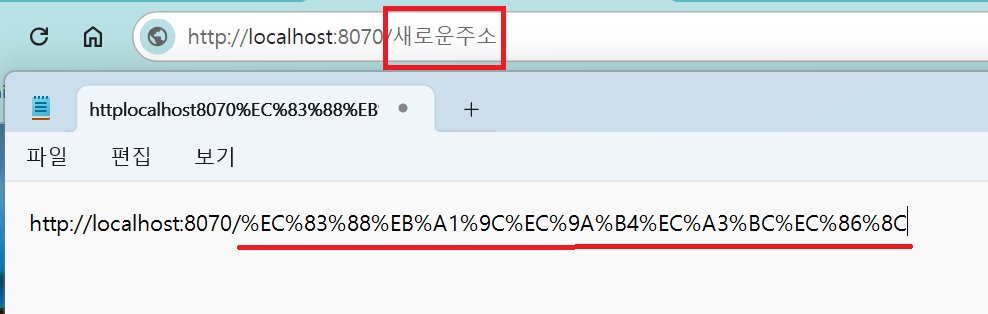

1. # URL Encoding
   브라우저의 주소창에 "http://" 이후에 한글을 치면 브라우저가 한글을 인코딩해서 주소창에 보여줍니다. 주소값을 그대로 복사해서 메모장에 붙여넣으면 인코딩되지 않은 한글값을 알 수 있습니다.   
      

   자바에서 url 인코딩을 해주는 코드는 다음과 같습니다.   

   @Controller
   ```java
   @PostMapping("/register/save")
   public String save(User user, Model m) throws Exception{
      String msg = URLEncoder.encode("id를 잘못 입력했습니다", "utf-8"); //주는 쪽에서는 Encode
      return "redirect:/register/add?msg"+msg;
   }
   ```   
   URLEncoder.encode메소드를 이용하여 한글을 String로 인코딩할 수 있습니다.   
   URLEncoder.encode메소드를 사용하면 예외처리를 해줘야 합니다.   

   /register/add.jsp 파일   
   ```html
      <%@ page import="java.net.URLDecoder" %>

      <div id="msg">${param.msg}</div> <!-- 이렇게 해서 msg가 안보이는 경우 밑에처럼 Decode를 수행 -->
      <div id="msg">${URLDecoder.decode(param.msg, "utf-8")}</div> <!-- 받는 쪽에서는 Decode -->
   ```   
   URLDecoder는 java.net에 있는 패키지라서 import를 해줘야합니다.   

   