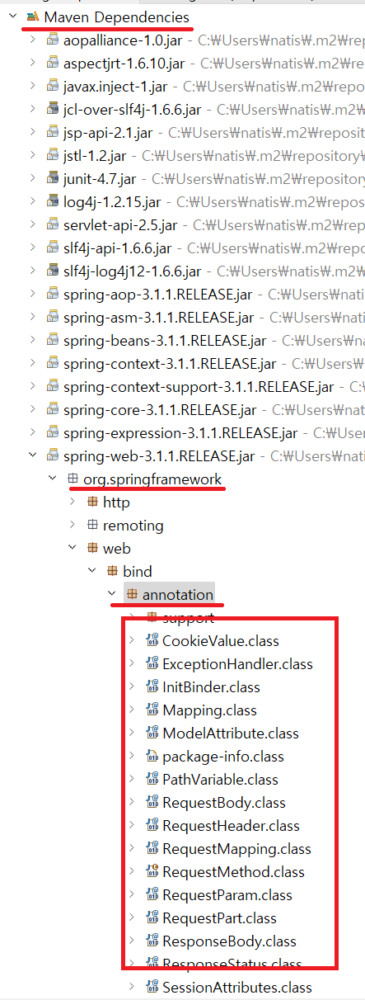

1. # @WebServlet에 빨간줄
   톰캣에 있는 라이브러리를 추가해야 합니다.   
      

1. # 한글 깨짐
      

1. # Spring에서 한글 깨짐 처리

   src - main - webapp - WEB-INF - web.xml파일에 붙여넣습니다.
   ```
      <!-- 한글 변환 필터 시작 -->
      <filter>
         <filter-name>encodingFilter</filter-name>
         <filter-class>org.springframework.web.filter.CharacterEncodingFilter</filter-class>
         <init-param>
            <param-name>encoding</param-name>
            <param-value>UTF-8</param-value>
         </init-param>
         <init-param>
            <param-name>forceEncoding</param-name>
            <param-value>true</param-value>
         </init-param>
      </filter>
      
      <filter-mapping>
         <filter-name>encodingFilter</filter-name>
         <url-pattern>/*</url-pattern>
      </filter-mapping>
      <!-- 한글 변환 필터 끝 -->
   ```   

1. # url을 메모장에 복사했을 때 한글 깨짐

      

1. # pom에러
   pom.xml파일의 가장 첫 줄에 빨간줄이 생긴 경우   
      

   pom.xml 파일 안에 밑에 코드 추가   
   ```css
      <plugin>
         <groupId>org.apache.maven.plugins</groupId>
         <artifactId>maven-war-plugin</artifactId>
         <version>3.3.2</version>
      </plugin>
   ```

1. # PostMapping error 수정
   
      
   다음과 같이 PostMapping 어노테이션에 빨간줄이 가고, 마우스를 올린 메뉴에도 어노테이션을 추가하는 목록이 없다면 스프링 업데이틀 해줘야 합니다. PostMapping가 스프링 4.3버전부터 나오기 시작했기 때문입니다.   

      
   다음과 같이 어노테이션에 GetMapping과 PostMappig 항목이 없는 것을 확인 할 수 있습니다.   

   pox.xml에서 springframework버전을 변경해 줍니다.   

   pom.xml 선택   
   ```cs
      <properties>
         <java-version>11</java-version>
         <org.springframework-version>3.1.1.RELEASE</org.springframework-version>
         <org.aspectj-version>1.6.10</org.aspectj-version>
         <org.slf4j-version>1.6.6</org.slf4j-version>
      </properties>
   ```   
   
   Spring Framework 5.x 버전 이상부터 JDK 11을 공식적으로 지원합니다
   
   ```cs
      <properties>
         <java-version>11</java-version>
         <org.springframework-version>5.2.25.RELEASE</org.springframework-version>
         <org.aspectj-version>1.6.10</org.aspectj-version>
         <org.slf4j-version>1.6.6</org.slf4j-version>
	   </properties>
   ```

   springframework-version을 5.2.25.RELEASE로 변경해 줍니다.   

   프로젝트위에서 오른쪽 마우스를 눌러 Maven메뉴에서 Update Project를 실행해 줍니다.   

   이후 import항목에서 어노테이션을 추가할 수 있습니다.   
      


   Spring Framework 버전 지원 문서입니다.   
   <a href="https://spring.io/projects/spring-framework#learn">https://spring.io/projects/spring-framework#learn</a>
