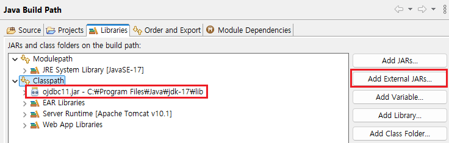
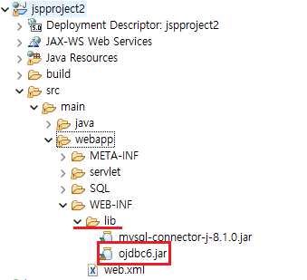

1. # 라이브러리 추가
   라이브러리를 추가하는 방법에는 Build Path로 추가하는 방법과 lib폴더에 추가하는 방법이 있습니다.   

      
   Build Path로 추가

      
   lib폴더에 추가   

   Build Path에서 Libraries에 추가하는 방법을 강력하게 추천합니다.   

   표준적인 방법: 이클립스에서 라이브러리를 관리하는 표준적인 방법입니다.   
   안정성: 빌드 경로에 자동으로 포함되어 컴파일 오류를 줄일 수 있습니다.   
   호환성: 다른 개발 환경이나 팀 개발에서도 문제없이 사용할 수 있습니다.   
   유지보수: 프로젝트 관리가 쉽고 편리합니다.   
   lib 디렉토리에 직접 추가하는 방법은 다음과 같은 경우에 제한적으로 사용할 수 있습니다.   
  
   간단한 개인 프로젝트: 빠르게 테스트하고 싶을 때   
   특별한 이유로 Build Path 설정을 사용할 수 없는 경우   