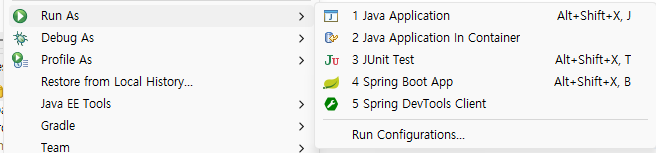
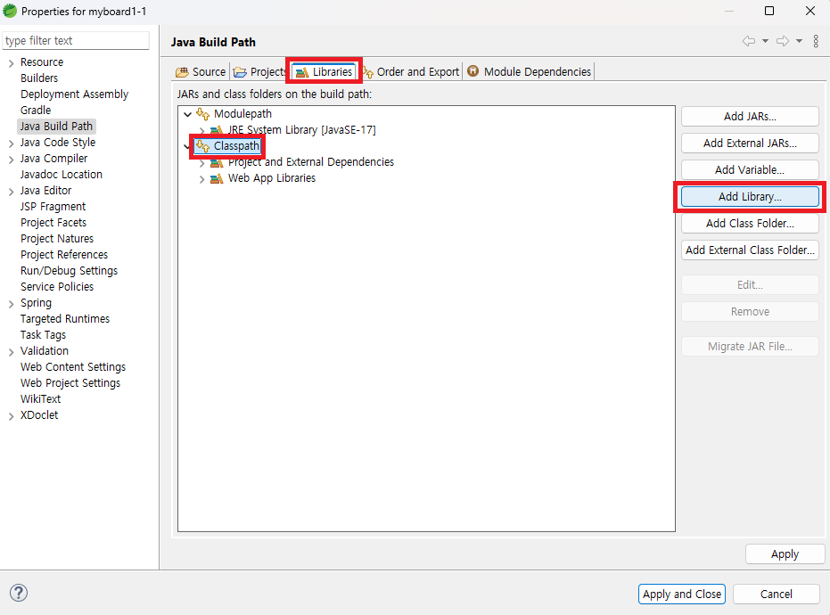
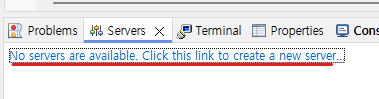
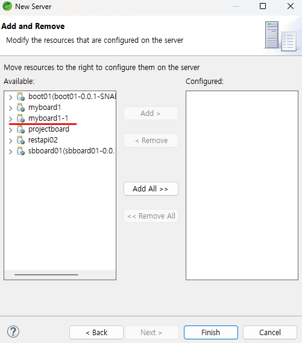

1. # 실행 시 Run on Server가 없는 경우

   실행 시 Run on Server메뉴가 보이지 않는 경우   
      

   프로젝트 위에서 오른쪽 마우스 -> Build Path -> Configure Build Path   

   Libraries -> Classpath -> Add Libarary   
      

   Server Runtime -> Apache Tomcat 선택 -> Apply 후 close   

   __gradle 또는 maven 업데이트__   

   그러면   

      

   서버를 새로 만들 때 목록에 나타남   

      

   Run on Server메뉴가 없는 경우는 서버 추가 목록에도 보이지 않음   
