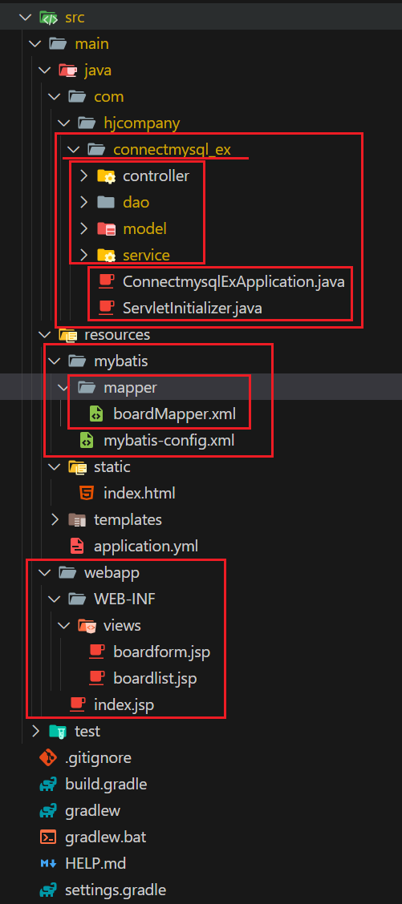

1. # 폴더 위치
    

   1)connectmysql_ex는 프로젝트명으로 이 안에 ServletInitializer.java파일과 ConnectionmysqlExApplication.java파일이 항상 위치해야한다.   
   이 2개의 파일과 같은 위치에 controller, dao, model, service 폴더가 위치해야 controlloer Mapping이 제대로 이루어진다

   2)resources안에 mapper파일이 있어야한다. config.xml파일과 mapper.xml파일은 위치은 편한대로하되 설정을 잘해줘야 한다.
   
   mybatis-config.xml에서 boardMapper.xml파일 참조   
   -mybatis-config.xml-   
   ```xml
      <?xml version="1.0" encoding="UTF-8" ?>
      <!DOCTYPE configuration PUBLIC "-//mybatis.org//DTD Config 3.0//EN" "http://mybatis.org/dtd/mybatis-3-config.dtd">
      <configuration>
      <mappers>
         <mapper resource="boardMapper.xml"/> <!-- mapper파일 참조 -->
      </mappers>
      </configuration>
   ```

   boardMapper.xml에서 dao의 BoardDao.java파일 참조   
   -boardMapper.xml-   
   ```xml
      <?xml version="1.0" encoding="UTF-8" ?>
      <!DOCTYPE mapper PUBLIC "-//mybatis.org//DTD Mapper 3.0//EN"
      "http://mybatis.org/dtd/mybatis-3-mapper.dtd">

      <mapper namespace="com.hjcompany.dao.BoardDao">
      </mapper>
   ```

   -BoardDao.java-   
   ```java
      @Repository
      public class BoardDao {
         
         @Autowired
         private SqlSession session;
      }
   ```

   3)application.yml파일에 설정한대로   
   main/webapp/WEB-INF/views : 여기에 jsp파일 위치   
   main/webapp/index.jsp : index.jsp파일 위치   

   *<spna style="color:red">static폴더 안에 index.html 파일 있어야 됨</span>