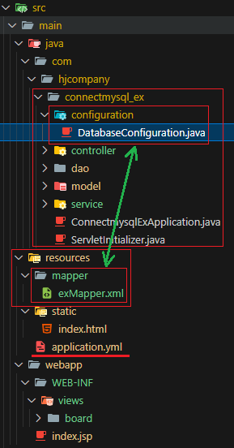
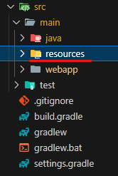
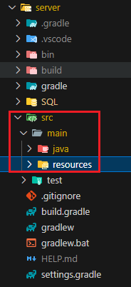

1. # MyBatis setting

1. # 폴더 구조
      

   configuration, controller, dao, model, servie 전부 connectmysql_ex 프로젝트명 폴더 안에 위치해야 한다.   

   configuration의 DatabaseConfiguration.java파일에서 mybatis path와 SqlSessionFactory, SqlSessionTemplate을 생성합니다.   

   DatabaseConfiguration.java와 mapper/exMapper.xml 파일의 관계를 설정해야 합니다.   

1. # DatabaseConfiguration.java

   __DataSource__   
   데이터베이스 연결을 관리하는 객체입니다. 자바 애플리케이션과 데이터베이스 사이의 다리를 놓아주는 역할. DataSource = Connection Pool   

   __SqlSession__   
   실제 sql문장을 실행하는 역할을 합니다.   

   __SqlSessionFactory__   
   SqlSession의 생산 공장으로 SqlSession객체를 생성하는 역할을 합니다.  

   __SqlSessionTemplate__   
   SqlSession을 관리합니다. SqlSession의 생명주기를 관리하고, 트랜잭션을 자동으로 처리해줍니다. 즉, SqlSession을 직접 생성하고 닫는 번거로움 없이 SqlSessionTemplate을 통해 간편하게 SQL을 실행할 수 있습니다.

   -DatabaseConfiguration.java의 전체 소스-   
   ```java
      @Configuration
      public class DatabaseConfiguration {
         
         @Autowired
         private ApplicationContext applicationContext;

         @Bean
         @ConfigurationProperties(prefix = "mybatis.configuration")
         public org.apache.ibatis.session.Configuration mybatisConfig() {
            return new org.apache.ibatis.session.Configuration();
         }

         @Bean
         public SqlSessionFactory sqlSessionFactory(DataSource dataSource) throws Exception {
            
            //sqlSessionFactoryBean 객체 생성
            SqlSessionFactoryBean sqlSessionFactoryBean = new SqlSessionFactoryBean();

            //DataSource 입력, 프레임워크에 의해 주입됨
            sqlSessionFactoryBean.setDataSource(dataSource);

            /*mapper 경로 설정
            classpath는 src/main/resources
            classpath:mapper/*.xml 이든 classpath:/mapper/*.xml이든 상관 X
            */ 
            sqlSessionFactoryBean.setMapperLocations( applicationContext.getResources("classpath:/mapper/*.xml"));

            sqlSessionFactoryBean.setConfiguration(mybatisConfig());

            
            //별명 설정. model에 있는 DTO클래스들을 별명 설정가능
            sqlSessionFactoryBean.setTypeAliasesPackage("com.hjcompany.connectmysql_ex.model");
            
            return sqlSessionFactoryBean.getObject();
         }
         
         @Bean
         public SqlSessionTemplate sqlSessionTemplate(SqlSessionFactory sqlSessionFactory) {

            // 위에서 생성한 sqlSessionFactory을 SqlSessionTemplate에 주입하여 SqlSessionTemplate생성
            return new SqlSessionTemplate(sqlSessionFactory); 
         }
      }
   ```
   <br>
   mapper의 경로를 설정하는 getResources부분   
   ```
      sqlSessionFactoryBean.setMapperLocations( applicationContext.getResources("classpath:/mapper/*.xml"));
   ```
   경로 설정에서 classpath는   
      
   "src/main/resources"까지 입니다.  
   src/main/resources/mapper/*.xml란 뜻으로 classpath:/mapper/*.xml 이든 classpath:mapper/*.xml 이든 상관 없습니다.   
   resources 폴더 안에 mapper폴더 안의 xml확장자를 가진 mapper와 맵핑.  

1. # mapper/exMapper.xml   
   -mapper/exMapper.xml의 전체 소스-   
   ```xml
      <?xml version="1.0" encoding="UTF-8" ?>
   `   <!DOCTYPE mapper PUBLIC "-//mybatis.org//DTD Mapper 3.0//EN"
      "http://mybatis.org/dtd/mybatis-3-mapper.dtd">

      <!-- DAO 클래스와 연결 -->
      <mapper namespace="com.hjcompany.connectmysql_ex.dao.ExDao">
         <select id="getList" resultType="exbean"> 
            SELECT * FROM TABLEEX
         </select>
      </mapper>
   ```
   namepsace에 DAO 전체 경로를 설정해 줍니다.   

   밑에 처럼 resultType으로 exbean이란 별명이 사용 가능한 이유는   
   ```xml
      <select id="getList" resultType="com.hjcompany.connectmysql_ex.model.ExBean"> 
      처럼 사용하지 않고
      <select id="getList" resultType="exbean"> 
      처럼 사용
   ```   
   DatabaseConfiguration.java 파일에서   
   ```java
     sqlSessionFactoryBean.setTypeAliasesPackage("com.hjcompany.connectmysql_ex.model");
   ```
   Alias를 설정해줬고,   

   DAO에 exbean의 별명 사용했기 때문에 가능합니다.   
   dao/ExDao.java   
   ```java
      @Data
      @Alias("exbean") //<-- DatabaseConfiguration.java에서 별명 사용을 선언했기 때문에 Alias사용 가능, 이 별명을 mapper의 xml파일에서 사용
      public class ExBean {
         private int A;
         private String B;
         private int C;
      }
   ```

1. # path
   ```
      mybatis.mapper-locations=/mybatis/mapper/**/**.xml
   ```   
   기본 폴더 설정은 src/main/resources 까지입니다.   
      

   ```
      mybatis.mapper-locations=classpath:/mybatis/mapper/**/**.xml
      mybatis.mapper-locations=classpath:mybatis/mapper/**/**.xml
   ```
   classpath를 추가하게 되면 기본 폴더 경로 com/hjcompany/server 까지가 classpath가 됩니다.   


1. # error
   ```
   java.lang.NullPointerException: Cannot invoke "com.hjcompany.connectmysql_ex.service.EXService.getList()" because "this.exService" is null
   ```
   @Autowired와 @Service 어노테이션 붙이는 부분 보기   


   ```
      org.springframework.beans.factory.BeanCreationException: Error creating bean with name 'sqlSessionFactory' defined in class path resource [org/mybatis/spring/boot/autoconfigure/MybatisAutoConfiguration.class]: Failed to instantiate [org.apache.ibatis.session.SqlSessionFactory]: Factory method 'sqlSessionFactory' threw exception with message: Failed to parse mapping resource: 'file [C:\khj\SpringBootEx\react-context-jwt-security\server\build\resources\main\mybatis\mapper\UserMapper.xml]'
   ```   
   application.properties의 mapper 경로 설정 오류   

   