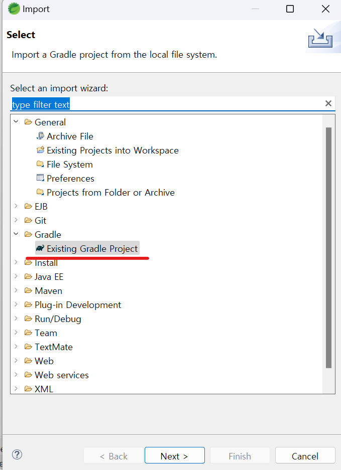

1. # STS4에서 Clone하기

   깃 클론 -> Gradle로 import하기   

   Clone a Git repostitory에 github 주소 넣고 clone하기   
      

   Clone submodules 체크 후 clone 완료   
      

   Project Explorer의 빈 공간에서 마우스 오른쪽 -> import 선택   
      

   Gradle -> Existing Gradle Project 선택   
      

   사용자 폴더에 있는 git폴더에 github에서 다운받은 프로젝트 폴더 선택   
      
   경로 : C:\Users\natis\git   

   next 클릭   
      

   next 클릭   
      

   finish 클릭   
      
   

