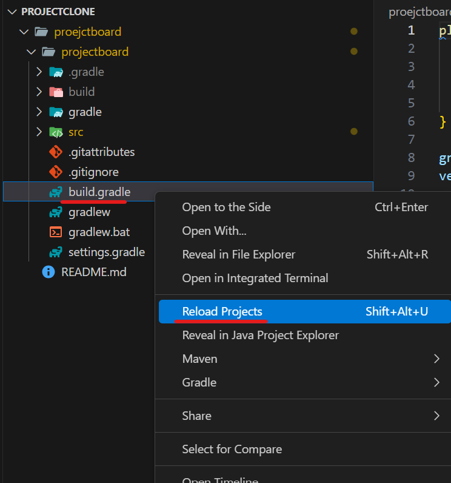

1. # VSCode에서 Clone하기

   사실상 clone만으로 모든 환경 설정이 끝난다. 마이크로소프트가 괜히 마이크로소프트가 아님   

   프로젝트를 저장할 폴더 생성 -> 터미널 열고
   ```
      git clone https://github.com/khj20231204/proejctboard.git
   ```

   build.gradle파일에서 Reload Projects 선택   
      

   -- END --   

   오라클 인재보다 마이크로소프트 인재가 휠씬 뛰어나다   
