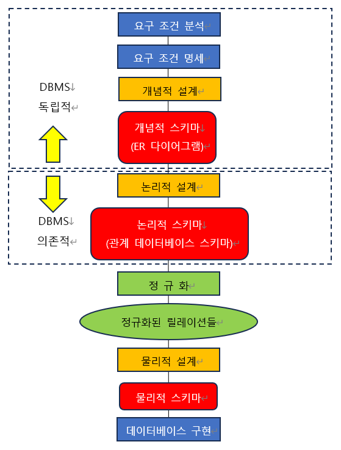
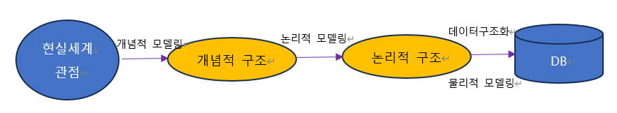
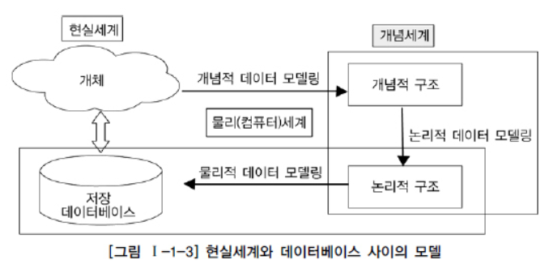
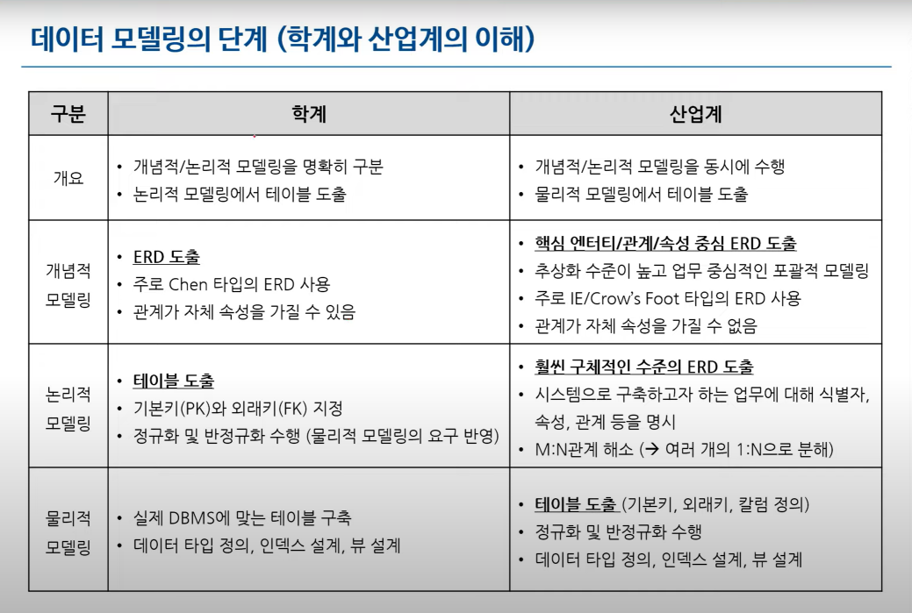
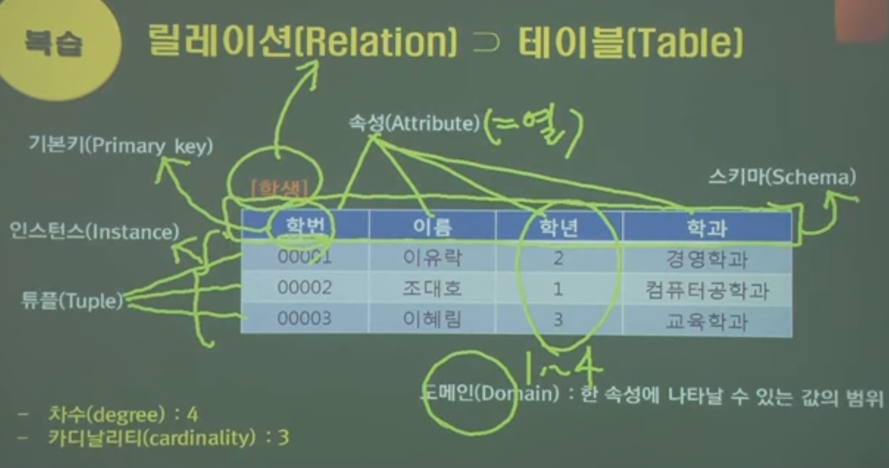

1. # 모델링이란?
  
   복잡한 현실세계를 추상화, 단순화하여 일정한 표기법에 의해 명확하게 표현하는 것   
   - 추상화(모형화), 단순화, 명확화   
   -구체화, 복잡화, 일반화 (X)    
 
   - 모델 : 현실 세계의 추상화된 반영   
   -ER모델링을 통해서 ER모델이 등장   
   -객체지향모델링을 통해서 객체지향 모델이 등장   

1. # 모델링의 관점
   - 데이터 관점(What)   
   -데이터와 데이터 간 관계, 업무와 데이터 간 관계를 모델링   
   -데이터에 접근하는 방법(How), 사람(Who)과는 무관   
    
   - 프로세스 관점(How)   
   -업무가 실제로 하고 있는 일 또는 해야할 일을 모델링   
    
   - 데이터와 프로세스의 상관 관점(Interaction)   
   -업무 처리 방법에 따라 데이터가 받는 영향을 모델링   

<!-- 1. # 데이터 모델링 과정
    -->
      
1. # 데이터 모델링의 3단계

        

    - 개념적 설계 : 현실 세계에 대한 인식을 __추상적 개념으로 표현__ 하는 과정   
    - 논리적 설계 : 현실 세계에서 발생하는 데이터 형태를 __컴퓨터가 이해하고 처리할 수 있는 논리적 데이터 구조로 변환__ 시키는 과정   
    - 물리적 설계 : 데이터베이스 파일에 대한 특정한 __저장 구조와 접근 경로를 결정__ 하는 과정

    현실세계에서 개념적 데이터 모델링을 수행하면 개념적 구조가 나오고, 개념적 구조에서 논리적 데이터 모델링을 수행하면 논리적 구조가 나오고, 논리적 구조에서 물리적 데이터 모델링을 수행하면 물리적 구조인 데이터베이스가 도출 됩니다.   
     

       

    개념적 구조 + 논리적 구조 = 개념세계   
    논리적 구조 + 물리적 구조 = 물리(컴퓨터)세계   

       
       

1. # 데이터 모델링의 3가지 구성 요소
   - entity(개체) : 업무와 관련된 어떤 것   
   - Attribute(속성) : 어떤 것에 갖는 성격   
   - Relationship(관계) : 어떤 것 간의 관계   

      

   *튜행카, 속애열차   
   
   테이블보다 큰 개념의 릴레이션(Relation)은 DBMS의 "<strong>관계(relation)</strong>형 데이터베이스 매니지먼트 시스템"에서의 관계이고, 모델링 3요소의 <strong>관계(relationship)</strong>는 Rleation<strong>ship</strong>으로 다른 개체와의 연결을 뜻 합니다.   

1. # 좋은 데이터 모델

   |중요성| 설명|
   |:----:|:----|
   |완전성 (Completeness)|업무에서 필요로 하는 모든 데이터가 데이터 모델에 정의되어야 함|
   |중복배제 (Non-Redundancy)|동일한 사실은 반드시 한 번만 기록하여야 함|
   |업무규칙 (Busniness Rules)|업무규칙이 데이터 모델에 표현되어야 함 (예: 사원에는 정규직, 임시직이 있으며 정규직만이 호봉 정보를 가짐)|
   |데이터 재사용 (Data Reusability)|회사 전체 관점에서 공통 데이터를 도출하고, 이를 전 영역에서 사용할 수 있도록 설계해야 함|
   |통합성 (Integration)|동일한 데이터는 조직의 전체에서 한 번만 정의되고, 이를 여러 다른 영역에서 참조, 활용해야 함|   

   완전성, 업무규칙 : 데이터는 빠짐없이 있어야 한다.   
   중복배제, 데이터 재사용, 통합성 : 데이터는 중복이 없어야한다.   
