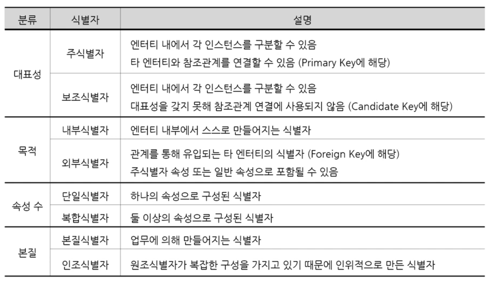
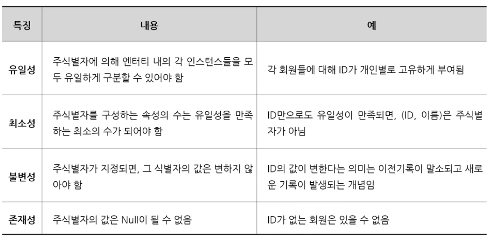
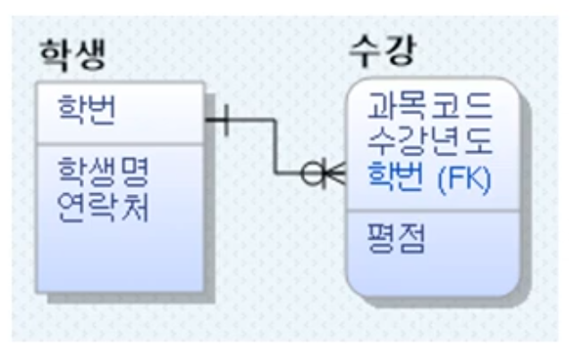
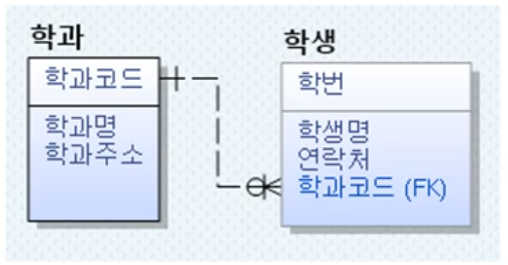
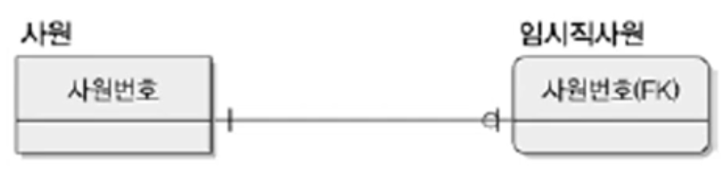
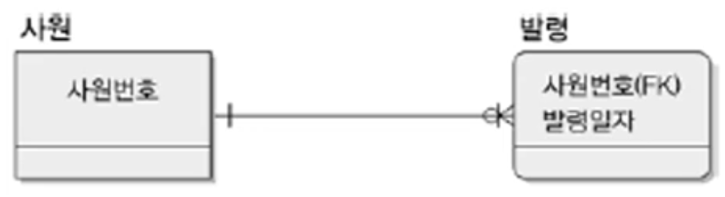
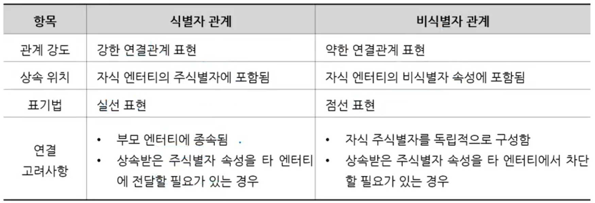

1. # 식별자의 분류   
      
   -주식별자이면서 내부식별자이면서 단일식별자, 본질식별자가 가장 일반적인 경우입니다.   
   -식별자(개념적 모델링의 ER다이어그램에서 사용한 용어) = 엔터티의 식별자(논리모델에서 테이블을 만든 이후의 용어) = 주식별자(실무:개념+논리) = Primary Key   
   -대표성은 설계자가 고릅니다.      
   예)학번, 주민번호, 이름, 이메일   
   주민번호은 개인정보네.. 이메일은 너무 기네.. 이름은 또 있을까봐 불안하네.. 그래 학번으로 하자!   
   이 때 학번이 주식별자가 되고, 주식별자가 될 수 있는데 선택되지 않은 주민번호, 이름, 이메일이 보조식별자가 됩니다.   
   -외부식별자 = Foreign Key. 다른 테이블의 PK가 온 경우로 FK가 주식별자와 일반식별자로 간 모든 경우에 해당      
   -복합식별자 : 피파게임 시 등번호와 팀. 2개가 묶여야 하나의 PK가 됩니다.   
   -인조식별자 : 설계 속성(설계과정에서 테이블 값을 식별하기 위해 설계자가 만든 속성)   
   앞으로 식별자라하면 주식별자(PK)가 됩니다   

1. # 식별자의 특징   
      
   ID를 바꾼 경우는 ID만 변경한 경우가 아니라 ID에 해당하는 모든 데이터를 삭제 후 새로 생성한 경우입니다. ID는 어떤 경우에도 변경되면 안 됩니다.   

1. # 식별자 도출 기준   
   -유일성을 갖는 속성 중 해당 업무에서 자주 이용되는 속성을 지정   
   -명칭,내역 등과 같이 이름으로 기술되는 것들은 가능하면 주식별자로 지정하지 않음   
   -복합식별자를 구성할 경우 너무 많은 속성이 포함되지 않아야 함   

1. # 식별자와 비식별자 관계   

   - 식별자 관계   
   -부모 엔터티 : 학생, 자식 엔터티 : 수강   
   -부모 엔터티(학번)가 자식 엔터티의 주식별자(학번FK)에 포함된 경우 → 식별자 관계   
      
   학생 테이블과 수강 테이블을 연관짓기 위해서 학번을 수강 테이블로 가져올 때 주식별자로 가져오나, 비식별자로 가져오나의 문제입니다. 현재 수강 테이블에 있는 과목코드와 수강년도 만으로는 인스턴스를 결정짓기 힘들기 때문에 학번을 주식별자 위치에 놓습니다.   
   __*식별자 관계 : 실선으로 표시__   

   - 비식별자 관계
   -부모 엔터티 : 학과, 자식 엔터티: 학생   
   -부모 엔터티(학과)가 자식 엔터티의 일반속성(학과코드FK)으로 포함된 경우 → 비식별자 관계   
      
   학과 테이블과 학생 테이블을 연관짓기 위해서 학과코드를 학생 테이블로 가져올 때 주식별자로 가져오나, 비식별자로 가져오나의 문제입니다. 학과코드가 없어도 학생 테이블의 학번만으로 인스턴스를 구별할 수 있기 때문에 비식별자의 위치로 학과코드를 가져옵니다.   
   __*비식별자 관계 : 점선으로 표시__   

1. # 식별자 관계(Identifying Relationship)   
   
   - 부모의 주식별자가 자식엔터티의 주식별자로 상속   

   - 부모 엔터티가 생성되어야 자식 엔터티가 생성될 수 있음   
   -해당 속성이 Not Null 이므로 → weak entity에 해당됨   
   *weak entity란? 자기 혼자만은 식별자를 만들 수 없고 주변의 다른 엔터티가 있어야 주식별자가 되는 경우 → 주식별자에 FK가 하나라도 있으면 weak   
   *strong entity란? 자기 혼자만으로 주식별자가 만들어지는 경우   

   - 자식 엔터티의 주식별자가 해당 속성만으로 구성되는 경우 → 1:1 관계   
      

   - 자식 엔터티의 주식별자가 해당 속성 +a로 구성되는 경우 → 1:N 관계   
      

1. # 비식별자 관계(Non-Identifying Relationship)   
   
   - 부모의 주식별자가 자식엔터티의 비식별자 속성으로 상속   

   - 다음의 경우 비식별자 관계가 생성   

   - 부모 엔터티와 자식 엔터티의 관계가 약한 경우 → 부모 엔터티 없이 자식 엔터티가 생성 가능   
   : __관계가 약하다__ - __강한 엔터티__   
   : __관계가 강하다__ - __약한 엔터티__   

   - 자식 엔터티의 주식별자로 사용해도 되지만, 일반 속성으로 두는 것이 유리할 때 → 자식 엔터티의 독립적인 주식별자 설정이 필요한 경우 등

1. # 비식별자 관계를 고려해야 하는 경우

   - 부모 엔터티와 자식 엔터티의 관계의 강도가 약한 경우   

   - 자식 엔터티의 독립적인 주식별자 설정이 필요한 경우   

   - PK속성의 단순화가 필요한 경우   
   -SQL복잡도 증가로 인해 개발 생산성이 저하되는 현상 방지   

         
