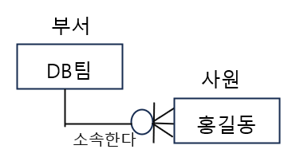
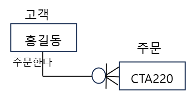
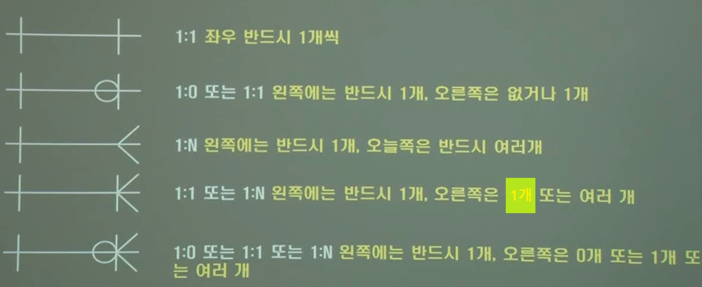
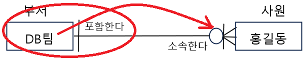
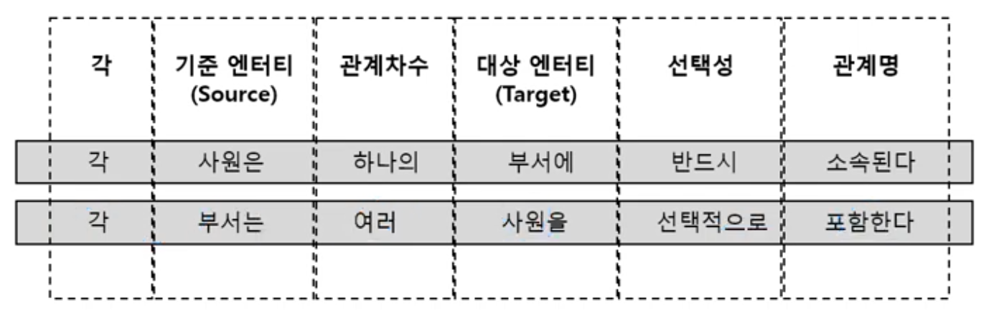
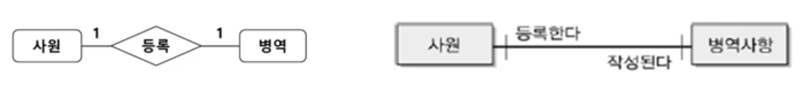
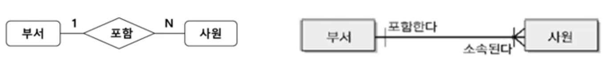
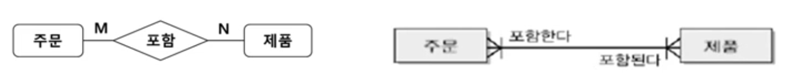
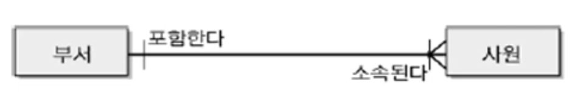
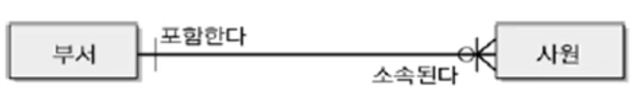

1. # 관계와 페어링

   - 관계   
   &nbsp;&nbsp;-__엔터티 간__ 논리적 연관성   

   - 페어링   
   &nbsp;&nbsp;-엔터티 내 __인스턴스 간__ 개별적 연관성   

   - 페어링의 집합 → 관계   
   &nbsp;&nbsp;-cf)인스턴스의 집합을 논리적으로 표현 → 엔터티   

   최초의 ERD(Chen모델)에서 관계는 속성을 가질 수 있었으나, 최근 ERD(IE모델)에서 관계는 속성을 갖지 않음   

1. # 관계의 분류

   -존재에 의한 관계 vs 행위에 의한 관계   

   존재에 의한 관계   
      
   부서는 따로 존재가능하고, 사원 따로 존재가능한데 굳이 부서와 사원의 관계도 만들 수 있습니다.   

   행위에 의한 관계 - __사건 엔터티__   
      
   주문은 고객이 합니다. 고객이 없으면 주문도 있을 수 없습니다. 고객 엔터티가 생기고나고 주문 엔터티가 만들어집니다.   

   ☞ 사건 엔터티는 행위에 의한 관계로부터 생성됩니다.   

1. # 관계의 표기법

   |기호|의미|   
   |:---:|:---:|
   |  `|` | 필수(Mandatory) |
   | Ｏ | 선택(Optional) |
   | ＜ | 다중(Multiple) |   

   표현법   
      
   [출처 https://www.youtube.com/watch?v=9QMAjEIz6VM]   

   - 관계명   
      -각 관계는 두 방향의 관계명을 가짐   
      -명명 규칙   

      |바람직한 관계명|바람직하지 않은 관계명|
      |:--------:|:----------:|
      | 주문한다 소속된다 출석을 한다|연관성이 있다 관계가 있다 관련있다 신청했다 출석했다|   
 
   - 관계 읽기   
       
    부서는 __포함한다__ 사원을 : 엔터티 옆에 있는 관계를 읽음.   
    부서는 __0명에서 다수__ 의 사원을 : 반대편에 붙은 마크를 읽음.   
       
   
   - 관계 차수(Degree)   
      -각 관계에 참여할 수 있는 인스턴스의 수   
      -1:N, 1:1, M:N 등이 존재함   
      -학계에서의 대응수(Cardinality)에 해당하는 개념   
      &nbsp;&nbsp;&nbsp;학계에서 차수(Degree)는 unary, binary, ternary, N-ary를 의미함   
 
         
      1명의 사원이 1개의 병역을 등록한다.   
      1개의 병역이 1개의 사원을 작성한다.   
      
         
      1개의 부서가 여러명의 사원을 포함한다.   
      1명의 사원은 1개의 부서에만 소속된다.   

         
      1개의 주문에 여러개의 제품이 포함된다.   
      1개의 제품이 여러개의 주문에 포함된다.   

   - 관계의 표기법   
      -관계 선택성(Optionality)   
      필수참여(Mandatory Membership)   
         
      부서는 사원을 포함하는데 반드시 1명 이상의 사원이여야 한다.   
      1명의 사원은 반드시 1개의 부서에 소속된다   

      선택참여(Optional Membership)   
         
      O가 추가됨.   
      부서는 사원을 포함하는데 0명이 올 수도 있다.   
      1명의 사원은 반드시 1개의 부소에 소속된다.   

      *만약 관계의 양쪽이 Optional(양쪽에 O가 있는 경우), 해당 관계는 잘못 설정되었을 가능성이 큼   

