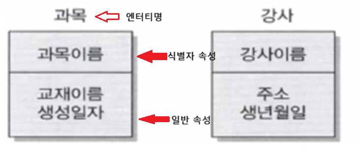

1. # 속성의 정의
   - 사물의 특징 또는 본질적인 성질   
   &nbsp;&nbsp;&nbsp;-속성이 없다면 실체를 생각할 수 없음   
   - 인스턴스에 대해 의미상 더 이상 분리되지 않는 최소의 데이터 단위   
   예)학생이란 엔터티가 있을 때 학생의 속성으로 "신상정보"이런 값은 속성이 되지 못 합니다. 신상정보는 다시 나이, 학년,.. 이렇게 더 작은 단위로 쪼개질 수 있기 때문에 더 이상 분리될 수 없는 나이, 학년, 생일,.. 이란 값들이 속성이 됩니다.   
   - 엔터티에 속한 인스턴스들의 성격을 구체적으로 나타냄   
   &nbsp;&nbsp;&nbsp;-인스턴스 각각을 구분할 수 있는 기준 파악 → 이름 부여 → 속성화   
   - 엔터티, 인스턴스, 속성 속성값을 대응   
   &nbsp;&nbsp;&nbsp;-각 엔터티는 둘 이상의 인스턴스를 가짐   
   &nbsp;&nbsp;&nbsp;-각 엔터티는 둘 이상의 속성을 가짐   
   &nbsp;&nbsp;&nbsp;-각 속성은 하나의 속성값을 가짐 : 예)나이가 26이면서 28. 이럴 수 없습니다.   

   *속성은 엔터티의 특징을 나타내는 최소의 데이터 단위   

1. # 속성의 특징
   - 해당 업무에서 필요하고 관리해야 하는 정보  
   - 모든 속성은 주식별자(PK)에 함수적으로 종속되어야 함   
   예)PK를 학번이라 할 때 하나의 학번을 선택하면 레코드 하나가 결정되고 그 레코드에 해당하는 모든 속성도 결정이 됩니다.   
   - 하나의 속성은 한 개의 값만을 가져야 함   
   &nbsp;&nbsp;&nbsp;-속성이 다중값을 가질 경우 해당 속성을 별도의 엔터티로 분리함   

1. # 속성의 명명  
   - 현업에서 사용하는 이름을 부여   
   - 약어 사용은 가급적 금지   
   - 서술식 속성명을 피하고 명사형 속성명을 사용   
   - 수식어와 소유격을 피함   
   - 속성의 이름은 가급적 전체 모델에서 유일하게 정의   
   &nbsp;&nbsp;&nbsp;-예)교수테이블에서 이름, 학생테이블에서 이름이 있을 경우 사용은 해도 되는데 가급적 "이름"이란 속성을 만들지 말라는 뜻으로 교수테이블에서 이름은 "교수명"으로 학생 테이블에서 이름은 "학생명"으로 유일한 값으로 합니다.   

1. # 속성의 표기
   -엔터티 내에 이름을 기재   
   네모를 그리고 가운데 선을 긋습니다.   
      
   최상단에 엔터티이름을 적고, 선 위엔 식별자가 될 수 있는 중요 속성, 아래엔 일반 속성을 적습니다.   

1. # 도메인(Domain)
   - 각 속성이 가질 수 있는 값의 범위   
   &nbsp;&nbsp;&nbsp;-예) 학점: 0.0 ~ 4.5 사이의 실수   
   &nbsp;&nbsp;&nbsp;-예) 주소 : 길이가 20자리 이내인 문자열   
   - 속성에 대한 데이터 타입과 크기, 그리고 제약사항을 지정하는 개념   

1. # 속성의 분류

   - 속성의 특성에 따른 분류   
   1)기본 속성(Basic Attribute)   
   -가장 일반적인 속성으로, 원래의 업무로부터 유래한 속성   
   2)설계 속성(Designed Attribute) - 구분이 애매함   
   -데이터 모델링을 위해 새로 만든 속성(주로 코드)   
   예) 같은 데이터가 많은 경우 이를 구별하기 위해 두는 주문번호, 일련번호,.. 같은 것   
   3)파생 속성(Derived Attribute)   
   -다른 속성들로부터 유도된 속성(주로 통계 관련)   
   -가급적 적게 정의하는 것이 좋음   
   
   |기본(BASIC)|설계(DESIGNED)-1:1치환| 파생(DERIVED)-계산값|
   |----------|------------------|-----------------------|
   |제품이름 제조년월 제조원가 |약품용기코드|평균값, 전체용기 수, 총 금액|   

   *특기설파

   - 엔터티 구성 방식에 따른 분류   
   -PK(Primary Key) 속성 : 엔터티의 인스턴스를 구별할 수 있는 속성   
   -FK(Foreign Key) 속성 : 타 엔터티의 PK를 참조하는 속성   
   -일반 속성 : 그 외의 속성   

   *구PF일

   - 분리 가능성에 따른 분류   
   -복합 속성(Composite Attribute) vs 단순 속성(Simple Attribute)   
   복합속성은 분해되어 배치되었다고 가정.   
   복합 속성 : 이름-first Name, middle Name, last Name   
   주소 : 시,군,구  / 동,면,번지   
   → 복합 속성은 분해하여 단일 속성으로 만듭니다.   
 
   - 속성값의 수에 따른 분류   
   -다중값 속성(Multi-Valued Attribute) vs 단일값 속성(Single -Value)   
   단일값 속성 : 혈액형, 나이, 학번, 가격, ...   
   다중값 속성 : 취미-축구,농구,배구 / 좋아하는 색-노랑, 빨강, 파랑,...   
   →다중값 속성은 테이블을 새로 만듭니다. 넘어온 데이터는 단일값만 있다고 가정.   
   →테이블이 만들어진 거면 단순 속성, 단일값 속성이 됩니다.   

