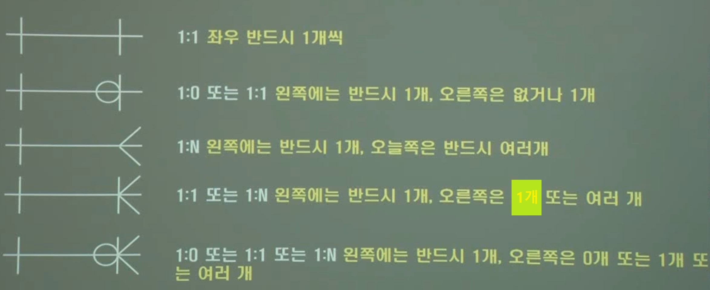

1. # 데이터 모델 표기법
      
   [출처 https://www.youtube.com/watch?v=59BFOn9zyCQ&t=1609s]   
      
   Chen방식에선 릴레이션이 "소속한다"라고 명시적으로 표시되어 있지만, IE/Crow's Foot에선 릴레이션이 선으로 표시.   
   1) __하나의__ 부서는 포함한다 __0명 또는 여러명의__ 직원을   
   2) __한명의__ 직원은 소속된다 __1개의__ 부서에   
   
1. # ERD(Entity Realtionship Diagram)
   Peter Chen의 ER다이어그램   
      
   [출처 https://itwiki.kr/]   

   erd로 나타낸 학생과 과목의 도형을 개체(엔터티)라고 부릅니다.   
      

   James Martin의 Information Engineering   
      
   [출처 https://lipcoder.tistory.com/330]

   |기호|의미|   
   |:---:|:---:|
   |  `|` | 필수(Mandatory) |
   | Ｏ | 선택(Optional) |
   | ＜ | 다중(Multiple) |

   표현법   
      
   [출처 https://www.youtube.com/watch?v=9QMAjEIz6VM]

1. # 교차엔티티
      

   학생과 과목은 N:N의 관계이기 때문에 중간에 등록이란 데이블을 두고 1:N의 관계를 만드는데 이러한 테이블을 교차엔티티라합니다.   

      

   -N:N관계의 경우 관계를 별도의 테이블(교차 엔티티)로 구성해야 됩니다.   
   -1:1이나 1:N인 경우 외래키 추가로 해결합니다.
    
   학번은 학생테이블에선 PK이고 등록테이블에선 FK입니다.   
   과목코드는 과목테이블에선 PK이고 등록테이블에선 FK입니다.   
   학번과 과목코드가 합쳐저서 하나의 PK가 됩니다.   

1. # ERD 작성 순서

   1) 엔터티를 그린 후 적절하게 배치   
      /- 가급적 선이 꼬이지 않게 배치   
      /- 왼쪽 -> 오른쪽, 위 -> 아래 순으로 읽어나가기 편하도록 배치   

   2) 엔터티간 관계 설정   
      /- 식별자 관계를 우선 설정함   
      &nbsp;&nbsp;&nbsp;&nbsp;식별자 관계 : 부모로부터 상속받은 FK가 자식의 PK의 일부가 되는 관계   
      /- 가급적 Cycle 관계도 발생하지 않아야 함   

   3) 관계명 기술(양 방향)   
      "□포함한다 -|------|-소속된다□" 처럼 한쪽은 "포함한다" 다른 쪽은 "소속된다" 양쪽 방향에서 입력   
      /- 현재형 사용   
      &nbsp;&nbsp;&nbsp;예)등록한다(O) 등록했다(X), 포함한다(O) 포함된다(X)   
      /- 지나치게 포괄적인 단어는 지양   
      &nbsp;&nbsp;&nbsp;예)사용한다, 조회한다, 관계된다.. 등 포괄적인 단어보단   
      &nbsp;&nbsp;&nbsp;&nbsp;신청한다, 포함한다.. 등 구체적인 단어 사용   
      /- 실제 프로젝트에서는 크게 고려하지 않음   

   3) 관계차수와 선택성 표시    

         

      → 학계   
      대응수 : cardinarity   
      차수 : degree   
      → 실무   
      차수 : degree, cardinarity   

      *튜행카, 속애열차