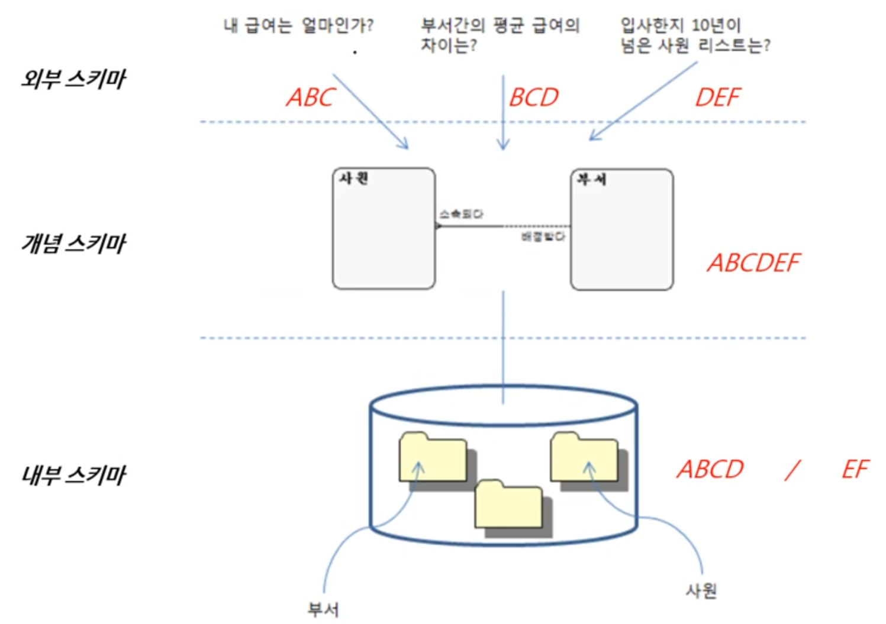
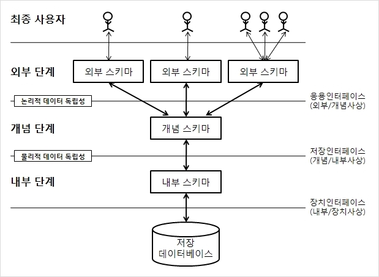
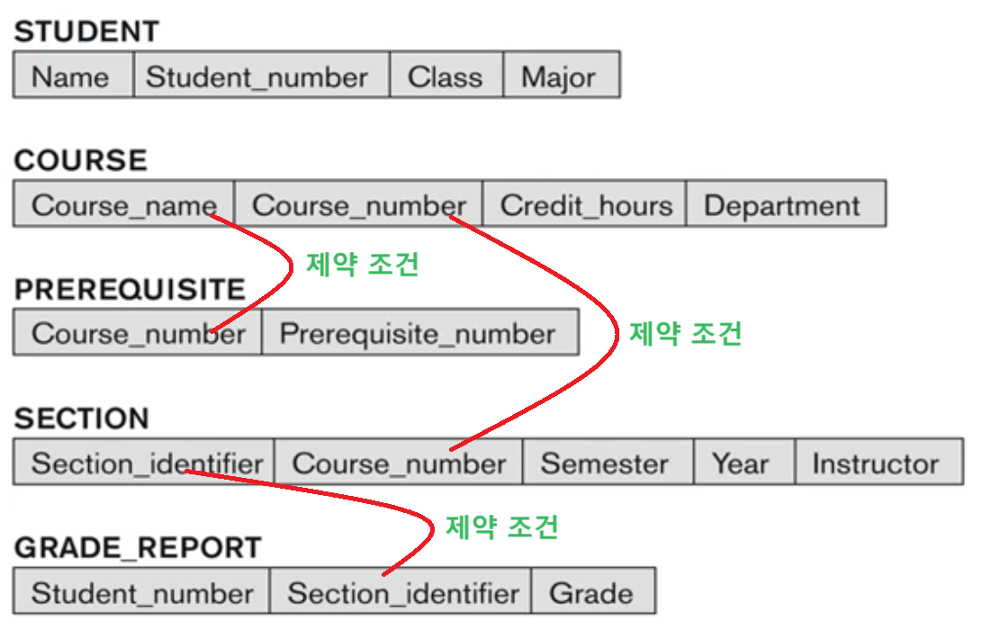
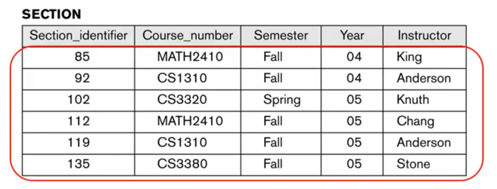
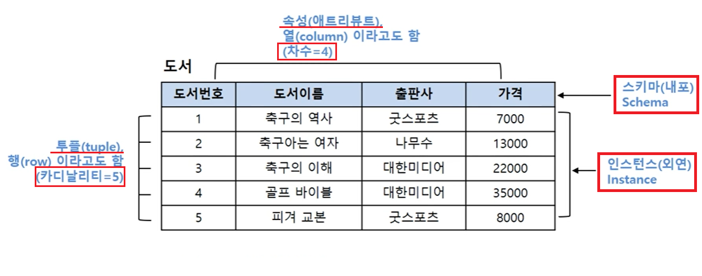

1. # 데이터 독립성
    응용 프로그램과 데이터를 따로 독립적으로 저장 관리하는 기술입니다. 데이터베이스가 없던 예전 파일 시스템에선 데이터가 응용 프로그램 내부에 바로 저장이 되어 있있기 때문에 데이터가 변경되면 응용 프로그램의 테이블도 변경을 해줘야했습니다. 즉 응용 프로그램이 데이터와 상당히 밀접한 관계를 맺은 환경이였습니다. 이후 데이터베이스에서는 응용 프로그램과 데이터의 상호 독립성이 핵심이론이됩니다. 프로그램과 데이터의 종속적인 관계를 없애고 데이터 따로 프로그램 따로 다루게 하는 것이 데이터베이스를 만든 이유였고 데이터와 응용 프로그램의 관점을 3단계로 나누어 정리한 것이 데이터베이스 3단계 구조입니다.   
 
1. # 스키마(Schema)

   *데이터베이스란?   
   데이터를 모아 놓은 저장소, 흔히 '디비(DB)'라고 합니다.   
   컴퓨터에 전자적으로 저장되는 구조화된 정보 또는 데이터의 조직화된 모음   

   스키마 - 개요, 윤곽    
   *실무에서 스키마라고 하면 테이블, 테이블과 관계, 개체, 속성, 인덱스 등 전체적인 구성을 말합니다.   

   1) 스키마의 정의   
   :데이터베이스의 구조와 제약조건에 대한 명세를 기술한 것(설계도)   
   /- 데이터베이스를 구성하는 데이터 객체, 성질, 관계 그리고 데이터의 조작 또는 값들이 갖는 제약조건에 관한 정의를 총칭하는 용어  
   /- 데이터 사전(=시스템 카탈로그)에 저장 : 데이터베이스에 저장되어 있는 모든 데이터 개체들에 대한 정보를 유지, 관리하는 시스템   
   /- 데이터베이스의 구조(개체, 속성, 관계)에 대한 정의   
   /- 다른 이름으로 메타데이터(데이터의 데이터)라고 함

   2)심리학에서의 스키마
   어떤 유형의 정보를 선택적으로 수용하고 바라보게 하는 심리 메커니즘   
   예)90년대 패션을 90년대 보았을 땐 멋져보인다. 하지만 90년대 패션을 2010년에 보았을 땐 촌스러워보인다. 같인 옷이라도 보는 __관점__ 에 따라 다르게 보인다

1. # 독립성과 스키마
   데이터베이스 독립성이란 응용 프로그램과 데이터의 독립성을 말합니다. 이때 외부 이용자(사용자 ≒ 응용 프로그램)의 관점을 통해 데이터를 바라볼 때의 시점을 스키마라 하고 외부 이용자가 데이터를 어떤 관점으로 바로 보는가에 따라 외부 스키마, 개념 스키마, 내부 스키마로 나누어 집니다.   

1. # 데이터베이스 3단계 구조
   
      

   외부 스키마 : 응용 프로그램 관점에 따른 필요한 데이터가 ABC, BCD, DEF가 있음(ABC, BCD, DEF가 각각의 하나의 관점)   
   개념 스키마 : 필요한 관점에 따른 데이터를 다 모아놓은 것 ABCDEF(각각인 ABC, BCD, DEF의 모든 사용자의 관점을 통합)   
   내부 스키마 : 필요한 ABCDEF 데이터를 어떻게 실제 물리적으로 저장할 것인가 - ABCD 와 DEF로 나눠서 저장   

   __스키마 : 보는 관점의 차이__   

   1) 외부 스키마(= 서브 스키마 = 사용자 뷰)   
   /- 사용자(응용 프로그램)가 보는 관점(사용자에 따라 다름, 여러개 존재)   

   2) 개념 스키마(= 스키마 = 전체적인 뷰, 범기관적, 총괄적 입장)   
   /- 모든 사용자의 관점을 통합한 스키마   
   /- DB에 저장되는 데이터와 그들 간의 관계를 표현 ▷ __데이터 모델링__   
  
   3) 내부 스키마(= 실제 DATA를 저장)   
   /- DB 전체적인 물리적 구조   
   /- DBA 관리   

   외부 스키마와 개념 스키마 사이에 독립을 보장하는 것이 논리적 데이터 독립성.   
   개념 스키마와 내부 스키마 사이에 독립을 보장하는 것이 물리적 데이터 독립성.   

   cf.   
   데이터 모델링 과정 : 개념적 모델링, 논리적 모델링, 물리적 모델링   
   데이터베이스 3단계 구조 : 외부 스키마, 개념 스키마, 내부 스키마   
   
   *데이터 모델링은 통합 관점의 개념 스키마를 만들어 가는 과정   
 
 1. # 데이터의 독립성과 종속성
 
   - 데이터 종속성   
   -응용 프로그램에 대한 데이터의 종속성   
   -예) 파일 시스템   
      응용 프로그램과 데이터가 상호 의존적.     
      데이터를 저장한 파일 구조가 변경되면 이에 대응되는 응용 프로그램도 변경되어야 함.   
  
   - 데이터 독립성   
   데이터가 응용 프로그램 외부에 따로 저장되어 독립적.   
   -데이터 구조가 변경되어도 응용 프로그램이 변경될 필요가 없음   
   -논리적 독립성 + 물리적 독립성으로 실현됨   

   - 데이터 독립성이 유지되지 않으면?   
   -데이터의 중복성과 복잡도 증가   
   -요구사항 대응 난이도 증가 → 데이터 유지보수 비용 증가   
   
 1. # 데이터베에스 3단계 구조와 독립성

   -    

   - 논리적 독립성   
   /- 논리적 사상(외부적/개념적 사상)을 통해 논리적 독립성이 보장됨   
   /- 내용   
   &nbsp;&nbsp;&nbsp;개념 스키마가 변경되어도 외부 스키마에서는 영향을 미치지 않음.   
   &nbsp;&nbsp;&nbsp;논리적 구조가 변경되어도 응용 프로그램에는 영향을 미치지 않음.   
   *사상 : 대응(mapping)   

   - 물리적 독립성   
   /- 물리적 사상(개념적/내부적 사상)을 통해 물리적 독립성이 보장됨   
   /- 내용   
   &nbsp;&nbsp;&nbsp;내부 스키마가 변경되어도 외부/개념 스키마는 영향을 받지 않음.   
   &nbsp;&nbsp;&nbsp;저장장치의 구조변경은 응용프로그램과 개념 스키마에 영향을 주지 않음.   

1. # Schema와 Instance
    
    1) 데이터베이스 스키마(Schema)   
      /- 데이터 모델링의 대상  
      /- 데이터베이스 구조, 데이터 타입, 그리고 제약조건에 대한 명세   
      /- 데이터베이스 설계 단계에서 명시되며, 자주 변경되지 않음   

         

   2) 데이터베이스 인스턴스(Instance)   
      /- 특정 시점에 데이터베이스에 실제로 저장되어 있는 데이터의 값   

      
   
1. # 정리

      

   *튜행카, 속애열차   
