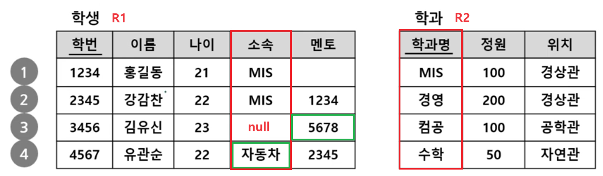
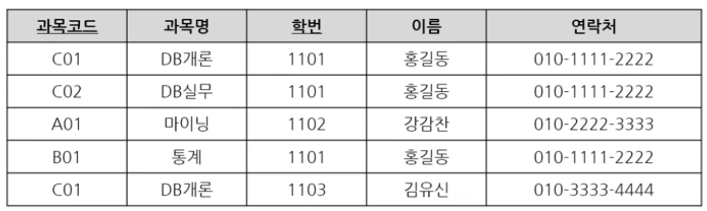

1. # 성능 데이터 모델링 진행 순서
   - 정규화를 정확하게 수행   
      -주요 관심사별로 테이블을 분산시킴   
   - 데이터베이스 용량산정 수행   
      -각 엔터티에 어느 정도의 트랜잭션이 들어오는지 파악   
   - 데이터베이스에 발생되는 트랜잭션의 유형 파악   
      -CRUD 매트릭스 활용   
   - 용량과 트랜잭션의 유형에 따라 반정규화 수행   
      -테이블, 속성, 관계 변경   
   - 이력모델의 조정, 인텍스를 고려한 PK/FK의 순서 조정, 슈퍼타입/서브타입 조정 등 수행   
      -성능 관점에서 데이터 모델 최종 검증   

1. # 관계 모델 제약
   - 도메인 제약   
      -속성(Attribute)에 대한 제약   
   - 키 제약   
      -릴레이션(Relation)에 대한 제약 - PK를 가져야한다.   
   - 개체 무결성 제약   
      -기본키에 대한 제약 - PK unique/not null이여야한다.   
   - 참조 물결성 제약   
      -외래키에 대한 제약 - FK   
   
   
   키 제약과 개체 무결성 제약을 합쳐서 개체 무결성 제약 하나로 나타낼 수 있습니다. 이때 개체 무결성 제약 조건은 릴레이션은 PK를 가져야 하며 PK는 unique하고 not null이여야 합니다.   
   
 
1. # 도메인 제약
   - 속성 값은 원자성을 가지며, 도메인에서 정의된 값이어야 함.   
   - Composit Attribute와 Multivalued Attribute는 허용되지 않음.   
      -cf) 주소 = 시군구 + 상세주소   
   - Null 값은 __허용됨__ ( __Not Null이 아닌 경우__ )   
   예)나이:320 → 나이가 320은 도메인(속성의 범위)에서 정의된 값이 아닙니다.   
   취미:축구,농부,배구 → 원자성에 위배됩니다.   

1. # 키 제약   
   - 릴레이션의 모든 튜플(Tuples)은 서로 식별 가능해야 함   
   - Primary Key : 튜플을 식별할 수 있는 유일한 키.
   - Candidate Key : Primary Key가 될 수 있는 조건을 갖춘 키 중에 설계자에 의해 선택이 되지 못한 키.   
   - Super Key : Candidat Key + α(기타 여분의 속성) ☞ 후보키에 기타 속성을 더한 키.   

1. # 개체 무결성 제약
   - 기본키는 NOT NULL & UNIQUE 여야함.   
 
1. # 참조 무결성 제약
   - 릴레이션 R1이 릴레이션 R2를 참조하는 경우, R2의 기본키는 R1에서 외래키로 사용됨.   
   - FK는 자기 자신이 속한 릴레이션을 참조할 수도 있음.   
   - FK는 Null도 가능함.   
   - FK가 Null이 아닌 경우 원본 테이블에 실제 존재하는 값으로 구성돼야함.   
      
   1,2: 문제가 없습니다.   
   3: 소속은 FK이기 때문에 null도 가능합니다. 멘토 5678이 자신의 학번에 존재하지 않습니다.   
   4: 소속 자동차가 학과명에 없습니다.   

1. # 이상현상(Anomaly)
      
   - 삭제 이상(delete anomaly)   
      -'1102' 학생이 'A01'을 수강한 기록을 삭제하면 마이닝이란 과목명 자체가 없어짐.   
   - 삽입 이상(insert anomaly)   
      -(1104, 유관순, 010-1111-5555)인 학생을 추가하고자 할 때 과목명이 없어서 삽입이 안됨. 수강을 무조건 해야하는 경우가 발생함.  
   - 갱신 이상(udate anomaly)   
      -'1101' 학생이 연락처가 변경된 경우 많은 데이터를 하나씩 다 바꿔줘야함.   
   

   

   
   

