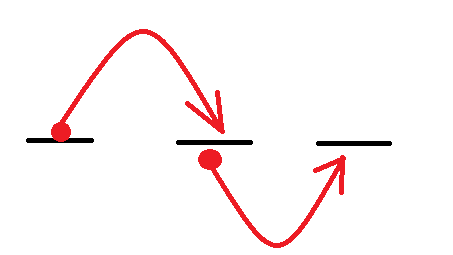
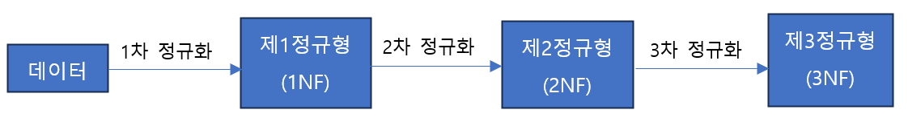

1. # 정규화(Normalization)   
   - 목적 : 삽입/삭제/갱신 이상현상 방지   
   - NF : Normal Form   
   - 함수적 종속성에 기반   
   - 종류 :   
      -1NF : 모든 값이 원자값을 가짐   
      -2NF : 부분함수종속 제거   
         

      -3NF : 이행함수종속 제거   
          

         
      모든 값을 원자값으로 만든 게 1NF(2NF와 3NF는 포함)   
      2차 정규화로 부분함수종속을 제거한 게 2NF(3NF는 포함)   
      3차 정규화로 이행함수종속을 제거한 게 3NF   

1. # 함수적 종속성   
   함수 : x값 1개에 y값도 1개이면 함수가 성립.   
   함수인 경우만 __결정__ 하는 경우와 __종속__ 하는 경우가 성립합니다.   

   x값 1개에 y값도 1개여야 함수가 성립합니다.   
      

   x값 1개에 y값이 2개기 때문에 함수가 아닙니다.   
      

      
   예를 들어 혈액형이란 속성이 있고 학번이란 속성이 있을 때 하나의 혈액형이 다수의 학번에 대응됩니다. 이것은 함수가 아닙니다. 이를 가리켜   
   "혈액형은 학번을 함수적으로 결정하지 못 한다"   
   "학번은 혈액형에 함수적으로 종속되지 않는다"   
   라고 합니다. 함수가 아니기 때문에 그렇습니다.   

      
   한명의 학번이 공통의 혈액형에 대응됩니다. x축 값 1개씩만 y축에 대응되므로 함수입니다. 이를 가리켜   
   "학번을 혈액형을 함수적으로 결정한다"   
   "혈액형은 학번에 함수적으로 종속된다"   
   라고 합니다. 함수이기 때문에 그렇습니다.   
  
    → 결정한다 x축 / 종속된다 y축    

1. # 정규화 효과
   
   -데이터 중복 감소 → 성능 향상   
   -데이터가 관심사 별로 묶임 → 성능 향상   
   -조회 질의에서 조인이 많이 발생 → 성능 저하   
   : 정규화를 통해 일반적으로 성능이 향상되나, 조회의 경우 처리 조건에 따라 성능이 향상되거나 저하됨   

      

1. # 부분함수종속   
   PK가 중복일 때 발생, PK가 1개면 발생하지 않습니다.   
      
   학번과 과목코드가 합쳐져서 평점을 결정합니다. 하지만   
   학번은 학생명, 소속학과코드, 학과명을 결정하고,   
   과목코드는 과목명을 결정합니다.   
   => 학번과 과목코드를 분리합니다.   
      

1. # 이행함수종속   
      
   *이행 : transitive - 전이적, 건너서 가다   
   소속학과코드가 학과명을 결정합니다.   
   PK가 아닌데 다른 속성이 속성값을 결정하는 경우 해당합니다.   
   학번 → 소속학과코드 → 학과명   
   학번이 소속학과코드로 와서 다시 소속학과코드에서 학과명을 찾는 경우 이행적이다, transitive하다고 합니다.   
   PK와 속성값을 결정하는 결정자를 분리합니다.   
      
    → 식별자가 아닌 속성(주식별자의 일부 또는 일반속성)이 결정자 역할을 하는 함수 종속 제거 → 3NF   
   
   *3NF 이후 BCNF, 4NF, 5NF까지 이론상으론 있지만 실무에선 너무 많이 정규화하는 걸 성능 저하로 선호하지 않습니다. 그래서 이론과 실무의 타협점이 3NF이고 3정규화까지를 목표로 합니다. 

1. # 정규화와 성능
   정규화를 하면 성능이 높아지지만 지나친 정규화는 오히려 성능을 저하시키기 때문에 이땐 반정규화가 필요합니다.   
   데이터 중복 감소 → 성능 향상   
   데이터가 관심사 별로 묶임 → 성능 향상   
   조회 질의시 조인이 많이 발생 → 성능 저하   
   정규화를 통해 일반적으로 성능이 향상되나, 조회의 경우 처리 조건에 따라 성능이 향상되거나 저하됨   
   정규화를 하면 삽입, 삭제, 갱신에선 성능이 향상됩니다.   
   정규화를 하면 조회에선 처리 조건에 따라 성능이 향상 될 수도 있고 저하 될 수도 있습니다.   

