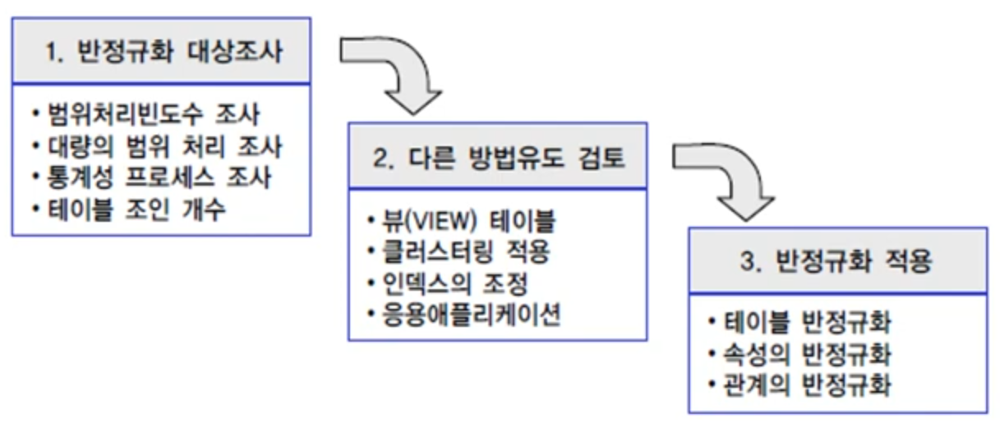

1. # 반정규화
   - 반정규화(=역정규화 Denormalization)   
   - 정규화된 엔터티, 속성, 관계에 대해 성능 향상을 목적으로 중복, 통합, 분리를 수행하는 데이터 모델링 기법   
   cf)비정규화 : 정규화를 아예 수행하지 않음   

1. # 특징
   - 테이블, 칼럼, 관계의 반정규화를 종합적으로 고려해야 함.   
      -일반적으로 속성(칼럼)의 중복을 시도함   
   - 과도한 반정규화 → 데이터 무결성을 침해함.   

1. # 반정규화의 사전 절차   

      

1. # 반정규화 대상조사

   - 범위처리빈도수 조사   
      a=3 : 값에 의한 조건   
      1 < a < 5 : a의 범위가 1과 5 사이   
      ▷ 값을 딱 정하는 '=' 보다 범위를 정하는 <, >가 처리속도가 상대적으로 느리다. 그렇기 때문에 범위를 나타내는 조건을 조사해야합니다.   

   - 대량의 범위 처리 조사   
      a의 범위가 1 < a < 5 보다 1 < a < 1000 가 대량의 범위   
      ▷ 범위가 1과 5사이 보다 1과 1000사이가 상대적으로 느리다. 그렇기 때문에 범위를 크기 정한 부분을 조사해야합니다.   

   - 통계성 프로세스 조사   
      통계성 프로세스(sum, count, avg 등)는 하나의 명령어지만 실제 참조하는 데이터의 수는 다량임.   
      ▷ 다량의 데이터를 검색하는 통계성 프로세스 부분을 조사해야합니다.   

   - 테이블 조인 개수   
      ▷ 테이블 조인이 많을수록 성능이 저하되기 때문에 이 부분을 조사해야합니다.   

1. # 다른 방법 유도

   - 뷰(View) 생성 : 뷰 자체가 성능 향상을 가져오지는 않음, 신중하게 설계된 뷰를 재상용할 때 성능 향상   

   - 클러스터링 : 자주 사용되는 테이블의 데이터를 디스크의 같은 블록에 저장   

   - 인덱스의 조정 : 인덱스 추가, 삭제 및 순서 조정   

   - 응용 애플리케이션 : 데이터 처리를 위한 로직 변경   

1. # 반정규화 기법   

   - 컬럼 반정규화   
      -중복컬럼 추가   
      -파생컬럼 추가   
      -이력테이블컬럼 추가   
      -PK의 의미적 분리를 위한 컬럼 추가   
      -데이터 복구를 위한 컬럼 추가   

   - 테이블 반정규화   
      -테이블 병합 - 관계 병합, 슈퍼/서브타입 병합   
      -테이블 분할 - 수직 분할, 수평 분할   
      -테이블 추가 - 중복 테이블 추가, 통계 테이블 추가, 이력 테이블 추가, 부분 테이블 추가   

   - 관계 반정규화   
      -중복 관계 추가   
   

    

   

   