1. # 테이블 반정규화
   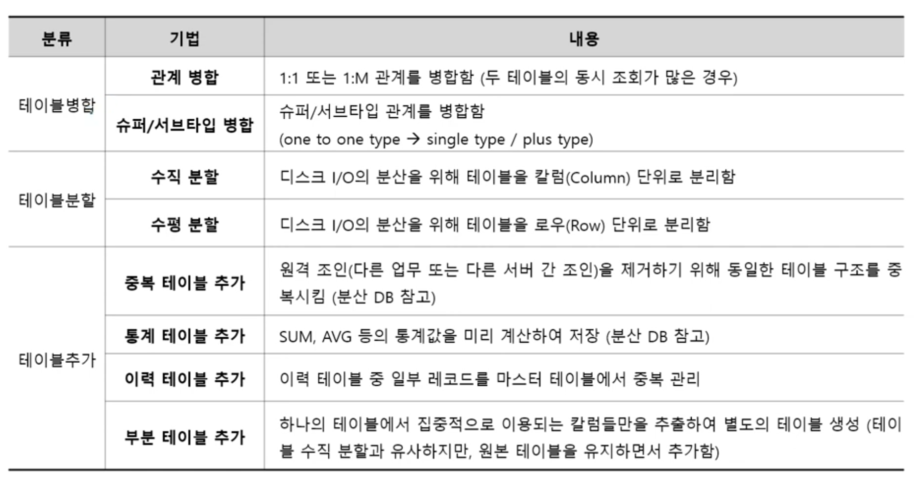   

1. # 테이블 병합 - 관계 병합
   - 두 테이블의 동시 조회가 많은 경우 이행   
   - 지점 테이블과 사원 테이블의 조회가 많은 경우 두 테이블을 합쳐 하나의 테이블로 만듦      
   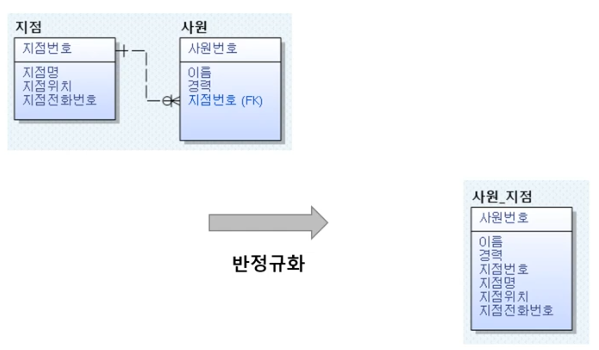   
   지점 테이블과 사원 테이블을 합쳐서 사원_지점 테이블을 만들었기 때문에 사원번호가 속성들을 결정하고 지점번호가 지점명과 지점위치, 지점전화번호를 결정하기 때문에 왼쪽 3정규형에서 오른쪽 2정규형으로 변화되었습니다.   

1. # 테이블 병합 - 슈퍼/서브타입
   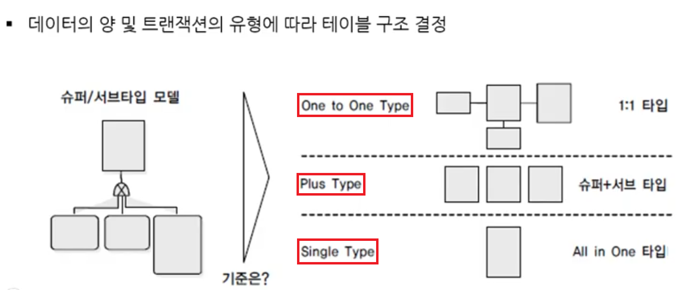   

   - One to One Type으로 변환.   
   가장 일반적인, 기본이 되는 슈퍼/서브타입 모델.   
   개별 접근 트랜잭션이 많은 경우.   
   공통 속성 : SuperType - 여기선 학생 테이블입니다, 개별 속성 : Sub Type - 여기선 학부생, 대학원생 테이블입니다.   
   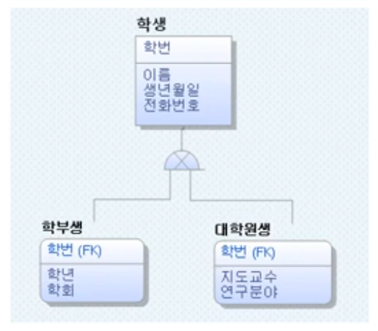   
   학부생 따로 대학원생 따로 접근하는 트랜잭션이 많은 경우 학번이란 PK를 전부 공통으로 가지는 학생이란 공통의 테이블을 만들고 개별 속성 값으로 학부생 테이블과 대학원생 테이블을 각각 만듭니다.   

   - Plus Type으로 변환   
   슈퍼타입 + 서브타입 접근 트랜잭션이 많은 경우.   
      <table>
      <tr>
         <td>One to One Type</td>
         <td> &nbsp;&nbsp;&nbsp; </td>
         <td>Plus Type</td>
      </tr>
      <tr>
         <td></td>
         <td>=></td>
         <td>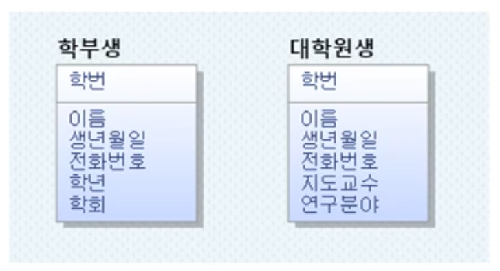</td>
      </tr>
      </table>   
   대학원생이 100명, 학부생이 10만명이 있다고 가정하면 학생 테이블은 10만100개의 값이 있게됩니다. 이 경우 대학원생을 조회하기 위해서 10만100개가 있는 학생 테이블을 먼저 조회를 해야합니다. 학생 테이블을 거치지 않고 바로 대학원생 테이블을 조회하기 위해서 학생+학부생, 학생+대학원생으로 테이블을 구성합니다.   

   - All in One Type(Single Type)   
   여러 서브타입에 대한 동시 접근이 많을 때.   
   학부생과 대학원생의 조회가 많을 때 학생+학부생+대학원생 모든 테이블을 하나로 합치는 경우 입니다.   

   - 정리   
   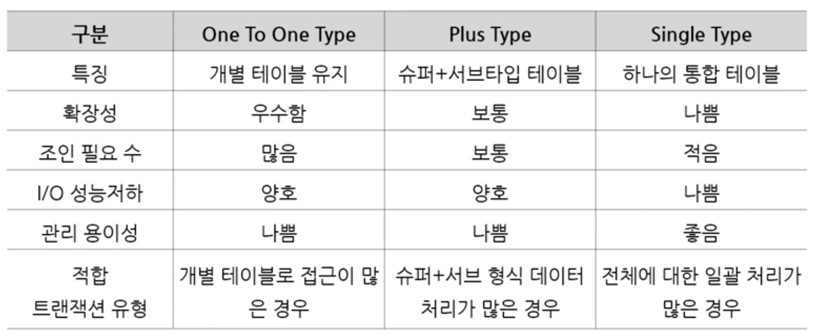   
   One to One Type : 테이블을 공통속성과 개별 속성으로 나눈 일반적인 슈퍼/서브타입 모델.(일반적 슈퍼/서브타입 모델)   
   Plust Type : One To One Type에서 공통 속성과 각각의 개별 속성을 합친 모델.(공통만 합침)   
   All in One Type : 공통과 모든 개별 속성을 하나로 합친 모델(전부 합침)   

1. # 테이블 분할
   - 절차   
      -데이터 모델링 수행   
      -데이터베이스 용량 산정   
      -대량 데이터가 처리되는 테이블에 대해 트랜잭션 처리 패턴 분석   
      -트랜잭션이 컬럼 단위로 집중되는 경우 수직 분할, 로우 단위로 집중되는 경우 수평 분할 수행   

1. # 테이블 분할 - 수직 분할   
   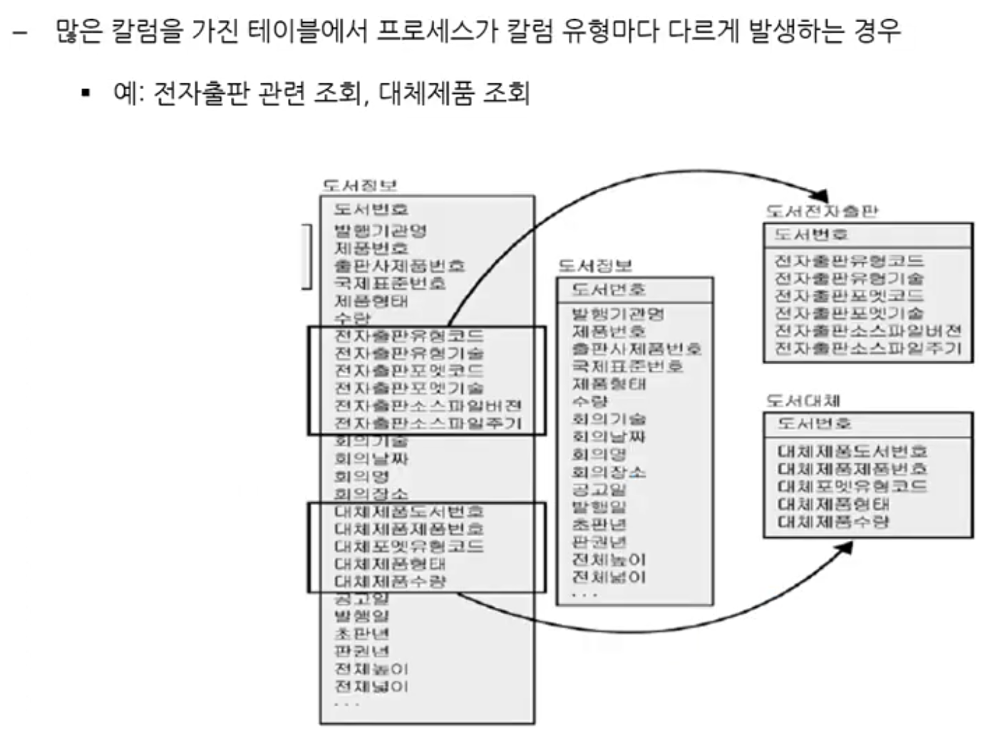   
   만약 도서전자출판 테이블에서 전자출판유형코드가 PK로 전자출판에 관한 컬럼값을 하나로 정의할 수 있고, 도서대체 테이블에서 대체체품도서번호가 PK로 도서대체에 관한 컬럼값을 하나로 정의할 수 있다면 도서정보 테이블은 부분함수종속을 포함하는 1NF 테이블로 볼 수 있습니다.   
   도서대체 테이블을 따로 분리하는 걸 부분함수종속을 제거하는 1NF → 2NF의 정규화로 볼 수 있습니다.   
   : 전자출판유형코드와 대체제품도서번호는 PK가 아니라는 가정 이후 테이블을 분할하는 것이 부분함수종속을 제거하기 위한 정규화를 위한 조치가 아니라 데이터 성능을 위한 조치로 분할하는 것이여야 테이블 분할이 됩니다.

1. # 테이블 분할 - 수평 분할   
   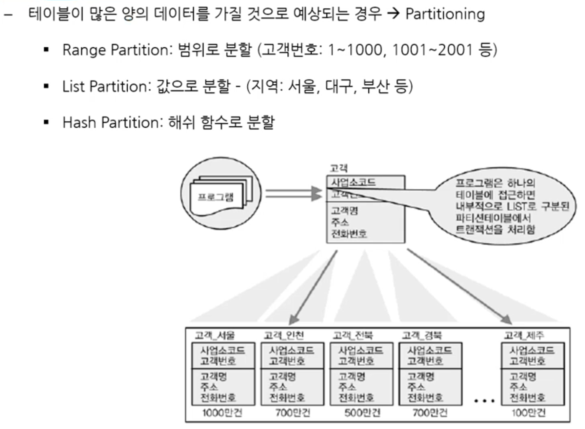   

1. # 테이블 추가 - 이력테이블 추가
   - 가장 최근값을 중복으로 기록한 컬럼을 생성(테이블 생성 x)   
   - 테이블 갯수와 구조는 그대로.   
   - 예제는 이력을 관리하는 테이블입니다. 공급자의 전화번호, 메일주소, 위치가 계속 바뀌는데 이 이력을 데이터가 많기 때문에 따로 관리를 하는 예제 테이블입니다.   
   - 공급자 테이블에 가장 최근의 전화번호, 메일주소, 위치를 기록하는 컬럼을 추가합니다.   
   <table>
   <tr>
      <td>추가 전</td>
      <td> &nbsp;&nbsp;&nbsp; </td>
      <td>추가 후</td>
   </tr>
   <tr>
      <td>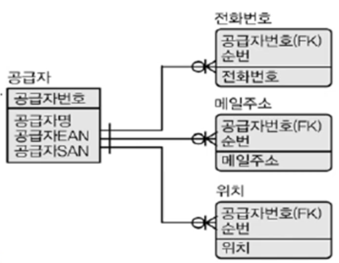</td>
      <td>=></td>
      <td>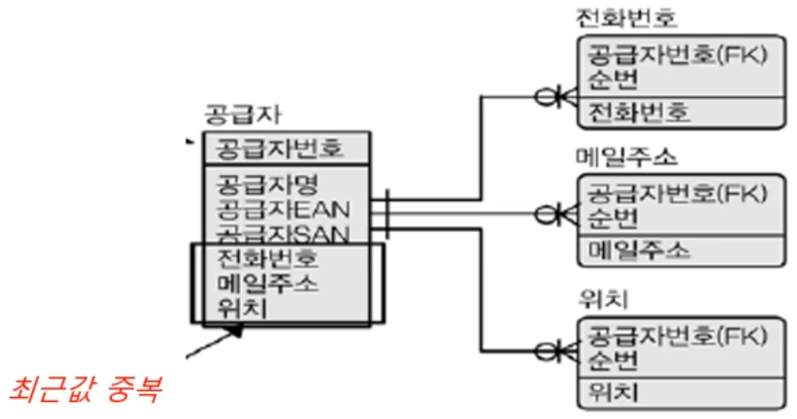</td>
   </tr>
   </table>
   
   - 이력테이블컬럼추가(컬럼 반정규화)와 비교
   <table>
   <tr>
      <td>추가 전</td>
      <td> &nbsp;&nbsp;&nbsp; </td>
      <td>추가 후</td>
   </tr>
   <tr>
      <td>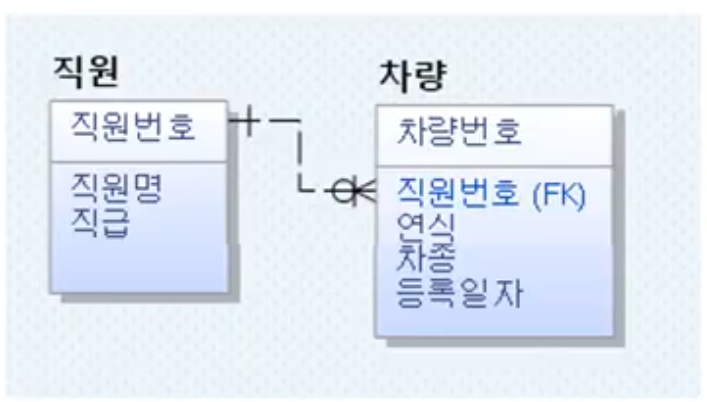</td>
      <td>=></td>
      <td>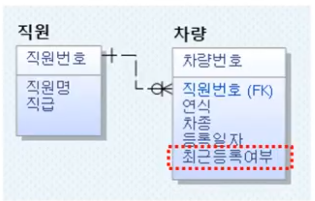</td>
   </tr>
   </table>   
      
   →이력테이블추가 : 전화번호, 메일주소, 위치에 실제 최근 데이터를 삽입   
   →이력테이블컬럼추가 : 최근등록여부는 컬럼에 최근 값인지 아닌지 Y, N로 구별만합니다. 컬럼에 데이터를 직접 삽입하지 않습니다.   
   
1. # 테이블 추가 - 부분테이블 추가   
   - 집중적으로 자주 사용되는 특정 속성들을 추출하여 별도 테이블 구성   
      -예) 차량번호에 대한 차량사진 조회 질의가 많은 경우   

   - 테이블 수직 분할과 유사하지만 원본 테이블이 그대로 유지됨   
   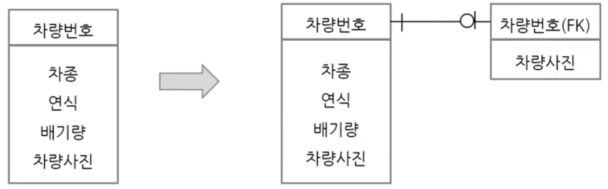   

   - 부분테이블추가 와 테이블수직분할의 비교   
   →부분 테이블 추가 : 원본 테이블은 유지한채 새로운 작은 테이블이 생성   
   →수직분할 : 테이블 자체를 수직으로 나눔   
   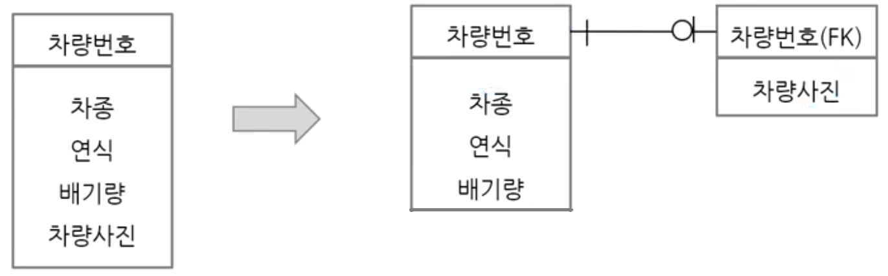    
   위와 같이 차량사진컬럼을 원본 테이블에서 빼버리고 따로 떼어내면 수직분할이 됩니다.   

