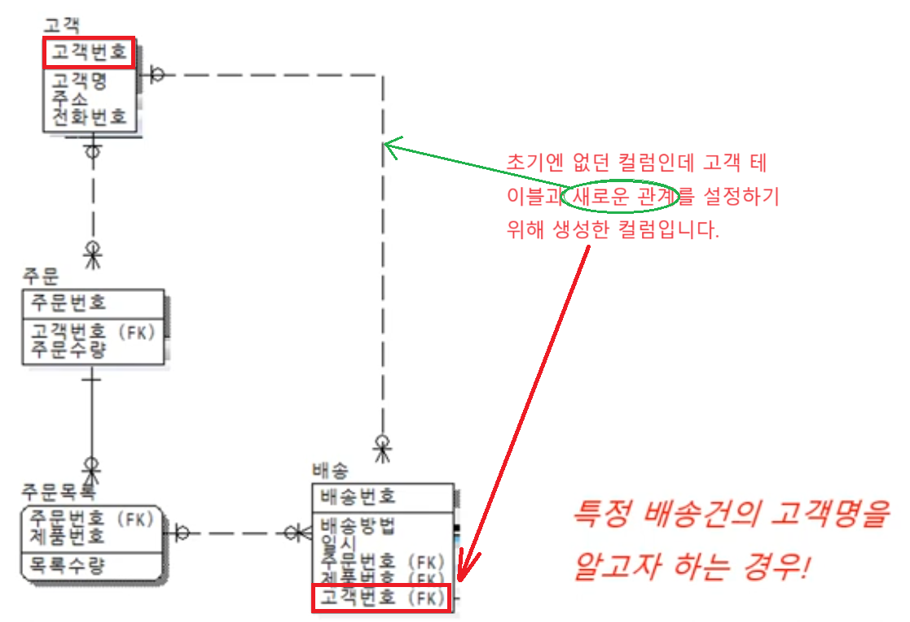
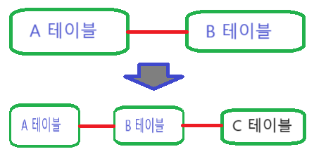

1. # 반정규화 기법 - 관계 반정규화 
   
   - 중복관계 추가란? 테이블 갯수는 변함이 없는데 컬럼이 추가되어 관계만 추가되는 것이 관계 추가입니다.   

   - 조인을 통해 정보 조회가 가능하지만, 조인 경로 단축을 위해 중복관계를 추가함 - 조인 경로 단축! 딱 이 한가지 경우에만 관계 반정규화 사용      

   - 예제   
      
   배송 테이블에 주문목록 테이블 PK인 (주문번호, 제품번호)가 FK로 있습니다.   
   주문목록 테이블에 주문 테이블의 PK인 주문번호가 PK로 있습니다.   
   주문 테이블에 고객 테이블의 PK인 고객번호가 PK로 있습니다.   
   "배송 테이블 → 주문목록 테이블 → 주문 테이블 → 고객 테이블"로 배송 테이블에서 모든 테이블 검색이 가능합니다. 하지만 배송 테이블에서 고객 정보를 알기 위해선 3번의 조인을 거쳐야 합니다. 이를 보안하기 위해 고객 테이블과 배송 테이블들 관계를 직접 설정합니다. 배송 테이블에 고객번호를 FK로 넣고 직접 고객 테이블과 관계를 설정합니다.   
      
   *N:1 관계에서 N테이블은 1테이블에 접근할 수 있지만 1테이블은 N테이블에 접근할 수 없습니다.   
   N테이블에서 1테이블의 PK가 FK로 입력되어 있기 때문에 N테이블에서 1테이블로 접근이 가능합니다. 1테이블에선 접근할 수 있는 키는 있지만 정확한 값을 가져올 수 없기 때문에 1테이블에서 N테이블로 값을 가져오지 않습니다.   
   주문목록 테이블에서 주문 테이블에 접근할 수는 있지만 주문 테이블에서 주문목록 테이블로 접근할 수 없습니다.   
   주문 테이블에서 고객 테이블에 접근할 수는 있지만 고개 테이블에서 주문 테이블로 접근할 수 없습니다.   
      
   *테이블을 추가해서 관계가 생기는 건 관계추가가 아니라 테이블 추가입니다.   
      
   A테이블과 B테이블이 있던 관계에서 새로운 C테이블이 생기면서 나타난 관계는 관계추가가 아니라 __테이블 추가__ 입니다.   
