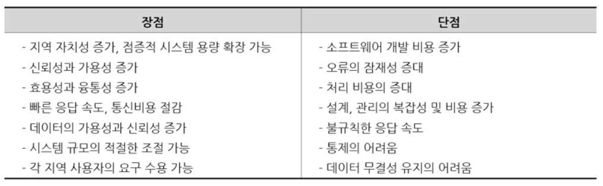
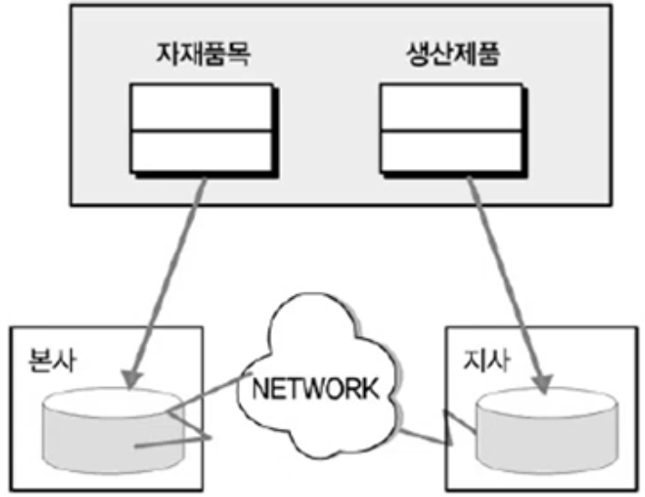
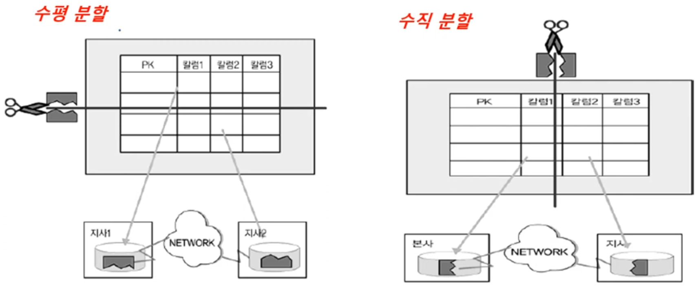
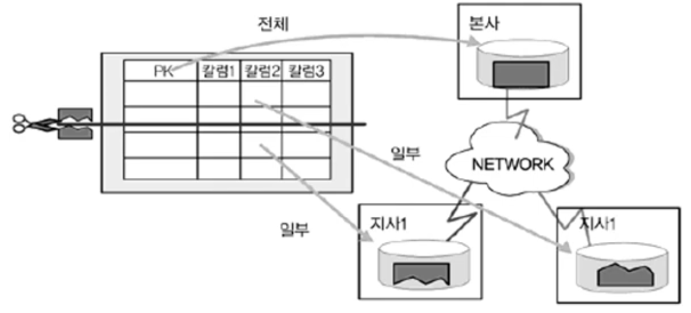
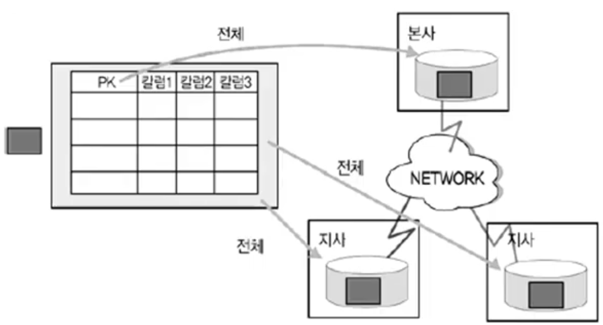

1. # 분산 데이터베이스의 개념
   __물리적으로__ 분산된 데이터베이스를 하나의 논리적 시스템으로 사용.   
   물리적으로 분산되었다는 건 : 하나의 PC가 아닌 다른 공간(다른 건물 혹은 다른 지역 혹은 다른 나라)에 데이터가 나눠져서 저장된 방식.   
   사용자가 쿼리를 보내면 서버에서 물리적으로 분산된 데이터베이스에 쿼리를 보내 해당 값들을 가져오게 됩니다. 이렇듯 물리적으로 지리적으로 따로 떨어져있는 데이터를 사용자는 마치 하나의 DB처럼 사용할 수 있도록 만들어 주는 것이 분산 데이터베이스입니다.   

1. # 분산 데이터베이스의 장단점

      

1. # 적용 기법
   
   - 테이블 위치 분산   

   - 테이블 분할 분산   

   - 테이블 복제 분산   
   -부분 복제   
   -광역 복제   

   - 테이블 요약 분산   
   -분석 요약   
   -통합 요약   

1. # 테이블 위치 분산   
   - 테이블을 각각 다른 장소에 위치시킴   
   자재품목 테이블(컬럼이 아님)은 본사에 생산제품 테이블(컬럼이 아님)은 지사에 각각 나눠서 위치 시킵니다.   
      

1. # 테이블 분할(Fragmentation) 분산   
   - 각 테이블을 분할하여 다른 장소에 데이터를 분산 저장하는 기법   
      

   - vs 반정규화의 테이블 분할   
   반정규화의 테이블 분할은 PC 한 대에서 분할하여 테이블을 새로 만드는 기법   

1. # 테이블 복제(Replication) 분산   

   - 동일 테이블의 복사본을 여러 서버에서 동시에 관리함   
   
   3-1)부분 복제 : 지사에서 먼저 발생  
      -본사는 통합 테이블 관리, 각 지사에서는 지사에 해당된 로우만 관리   
      -실제로는 __지사에서 먼저 데이터 발생__ → 본사에서 전체 통합   
         
   
   3-2)광역 복제 : 본사에서 먼저 발생     
      -동일한 테이블을 여러 곳에 복제하여 관리   
      -본사에서 데이터의 입력, 수정, 삭제 발생 → 지사에서 이를 반영 
          
   
1. # 테이블 요약 분산   
   - 유사한 내용의 데이터를 서로 다른 관점/수준에서 요약하여 분산 관리   
   
   4-1)분석 요약(Rollup Replication)   
      -각 지사별 __동일한 주제__ 의 정보를 본사에서 통합하여 전체 요약 정보 산출   
      -예: 상품A의 지사1, 지사2의 매출 정보 요약 → 전체 매출 정보 요약   
   
   4-2)통합 요약(Consolidation Replication)   
      -각 지사별 __상이한 주제__ 의 정보를 본사에서 단순 취합하여 제공   
      -예: 지사1의 상품A, 지사2의 상품B에 대한 매출 정보 요약 → 전체 매출 정보 요약   

   *통상 운(분)동   

1. # 분산 설계 고려사항
   - 성능이 중요한 사이트에 적용해야 함   
   - 공통코드, 기준정보, 마스터 데이터 등에 대해 분산 구성시 성능 향상   
   - 실시간 동기화가 요구되지 않을 때 바람직   
      -Near Real Time 업무의 경우도 분산 환경 구성 가능   
   - 특정 서버에 집중된 부하를 분산시키기 위한 목적으로도 가능   
   - 백업 사이트(Disaster Recovery Site) 구성 시 분산 설계의 개념을 적용할 수 있음    

   

