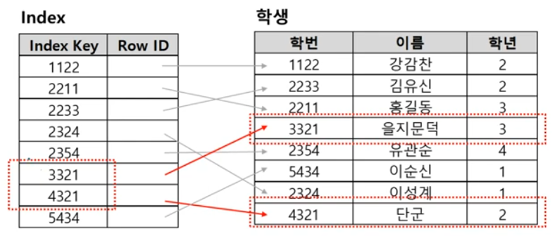
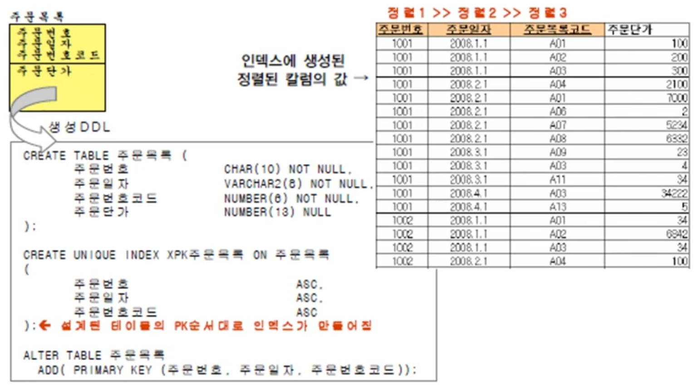
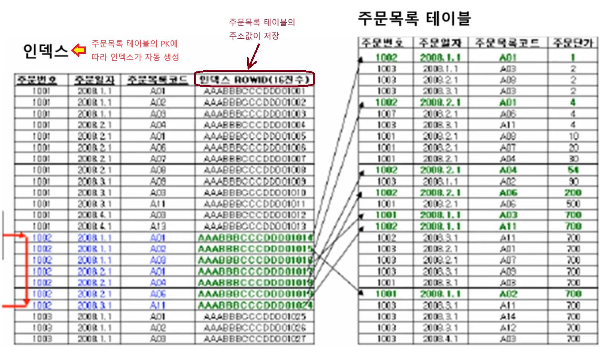
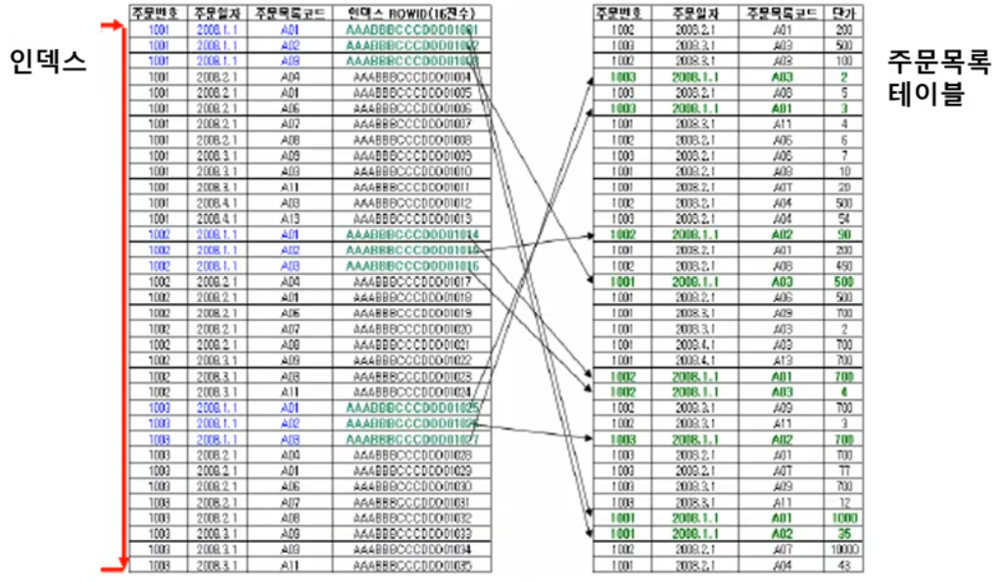
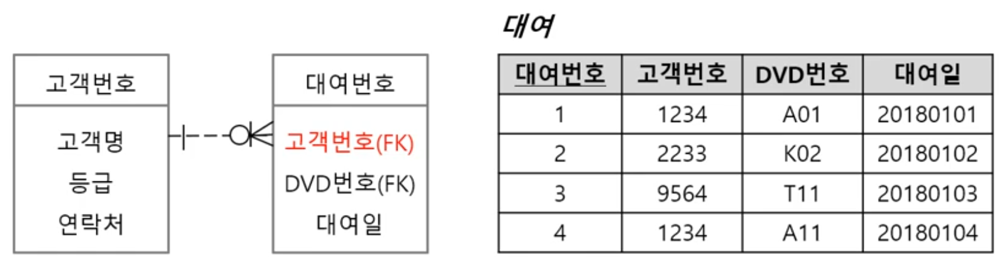

1. # 인덱스(Index)

   - 검색 속도의 향상을 위한 기술 → 실제 테이블을 Full Scan하지 않고 인덱스 테이블을 검색   

   - 지나치게 많은 인덱스 생성시 시간 및 공간 낭비   

   - 인덱스된 필드의 업데이트시 시간 증가   

   - 자동 생성(PK 또는 Unique 조건)   

   - 수동 생성(Create Index 구문)   

      
   학생 컬럼의 값만 따로 빼서 정렬한 왼쪽 테이블이 Index입니다.      

1. # pk 인덱스의 스캔 구조 이해 
   - PK의 __속성 순서대로__ 인덱스가 정렬됩니다. ← PK는 인덱스 테이블이 자동 생성   
      
   주문목록 테이블에서 주문번호, 주문일자, 주문번호코드가 PK가 되는데 이들의 순서에 따라 index가 결정됩니다.   
   주문번호 >> 주문일자 >> 주문번호코드   
   순으로 인덱스가 정렬되므로 __PK의 순서가 중요__ 합니다.   

   - 예제)SELECT 주문단가 FROM 주문목록 WHERE 주문번호='1002'란 쿼리가 주어진 경우   
      
   where절에 주문번호로 검색하기 때문에 인덱스의 가장 첫 번째 컬럼부터 검색   
   <span style="color:red">:PK에 인덱스가 결려있기 때문에 PK가 복합키이면 컬럼의 순서를 바꿔주는 것만으로 성능이 향상 될 수 있습니다.</span>   

   - 예제)SELECT 주문단가 FROM 주문목록 WHERE 주문일자='2008.1.1'란 쿼리가 주어진 경우   
   2차 컬럼인 주문일자로 검색이 들어오면 주문번호로 검색할 때보다 오랜 시간이 걸립니다. 즉 최초의 정렬기준이 아닌 다른 정렬기준으로 검색이 들어오면 인덱스 테이블을 Full Scan해야 됩니다.   
      
   
   ▷ 조회가 가장 많이 일어나는 컬럼을 기준으로 PK순서를 정해야합니다.   

1. # FK 인덱스 설정을 통한 성능 향상   
   
   - PK와 Unique는 index 자동 생성   

   - FK에서 인덱스 : 오라클은 자동생성 (X), mySql은 자동생성 (O)   
   
   - FK컬럼에 Create Index를 통해 인덱스를 생성해서 성능 향상이 가능합니다.(오라클)   

   - 예)고객번호 테이블의 '고객번호'에는 PK로 인덱스가 자동으로 걸려 있습니다. 대여번호 테이블의 '고객번호'는 FK로 인덱스가 자동으로 걸려있지 않습니다. 이때 대여테이블에서 고객번호로 검색이 자주 일어나는 경우 고객번호에 인덱스를 생성하므로 성능 향상이 가능합니다.   
      
   FK가 Create Index의 가장 첫번째 후보  → 검색이 많은 경우 Index 생성   

1. # INDEX 수동 
   - 인덱스 확인   
   ```sql
      1)인덱스 정보확인
      SELECT * FROM USER_INDEXES;

      2)인덱스가 있는 컬럼 정보 확인
      SELECT * FROM USER_IND_COLUMNS;
   ```    

   - 생성
   ```sql
      CREATE INDEX 인덱스명
      ON 테이블명(컬럼1, 컬럼2,..);

      예)
      CREATE INDEX IDX_EMP
      ON EMP(SAL);
   ```   

   - 삭제
   ```sql
      DROP INDEX 인덱스명;

      예)
      DROP INDEX IDX_EMP;   
   ```   