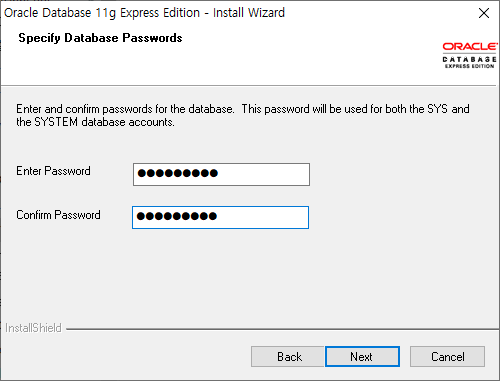
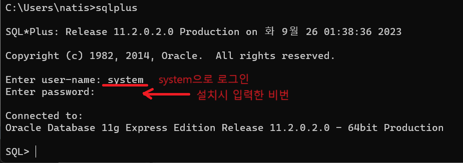
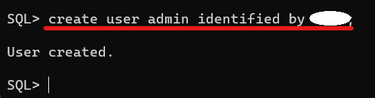
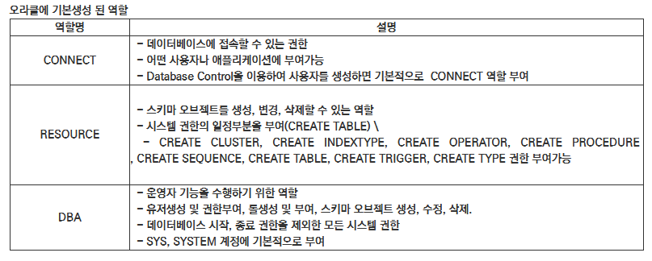
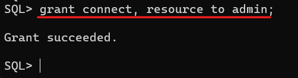
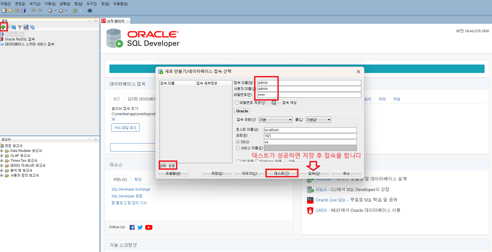
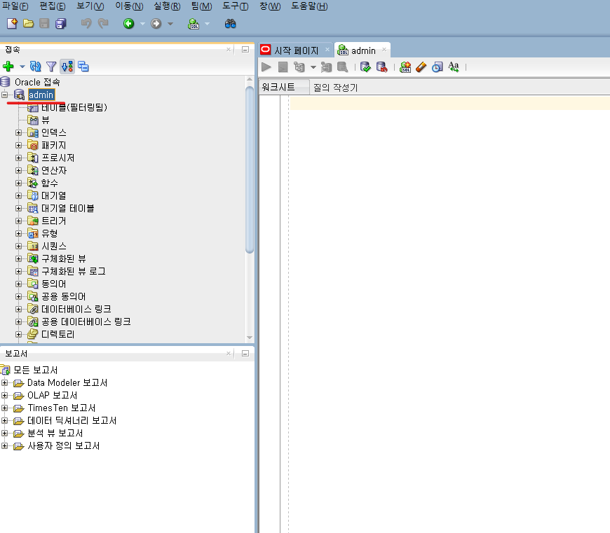

1. # 오라클 데이터베이스 다운로드
   오라클 계정이 없으면 먼저 만듭니다.   
   ```
      https://profile.oracle.com/myprofile/account/create-account.jspx?source=:ow:o:p:nav:070220DatabaseCloudHero   
   ```   
   <br>
   23C와 19C가 있지만 용량이 커서 쿼리 연습용으로 간단한 하기에 용량이 작은 11g를 선택 했습니다.   
   ```
      https://www.oracle.com/database/technologies/xe-prior-release-downloads.html   
   ```   
   <br>
   setup을 합니다. 설치할 때 설정한 비번은 이후 system으로 로그인 시 사용됩니다.   
      
   <br>
   설치 후 system으로 로그인 합니다. 비번은 위에서 설치시 설정한 암호입니다.   
      
   <br>
   __계정 생성__   
   create user [유저명] identified by [비번]; <span style="color:red">*마지막에 ;중요</span>   
      
   <br>
   __권한 부여__   
      
   grant [권한] to [유저명]; <span style="color:red">*마지막에 ;중요</span>   
      

1. # Sql Developer 설정
   cmd 창에서 로그인할 유저를 만들고 그 유저에 권한을 부여했다면 sql을 편하게 다루기 위해 Sql Developer를 실행합니다.
   앞에서 설정한 새로운 접속자를 만듭니다.   
      
   <br>
   admin계정으로 데이터베이스가 생성 되었습니다.   
      