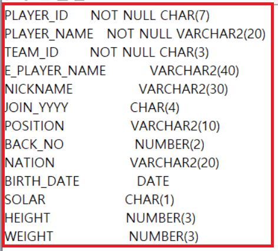
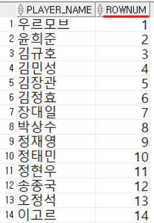

1. # DUAL테이블   
   오라클이나 MySQL같은 DBMS에서 제공하는 임시 테이블로 간단한 실행 결과를 확인하게 위해 사용하는 테이블입니다.  

 1. # BETWEEN/LIKE/IN

   <table style="border:1px solid yellow">
      <tr>
         <td>연산자</td>
         <td>의미</td>
         <td>예시</td>
      </tr>
      <tr>
         <td>BETWEEN A AND B</td>
         <td>A와 B의 사이(A,B 포함)</td>
         <td>WHERE COL BETWEEN 1 AND 10</td>
      </tr>
      <tr>
         <td>LIKE '비교 문자열'</td>
         <td>비교 문자열을 포함</td>
         <td>
            WHERE A LIKE 'AIR%'
            WHERE A LIKE '%AIR'
            WHERE A LIKE '%AIR%'
         </td>
      </tr>
      <tr>
         <td>IN (LIST)</td>
         <td>LIST 중 하나와 일치</td>
         <td>WHERE A IN (1,3,5)</td>
      </tr>
      <tr>
         <td>IS NULL</td>
         <td>NULL 값</td>
         <td>WHERE A IS NULL</td>
      </tr>
   </table>
      
   ```
      /*나이가 20살과 30살사이 검색(20과 30 포함)*/
      SELECT * FROM EMPLOYEE WHERE AGE BETWEEN 20 IN 30;

      /*문자열 중간에 101이 들어간 문자 검색*/
      SELECT PLAY_ID, NAME FROM PALY_LIST WHERE NAME LIKE '%101%'

      /*밑에 2개는 같은 쿼리*/
      SELECT LAST_NAME, FIRST, TITLE FROM EMPLOYEE WHERE TITLE IN ('IT STAFF', IT MANAGER');
      SELECT LAST_NAME, FIRST, TITLE FROM EMPLOYEE WHERE (TITLE='IT STAFF' OR TITLE='IT MANAGER');

      /*IN의 2가지 조건*/
      SELECT PLAYER_NAME 선수이름, TEAM_ID, POSITION
      FROM PLAYER
      WHERE (TEAM_ID, POSITION) IN (('K04','GK'), (K06','MF'));

      /*NOT IN의 2가지 조건*/
      SELECT PLAYER_NAME 선수이름, TEAM_ID, POSITION
      FROM PLAYER
      WHERE (TEAM_ID, POSITION) NOT IN (('K04','GK'), (K06','MF'));

      /*COMPANY가 NULL인 행 조회*/
      SELECT FIRST_NAME, LAST_NAME, COMPANY FROM MEMBER WHERE COMPANY IS NULL;
   ```   

  1. # BETWEEN/LIKE/IN 부정

   | 연산자 | 의미 | 예시 |
   |:----:|:------:|:----:|
   | NOT BETWEEN A AND B | A와 B의 사이가 아님(A,B 미포함) | WHERE A NOT BETWEEN 1 AND 10 |
   | NOT IN (LIST) | LIST 중 일치하는 것이 없음 | WHERE A NOT IN (1,3,5) |
   | IS NOT NULL | NULL 값이 아님 | WHERE A IS NOT NULL |
      
   ```
      /*전부 같은 의미*/
      SELECT * FROM MEMBER WHERE AGE NOT BETWEEN 20 AND 24;
      SELECT * FROM MEMBER WHERE NOT (AGE BETWEEN 20 AND 24);
      SELECT * FROM MEMBER WHERE NOT (AGE >= 20 AND AGE <= 24);
      SELECT * FROM MEMBER WHERE AGE<20 OR AGE>24;

      /*전부 같은 의미*/
      SELECT * FROM MEMBER WHERE GRADE NOT IN (2,3);
      SELECT * FROM MEMBER WHERE NOT (GRADE IN (2,3));
      SELECT * FROM MEMBER WHERE NOT (GRADE = 2 OR GRADE = 3);
      SELECT * FROM MEMBER WHERE (GRADE <> 2 AND GRADE <> 3);

      /*COMPANY가 NULL이 아닌 행 조회*/
      SELECT FIRST_NAME, LAST_NAME, COMPANY FROM MEMBER WHERE COMPANY IS NOT NULL;
   ```   

1. # DESC
   DESC TABLE명 = DESCRIBE TABLE명 : 같은 명령어
   TABLE 정보를 확인 할 수 있습니다.   
      

1. # ROWNUM
   ROWNUM(TOP N개의 레코드 반환)   
   -사용자가 아닌 시스템이 관리하는 Pseudo[수도] Column(의사 컬럼:사용할 수는 있지만 실제 컬럼은 아님)   
   :채번(번호를 나타낼 때), 출력 개수 지정 등에 활용 가능   

   ```
      SELECT PLAYER_NAME, ROWNUM FROM PLAYER;
   ```   
      
   실제 존재하지 않는 컬럼인 ROWNUM컬럼에 데이터가 있습니다.   
   테이블을 만들게 되면 명시적으로 지정하는 컬럼 외에 DBMS시스템에서 기본값으로 생성하는 System Generated Column이 있습니다. 이러한 컬럼들 중 가장 흔히 사용되는 컬럼이 ROWNUM컬럼입니다.   

   ROWNUM은 TOP(상위)에서 몇 번째까지 출력할지를 정합니다.
   ```
      SELECT PLAYER_NAME, ROWNUM
      FROM PLAYER
      WHERE ROWNUM <= 3; /*(O)*/

      SELECT PLAYER_NAME, ROWNUM
      FROM PLAYER
      WHERE ROWNUM < 3; /*(O)*/

      SELECT PLAYER_NAME, ROWNUM
      FROM PLAYER
      WHERE ROWNUM > 3; /*(X)*/

      SELECT PLAYER_NAME, ROWNUM
      FROM PLAYER
      WHERE ROWNUM >= 3; /*(X)*/

      SELECT PLAYER_NAME, ROWNUM
      FROM PLAYER
      WHERE ROWNUM = 3; /*(X)*/

      SELECT PLAYER_NAME, ROWNUM
      FROM PLAYER
      WHERE ROWNUM > 3; /*(X)*/
   ```   
   ROWNUM으로 출력될 수 있는 값은 <, <= 조건일 때만 출력됩니다.   
   *WHERE ROWNUM = 1; 1인 경우에 한해서만 =(equal)을 허용하고 출력되는 값은 TOP 1인 값이 됩니다.   

   -테이블 내의 UNIQUE한 값 설정에도 사용 가능   
   - ROWNUM을 이용하여 ID 필드 생성   
   - UPDATE 테이블명 SET 컬럼명=ROWNUM;
   ```
      ALTER TABLE PLAYER ADD (ROW_ID NUMBER);   /*PLAYER테이블에 ROW_ID란 컬럼 추가*/
      UPDATE PLAYER SET ROW_ID = ROWNUM;   /*ROW_ID컬럼에 ROWNUM 값을 입력*/

      SELECT * FROM PLAYER WHERE ROW_ID = 4;   /*ROWNUM에서 사용 못한 =을 ROW_ID에서는 사용 할 수 있습니다*/
   ```

