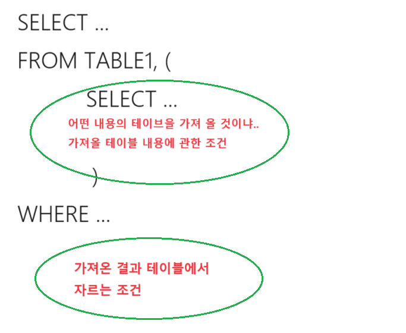

1. # SQL 개요
   - SQL 기본 작성 규칙   
   -문장 마지막은 세미콜론으로 끝남   
   -명령어, 객체명, 변수명은 대/소문자 구분이 없음   
   -데이터 값은 대/소문자 구분함   
   예) 성이 'kim'인 사람을 뽑아라 : 'Kim','kIm','kiM' 전부 다른 데이터 값   
   -숫자는 바로 사용   
   예)age=24, height=176,...
   -날짜와 문자열에는 작은 따옴표를 사용   
   예)date='2023-10-2', name='kim',...   
   -단어와 단어 사이는 공백 또는 줄바꿈으로 구분 → __줄바꿈도 공백으로 인식__   
   -주석 : -- 와 /`*`  `*`/ 사용   

1. # SQL 구문 유형   
         
 
1. # ALL/DISTINCT

   - SELECT [ALL/DISTINCT] 컬럼1, 컬럼2,.. FROM 테이블명   

   - ALL : 중복 데이터 모두 출력 - 기본값   

   - DISTINCT : 중복 데이터를 1건으로 출력   
   -DISTINCT 키워드는 첫 컬럼의 앞에 위치해야 함   
   -컬럼의 조합에 대해 중복 체크   
   -NULL 값도 하나의 값으로 간주   
   예)나이가 26, 28, NULL, 26, NULL이 있을 때 26, 28, NULL로 NULL을 하나로 취급   
   
   - DISTINCT 위치와 컬럼 갯수
   예)SELECT DISTINCT TEAM_ID, POSITION FROM PLAER;   
   TEAM_ID 뒤나 POSTITION 다음에 올 수 없습니다. DISTINCT는 항상 SELECT와 첫 컬럼 사이에 옵니다. 
   DISTINCT로 중복 제거할 데이터는 TEAM_ID와 POSITION의 조합입니다. TEAM_ID 하나만의 값이 아니고 POSITION 하나만의 값이 아닌 TEAM_ID과 POSITION 2개의 값이 일치하는 중복을 제거합니다.   

1. # FROM과 WHERE절 차이   
   SELECT ...   
   <span style="color:green;font-size:20px">여기서부터</span>   
   FROM ... (LEFT, RIGHT OUTER) JOIN ... <span style="color:green;font-size:20px">(OUTER JOIN인 경우 일단 LEFT나 RIGHT 테이블을 뿌려주고)</span>   
   ON ... JOIN ... <span style="color:green;font-size:20px">(ON조건에서 거르고 값이 없는 경우 NULL입력)</span>   
   ON ...   
   <span style="color:green;font-size:20px">--여기까진 테이블 내용을 가져오는 조건--</span>   
   WHERE ...<span style="color:green;font-size:20px">(여기서부터 가져온 테이블을 거르는 조건)</span>   
   AND ...   

      

1. # WHERE
   DML문에서 INSERT를 제외한 SELECT, UPDATE, DELETE에서 원하는 데이터만 골라서 수행할 때 사용하는 구문입니다.
   ```sql
      SELECT * FROM MEMBER WHERE AGE > 20;   /*WHERE절에서 조건 검색*/
      UPDATE MEMBER SET TITLE='ADOLESCENCE' WHERE AGE >= 20;   /*WHERE절에서 조건 검색*/
      DELETE FROM MEMBER WHERE AGE >= 20;   /*WHERE절에서 조건 검색*/
   ```   

1. # WHERE절에 연산자

      

      

   -우선순위   
      
   NOT A OR B AND C → (NOT A) OR (B AND C)   

1. # INSERT
   -INSERT INTO 테이블명 (COLUMN_LIST) VALUES (VALUE_LIST);   
   - 컬럼 순서는 실제 테이블의 컬럼 순서와 무관   
   - 정의하지 않은 컬럼은 NULL값이 입력 됨   
   ```sql
      INSERT INTO PLAYER(PLAYER_ID, PLAYER_NAME, TEAM_ID)
      VALUES('2999219','손흥민','K07','1999-02-20');
   ```   
   -INSERT INTO 테이블명 VALUES (전체 COLUMN의 VALUE_LIST);   
   - 전체 컬럼의 모든 값을 순서대로 입력해야 함   
   - 빈 값은 NULL또는 작은 따옴표('')로 입력 함   
   *단 작은 따옴표 사이에 공백이 오면 안 됨   
   ```sql
      INSERT INTO PLAYER VALUES('2999219','손흥민','K07','', '' ,'1999-02-20','MF',NULL,NULL);
   ```   

1. # INSERT ALL
   -동시에 여러 레코드를 추가하는 경우   
      - 테이블 생성 후 초기 데이터 일괄 업로드   
      - 기존 테이블의 레코드 조회 후 다른 테이블에 삽입   
   -예) Table1에서 레코드를 반환하여 Table2, Table3에 분할 저장 : 예금 테이블에서 그달 납입하지 않은 리스트를 조회 후 바로 테이블로 만드는 경우   

   1)기존 테이블에서 가져와서 입력   
   ```sql
      INSERT ALL  ---2
         INTO TABLE2 VALUES(ID, NAME)  ---3
         INTO TABLE3 VALUES(ID, SALARY)  ---4
      SELECT ID, NAME, SALARY FROM TABLE1; ---1
   ```   
      
   TABLE1에서 ID, NAME, SALARY를 조회 후 ---1   
   INSERT해라 ALL전부를 ---2   
   TABLE2에 SELECT에서 가져온 ID와 NAME을 넣어라 ---3   
   TABLE3에 SELECT에서 가져온 ID와 SALARY를 넣어라 ---4   

   2)값 직접 저장   
   -INSERT ALL은 반드시 SELECT문을 사용해야 함   
   -새로운 값을 직접 입력하는 경우 DUAL테이블 사용   
   ```sql
      INSERT ALL
         INTO TABLE1(ID, NAME) VALUES('T1','경기장')
         INTO TABLE1(ID, NAME) VALUES('T2','의자')
      SELECT * FROM DUAL;
   ```   

1. # UPDATE
   -테이블에 존재하는 전체 레코드의 값 변경   
      - UPDATE 테이블명 SET 컬럼명 = 새로운 값   
      - 예)PLAYER 테이블에서 모든 레코드의 POSITION을 'GK'로 변경   
      ```sql
         UPDATE PLAYER SET POSITION='GK'
      ```   
      WHERE조건 넣기   
      ```sql
         UPDATE PLAYER SET POSITION='GK'  
         WHERE PLAYER_ID = '345'
      ```   
      
1. # ORDER BY
   ORDER BY 절은 선택된 컬럼을 기준으로 정렬하는 명령어로 SELECT 문에서 논리적으로 맨 마지막에 수행됩니다.   
      
   ASC : 오름차순   
   DESC : 내림차순   
   생략하면 기본 ASC입니다.      
   <span style="color:red">*정렬의 기준이 되는 컬럼에 NULL이 포함되어 있으면 데이터베이스에 따라 NULL 정렬 기준이 달라집니다. 오라클은 NULL을 최대값으로 취급합니다. MS-SQL은 NULL값이 최소값입니다. 만약 순서를 변경하고 싶다면 ORDER BY 절에 NULLS FIRST, NULLS LAST 옵션을 사용해서 NULL의 정렬 순서를 변경할 수 있습니다.</span>   

   ```sql
      SELECT 
       AGE AS A,
       GRADE AS R
      FROM MEMBER ORDER BY A, R DESC   /*A내림차순 정렬 후 R내림차순 정렬*/
   ```
   SELECT 문 논리적 수행 순서   
   SELECT   - 5   
   FROM     - 1   
   WHERE    - 2   
   GROUP BY - 3   
   HAVING   - 4   
   ORDER BY - 6   
   ORDER BY절은 ALIAS가 있는 SELECT문 다음에 실행되기 때문에 ALIAS를 사용할 수 있습니다.   

1. # ORDER BY 와 CASE문
   ```sql
      TAB1테이블 내용:
      ID
      ----
      1
      2
      3
      4

      SELECT ID FROM TAB1
      ORDER BY (CASE WHEN ID IN(1, 3) THEN ID*3 ELSE ID END) DESC;   
   ```   
   결과:   
    3   
    4   
    1   
    2   
   ID가 1과 3인 경우 3과 9를 ID값으로 적용해 정렬은 하지만 실제 결과에 변경된 숫자가 적용되진 않습니다.   

   ```sql
      TBL테이블 내용:
      ID | AMT  
      A    50
      A    200
      B    300
      C    100

      SELECT ID, AMT
      FROM TBL
      ORDER BY (CASE WHEN ID='A' THEN 1 ELSE 2 END), AMT DESC
   ```   
   결과:   
   ID | AMT   
   A&nbsp;&nbsp;&nbsp;&nbsp;200   
   A&nbsp;&nbsp;&nbsp;&nbsp;50   
   B&nbsp;&nbsp;&nbsp;&nbsp;300   
   C&nbsp;&nbsp;&nbsp;&nbsp;100   
   ID가 A인 경우 1로 치환되고 나머지 B,C인 경우 2로 치환되어서 기본 ASC정렬이 먼저되어 A=1, B,C=2로 B와 C의 순서는 알 수 없습니다. 앞에 순서가 정해진 후 다음 AMT로 DESC 정렬이 됩니다.   

   만약 ORDER BY (CASE WHEN ID='A' THEN 1 ELSE 2 END) __DESC__ , AMT DESC 가 된다면   
   A=1, B,C=2이 되어 (B,C 먼저 오고),A,A 가 오게 됩니다.   

   하지만 정렬이 끝난 후 출력되는 값은 1,2가 아닌 A와 B,C가 출력되게 됩니다.   

1. # alias
   ```sql
      SELECT COL FROM TAB;   
      SELECT COL FROM TAB T;   '별명을 정하면 SELECT문에 아무것도 쓰지 않던지'
      SELECT T.COL FROM TAB T;   '별명을 SELECT문에 사용하던지'
      SELECT TAB.COL FROM TAB;   '별명을 정하지 않고 테이블명을 그대로 사용하던지'
      SELECT TAB.COL FROM TAB T;    '(X)별명을 정하고 SELECT문에 테이블명을 그대로 사용하면 안 됨'
   ```

1. # GROUP BY  
   데이터를 그룹별로 묶을 수 있도록 해주는 명령어로 BY 뒤엔 그룹핑의 기준이 되는 컬럼이 오게 됩니다.

1. # 집계 함수

   <table>
      <tr>
         <td>COUNT(*)</td>
         <td>전체 ROW를 COUNT하여 반환</td>
      </tr>
      <tr>
         <td>COUNT(컬럼)</td>
         <td>컬럼값이 NULL인 ROW를 제외하고 COUNT하여 반환</td>
      </tr>
      <tr>
         <td>COUNT(DISTINCT 컬럼)</td>
         <td>컬럼값이 NULL이 아닌 ROW에서 중복을 제거한 COUNT를 반환</td>
      </tr>
      <tr>
         <td>SUM(컬럼)</td>
         <td>컬럼값들의 합계를 반환</td>
      </tr>
      <tr>
         <td>AVG(컬럼)</td>
         <td>컬럼값들의 평균을 반환</td>
      </tr>
      <tr>
         <td>MIN(컬럼)</td>
         <td>컬럼값들의 최솟값을 반환</td>
      </tr>
      <tr>
         <td>MAX(컬럼)</td>
         <td>컬럼값들의 최댓값을 반환</td>
      </tr>
   </table>   
   ```sql
      SELECT STUDENT_NO, AVG(MATH_SCORE) AS SCORE_AVG
      FROM STUDENT_SCORE
      WHERE YEAR = '2021' AND SEMESTER = '1'
      GROUP BY STUDENT_NO
      HAVING AVG(MATH_SOCRE) >= 90;  /* ☜ (O) */

      SELECT STUDENT_NO, AVG(MATH_SCORE) AS SCORE_AVG
      FROM STUDENT_SCORE
      WHERE YEAR = '2021' AND SEMESTER = '1'
      GROUP BY STUDENT_NO
      HAVING SCORE_AVG >= 90;   /* ☜ (X) */
   ```   
   SELECT 문 논리적 수행 순서   
   SELECT   - 5   
   FROM     - 1   
   WHERE    - 2   
   GROUP BY - 3   
   HAVING   - 4   
   ORDER BY - 6   
   HAVING절은 ALIAS가 있는 SELECT문 전에 실행되기 때문에 ALIAS를 사용하지 못 합니다.   