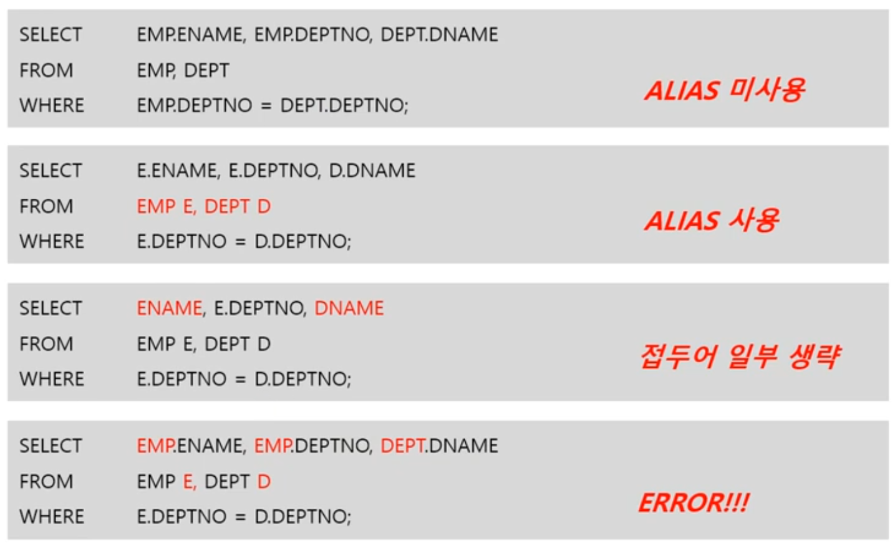

---
layout: single
title: EQUI/NON EQUI/암시적/명시적조인 - JOIN
categories: ORACLE
tag: [equi join, non equi, 암시적, 명시적]
---  

1. # JOIN의 유형
   - (1)Equi Join / Non-Equi Join : 조인 조건으로 '=' 사용여부  
   - (2)암시적 조인 / 명시적 조인 : JOIN이란 명령어 사용여부   
   - (3)Inner Join / Outer Join / Cross join / Self Join

   쿼리문은 equi 조인 이거나 non-equi 조인 일 수 있고,
   동시에 암시적 조인 이거나 명시적 조인 일 수 있고,
   동시에 inner 조인 이거나 outer 조인 이거나 cross 조인 이거나 self 조인 일 수 있습니다.

   (1),(2),(3)은 분류 기준이 다릅니다.   

1. # EQUI/NON-EQUI
   조인 조건으로 Equl(=) 연산자만 사용한 경우   

   ```sql
      /* 1)암시적 조인에서 EQUI조인 */
      SELECT EMP.ENAME, DEPT.DEPTNO, DEPT.DNAME  
      FROM EMP, DEPT
      WHERE EMP.DEPTNO = DEPT.DEPTNO;  /* JOIN조건으로 WHERE절에 '='만 사용 */

      /* 2)명시적 조인에서 EQUI조인 */
      SELECT E.EMPNO, E.DEPTNO, D.DNAME
      FROM EMP E JOIN DEPT D
      ON E.DEPTNO = D.DEPTNO /* JOIN조건으로 '='만 사용 */
      WHERE E.ENAME LIKE '%S%';  /* 일반조건으로 LIKE연산자 사용 */
   ```
   
   -중복 컬럼의 경우 컬럼명 앞에 테이블명을 붙여야합니다.   
   -중복되지 않는 컬럼도 컬럼명 앞에 테이블명을 붙이는 것을 권장합니다.
   ```sql
      SELECT EMP.ENAME, DEPT.DEPTNO, DEPT.DNAME  /* 컬럼명 앞에 테이블명 명시 */
      FROM EMP, DEPT
      WHERE EMP.DEPTNO = DEPT.DEPTNO;  /* WHERE절에 '='사용 */
      /* SELECT절에 DEPTNO컬럼의 테이블을 명시해 줘야 합니다. */
   ```   
   WHERE절에 =을 사용했기 때문에 EQUI JOIN이 됩니다.   
   →테이블명이 긴 경우 ALIAS사용   

   -에러발생하는 경우   
   ```sql
      SELECT ENAME, DEPTNO, DNAME
      FROM EMP, DEPT
      WHERE EMP.DEPTNO = DEPT.DEPTNO;  /* WHERE절에 '='사용 */
      /* ERROR발생 - SELECT절에 DEPTNO컬럼이 불분명 */
   ```   
   중복 컬럼이 있으면 테이블명을 붙여줘야됩니다.

1. #  ALIAS 사용
      
   *FROM절에서 ALIAS 정의 후에는 WHERE/SELECT절에서 테이블명 사용 불가   

   - ERROR 발생 원인   
   1. ALIAS 정의 후 테이블명 사용   
   2. 중복 되는 컬럼 앞에 테이블명이 없는 경우   

1. # Non EQUI JOIN   
   조인 조건으로 Equal(=) 이외의 연산자를 사용   
   BETWEEN, >, >=, <, <= 등   

   예)   
   EMP 테이블   

   |ENAME|SAL|
   |:---:|:----:|
   | SMIT | 920 |
   | ALLEN | 1000 |
   | WARD | 1200 |   

   SALGRADE 테이블   

   | GRADE | LOSAL | HISAL |
   |:----:|:----:|:----:|
   | 1 | 700 | 900 |
   | 2 | 900 | 1100 |
   | 3 | 1100 | 1300 |   

   결과 테이블   

   | ENAME | SAL | GRADE| LOSAL | HISAL |
   |:-----:|:---:|:----:|:-----:|:-----:|
   | SMIT  | 820 |   1  |  700 |  900  |
   | SMIT  | 820 |   2  |  800 |  1100  |
   | ALLEN | 850 |  1  | 700  |  900  |
   | ALLEN | 850 |  2  | 800  |  1100  |
   | WARD  | 1200 | 3  | 1100 |  1300 |   
   
   ```sql
      SELECT E.ENAME 이름, E.SAL 봉급, S.GRADE 등급, S.LOSAL 최소액, S.HISAL 최대액
      FROM EMPSAL E, SALGRADE S
      WHERE E.SAL BETWEEN S.LOSAL AND S.HISAL;
   ```   
   __먼저 CROSS JOIN 한 결과에서__   
   SELECT E.ENAME 이름, E.SAL 봉급, S.GRADE 등급, S.LOSAL 최소액, S.HISAL 최대액   
   FROM EMPSAL E, SALGRADE S   

   __조건 BETWEEN을 걸러냅니다.__   
   WHERE E.SAL BETWEEN S.LOSAL AND S.HISAL   

1. # 암시적/명시적 조인
   1)암시적 조인 : JOIN이란 단어를 사용하지 않음   
   ```sql
      SELECT ENAME, EMP.DEPTNO, SAL, DNAME   
      /* EMP.DEPTNO 중복 컬럼에는 테이블명을 붙임 */
      FROM EMP, DEPT
      WHERE EMP.DEPTNO = DEPT.DEPTNO AND SAL > 2000;   
      /* 조인 조건과 일반 조건이 혼용 - 암시적 조인 */
   ```   
   - DBMS 초창기에 사용한 방식   
   - 조인 조건(E.DEPTNO = D.DEPTNO)과 일반 조건(E.SAL)이 혼용되어 가독성이 떨어짐   
   - 이후 가독성을 높이기 위해 JOIN이란 단어를 사용해서 명시적 조인을 표준 조인으로 정함   
   - 대부분의 DBMS는 명시적 조인을 표준으로 채택하지만, 기존의 암시적 조인도 허용됨   

   2)명시적 조인 : JOIN이란 단어를 사용함(=표준 조인)
   ```sql
      SELECT E.ENAME, E.DEPTNO, E.SAL, D.DNAME
      FROM EMP E INNER JOIN DEPT D   /*JOIN이란 용어 사용*/
      ON E.DEPTNO = D.DEPTNO
      WHERE E.SAL > 2000;
   ```   
   INNER JOIN, OUTER JOIN, CROSS JOIN,.. 등 JOIN이란 단어를 사용하기 때문에 명시적 조인입니다.   
   *INNER JOIN은 INNER 생략 가능.   


    


 


