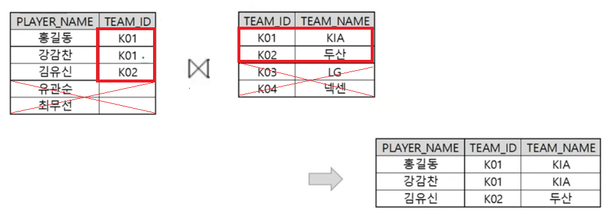
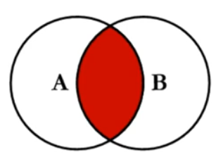
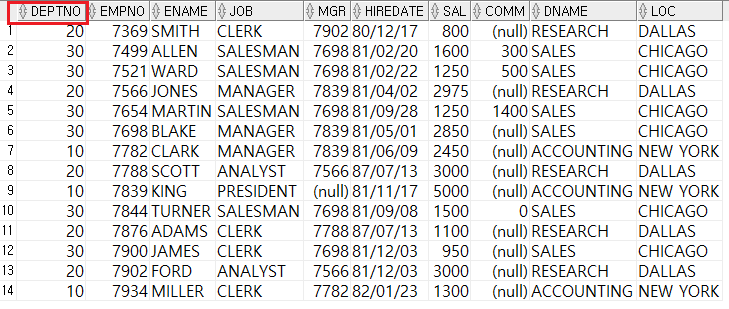
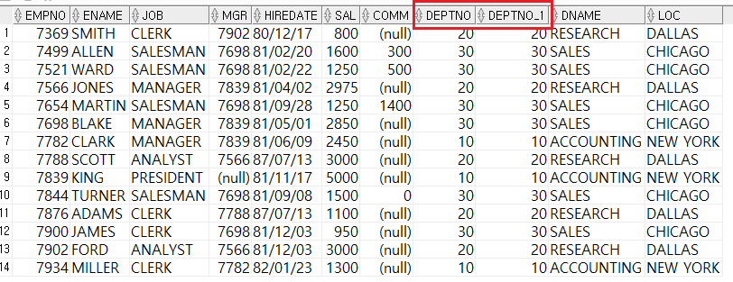
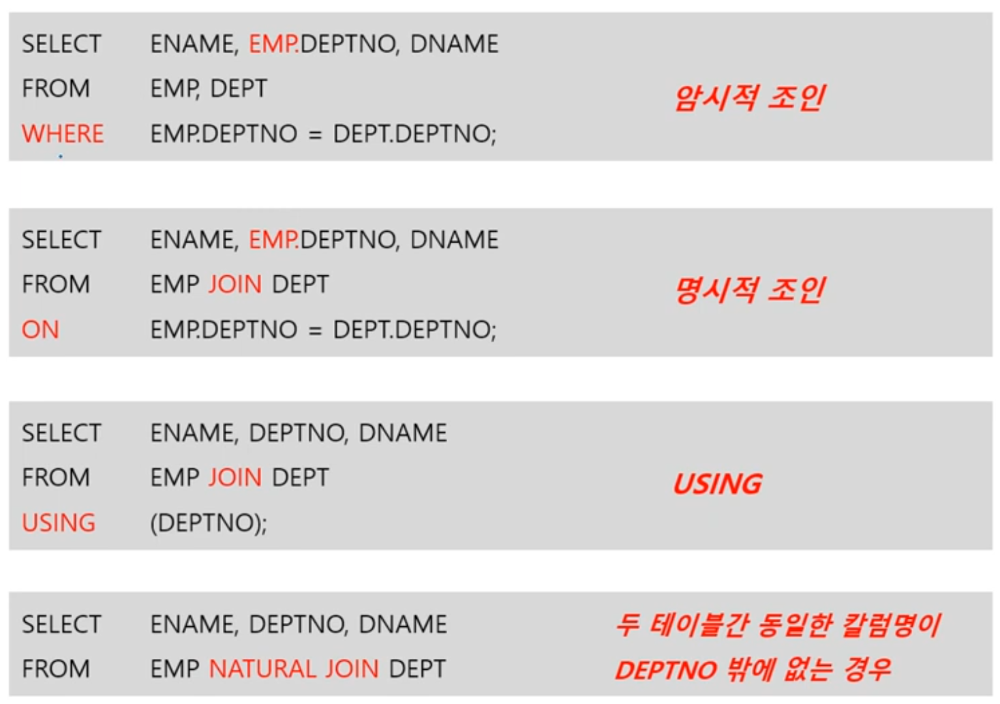

1. # INNER JOIN   
   - 서로 대응되는 내용만 검색하는 조인 : 조건을 필수로 사용   
   - 조인의 Default이므로 "INNER" 생략 가능 : INNER JOIN = JOIN   

   

   PLAYER_NAME에만 있는 TEAM_ID K01, K02만 TEAM_ID에서 뽑아옵니다. JOIN 값은 모든 테이블에 있는 값만 가져옵니다.   

   INNER JOIN은 교집합입니다.   
       

1. # NATURAL JOIN   
   - INNER JOIN의 특수한 경우 : NATURAL INNER JOIN = NATURAL JOIN   

   - 두 테이블 간 __동일한 이름을 갖는 모든 칼럼__ 들에 대해 EQUI JOIN 수행   
   -컬럼 간 __데이터 타입도 동일__ 해야 함   
   -별도의 조인 칼럼 및 조건을 지정할 수 없음   

   - 조인의 대상이 되는 컬럼에는 접두사(테이블명 또는 ALIAS)를 사용할 수 없음   
   ex)SELECT A.EMPNO, A.ENAME, B.DEPTNO (X)   
   → SELECT EMPNO, ENAME, DEPTNO (O)   
   
   *EQUI JOIN에서는 접두사(테이블명 또는 ALIAS)를 사용해야됨   
   ```sql
      SELECT EMP.ENAME, EMP.DEPTNO, DEPT.DNAME /* EMP, DEPT사용 */
      FROM EMP, DEPT
      WHERE EMP.DEPTNO = DEPT.DEPTNO
   ```   

1. # NATURAL JOIN과 INNER JOIN 
   1)NATURAL JOIN   
   ```
      SELECT EMPNO, ENAME, JOB, DEPTNO, DNAME   /*DEPTNO가 중복*/
      FROM EMP NATURAL INNER JOIN DEPT;   /*ON이란 조건절이 없습니다.*/
   ```   
   EMP와 DEPT의 공통 컬럼이 있어야 되며 공통 컬럼은 이름과 타입이 같아야 합니다. 위에 예시에선 DEPTNO가 사용되었습니다.   
   ON조건을 사용하지 않습니다. __공통 컬럼으로 내부적으로 두 테이블이 연결__ 됩니다. 공통 컬럼 DEPTNO를 사용하지만 따로 테이블을 구별하지 않습니다.   

   2)INNER JOIN   
   ```
      SELECT E.EMPNO, E.ENAME, E.JOB, D.DEPTNO, D.DNAME
      FROM EMP E INNER JOIN DEPT D
      ON E.DEPTNO = D.DEPTNO;
   ```   
   위에 NATURAL JOIN을 INNER JOIN으로 변경했습니다. 실행 결과는 같으며 ON에 E.DEPTNO = D.DEPTNO란 조건이 입력되었습니다. DEPTNO컬럼을 테이블에 따라 구별하기 위해서 별명을 사용해야 합니다. 아니면 모호성 에러가 발생합니다.   

1. # NATURAL JOIN과 INNER JOIN의 출력 컬럼 순서 차이   
   1)NATURAL JOIN   
   ```sql
      SELECT *
      FROM EMP NATURAL INNER JOIN DEPT;
   ```   
      
   SELECT *을 사용했기 때문에 모든 컬럼이 출력됩니다. 중복되는 컬럼을 기준으로 테이블을 연결하기 때문에 가장 먼저 중복 컬럼을 출력 후 테이블 순서에 따라 EMP의 모든 컬럼을 뽑고 뒤에 DEPT 컬럼을 붙여줍니다.   

   2)INNER JOIN   
   ```sql
      SELECT *
      FROM EMP E INNER JOIN DEPT D
      ON E.DEPTNO = D.DEPTNO; 
   ```   
      
   SELECT *을 사용했기 때문에 모든 컬럼이 출력됩니다. 먼저 EMP에 있는 모든 컬럼을 뽑은 후 뒤에 DEPTNO로 일치하는 DEPT테이블의 모든 컬럼을 붙이기만 합니다. 그렇기 때문에 DEPTNO와 DEPTNO_1으로 컬럼이 2개 생깁니다. DEPTNO란 컬럼이 EMP란 테이블과 DEPT란 테이블 2군데에 있기 때문입니다.   
 
 1. # ON 조건절
    - 암시적 JOIN   
    모든 조건을 WHERE절에 기술   

    - 명시적 JOIN   
    ON절의 괄호는 생략 가능   
    JOIN과 무관한 일반 조건은 WHERE절에 기술   
    ```
      SELECT E.EMPNO, E.ENAME, E.DEPTNO, D.DNAME
      FROM EMP E JOIN DEPT D
      ON (E.DEPTNO = D.DEPTNO)   /*ON절에 괄호는 생략 가능*/
      WHERE E.ENAME LIKE '%S%'   /*JOIN과 무관한 일반 조건은 WHERE절에 기술*/
    ```   

1. # USING 조건걸
   - ON절의 "=" 연산자 대신 USING 절 사용 가능   
   - 테이블 간 컬럼명이 같을 때 사용 가능   
   - 괄호 : ON 절에서는 괄호 생략 가능, USING에는 괄호 생략 불가   
   - 접두사(테이블 명 또는 ALIAS)를 사용할 수 없음   

   ON절   
   ```sql
      SELECT E.ENAME, E.DEPTNO, D.DNAME
      FROM EMP E JOIN DEPT D   /*접두사(테이블명 또는 ALIAS)사용 가능*/
      ON (E.DEPTNO = D.DEPTNO);   /*괄호 생략 가능*/
   ```   

   USING절   
   ```sql
      SELECT ENAME, DEPTNO, DNAME
      FROM EMP JOIN DEPT   /*접두사(테이블명 또는 ALIAS)사용 불가*/
      USING (DEPTNO);   /*괄호 생략 불가*/
   ```   
   NATURAL JOIN처럼 접두사를 사용 못 하지만 JOIN으로 (INNER) JOIN 사용   

1. # WHERE, ON, USING절 조건 기술 비교   
      

   -USING과 NATURAL JOIN 비교 -   
   만약 EMP테이블과 DEPT테이블에서 중복되는 컬럼이 DEPTNO 1개밖에 없는 경우면 USING = NATURL JOIN이 같은 결과를 가져옵니다.   
   만약 중복컬럼이 2개 이상이라면 
   USING은 오직 DEPTNO컬럼에 대해서만 조인을 하겠단 뜻이고, NATRUAL JOIN은 중복되는 모든 컬럼에 대해서 조인을 하겠단 뜻이 됩니다.   
