1. # OUTER JOIN(외부 조인)
   - 서로 대응되지 않는 행도 출력하는 조인   
   - 조건절을 필수로 이용   
   - 성능 저하의 원인이 될 수 있으므로 필요한 경우만 사용   
   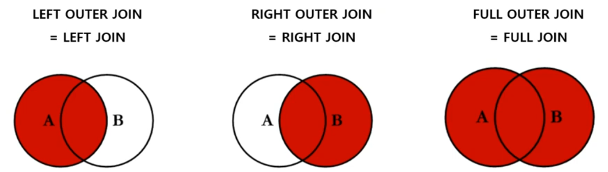   

   INNER JOIN = JOIN(INNER 생략)   
   NATURAL INNER JOIN = NATURAL JOIN(INNER 생략)   
      
   LEFT OUTER JOIN = LEFT JOIN(OUTER 생략)   
   RIGHT OUTER JOIN = RIGHT JOIN(OUTER 생략)   
   FULL OUTER JOIN = FULL JOIN(OUTER 생략)   

1. # 작동 방식
   - LEFT OUTER JOIN   
   ```sql
      SELECT * FROM A;
      A_ID       A_NUM
      ----- ----------
      A_2            2
      A_4            4
      A_5            5
      A_6            6

      SELECT * FROM B;
      B_ID       B_NUM
      ----- ----------
      B_2            2
      B_6            6
      B_7            6
      B_10          10  

      쿼리 실행:
      SELECT * 
      FROM A LEFT OUTER JOIN B
      ON A.A_NUM = B.B_NUM;
   ```   
   결과 값:   
   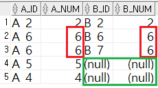  
   A테이블 값 전부 출력(A_NUM:2,4,5,6) → B테이블에 중복되는 A값 모두 출력(B_NUM:6 2번 출력) → A만 있고 B엔 없는 값은 NULL로 출력(B_NUM에는 5,4가 없어서 NULL) → B만 있고 A엔 없는 값은 출력 안됨(B_NUM의 10은 출력 안 됨)     

   - LEFT OUTER JOIN ON.. LEFT OUTER JOIN (LEFT 조인 2번)   
   A,B,C 테이블 생성   
   ```sql      
      DROP TABLE A;
      CREATE TABLE A(
          A_ID VARCHAR(5),
          A_NUM NUMBER
      );

      INSERT INTO A VALUES('A_2',2);
      INSERT INTO A VALUES('A_4',4);
      INSERT INTO A VALUES('A_5',5);
      INSERT INTO A VALUES('A_6',6);

      CREATE TABLE B(
          B_ID VARCHAR(5),
          B_NUM NUMBER
      );

      INSERT INTO B VALUES('B_2',2);
      INSERT INTO B VALUES('B_4',4);
      INSERT INTO B VALUES('B_6',6);
      INSERT INTO B VALUES('B_10',10);
      INSERT INTO B VALUES('B_8',8);

      CREATE TABLE C(
          C_ID VARCHAR(5),
          C_NUM NUMBER
      );

      INSERT INTO C VALUES('C_1',2);
      INSERT INTO C VALUES('C_6',6);
      INSERT INTO C VALUES('C_7',7);
      INSERT INTO C VALUES('C_10',10);
      INSERT INTO C VALUES('C_11',11);
   ```   
   테이블 결과 값:   
   ```sql
      
      A_ID       A_NUM
      ----- ----------
      A_2            2
      A_4            4
      A_5            5
      A_6            6

      B_ID       B_NUM
      ----- ----------
      B_2            2
      B_4            4
      B_6            6
      B_10          10
      B_8            8

      C_ID       C_NUM
      ----- ----------
      C_1            2
      C_6            6
      C_7            7
      C_10          10
      C_11          11
   ```   
   쿼리 실행   
   ```sql
      SELECT * 
      FROM A LEFT OUTER JOIN B
      ON A.A_NUM = B.B_NUM
      LEFT OUTER JOIN C
      ON B.B_NUM = C.C_NUM;
   ```   
   쿼리 결과 값:   
   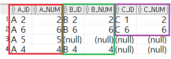   
   (A LEFT OUTER JOIN B)한 결과를 먼저 전부 출력 → (A LEFT OUTER JOIN B)에 없는 C테이블 값은 NULL로 출력

   - LEFT OUTER JOIN ON.. RIGHT OUTER JOIN (LEFT 조인 2번)   
   ```sql
      SELECT * 
      FROM A LEFT OUTER JOIN B
      ON A.A_NUM = B.B_NUM
      RIGHT OUTER JOIN C
      ON B.B_NUM = C.C_NUM;
   ```   
   쿼리 결과 값:   
   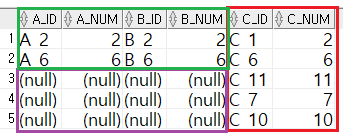   
   LEFT OUTER JOIN한 결과와 RIGHT OUTER JOIN.   
   C테이블 값을 먼저 전부 출력 → C테이블에 없는 (A LEFT OUTER JOIN B)값은 NULL로 출력   

1. # LEFT OUTER JOIN   
   - 왼쪽 테이블의 데이터를 모두 읽은 후 오른쪽 테이블에서 JOIN데이터를 가져옴   
   - 오른쪽 테이블이 JOIN조건에 해당되지 않는 경우, 해당 컬럼은 NULL로 채움   
   - 기준은 FORM절에서 테이블 순서가 기준이 됩니다.   
      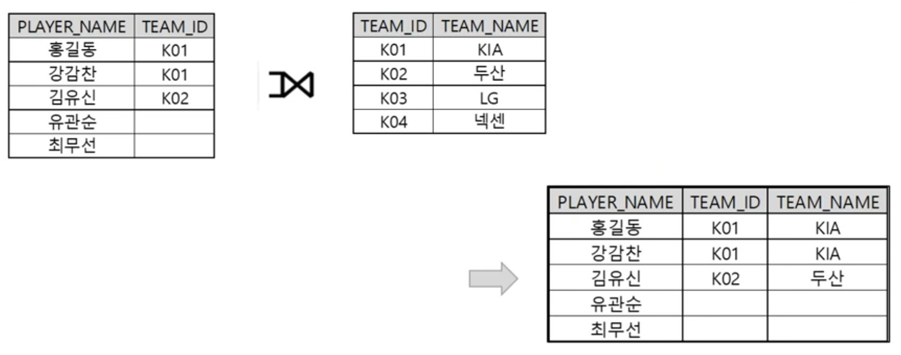   
      <hr>

      ```
         SELECT * 
         FROM PLAYER LEFT OUTER JOIN TEAM
         ON PLAYER.TEAM_ID = TEAM.TEAM_ID;
      ```   
      결과:   

      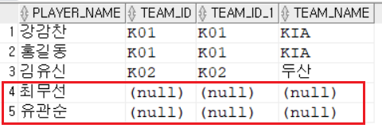   

      LEFT JOIN이기 때문에 PLAYER을 기준으로 먼저 읽어 유관순과 최무선이 나타나고 넥센과 LG가 보이지 않습니다. PLAYER를 먼저 읽고 TEAM과 일치하는 TEAM_ID를 불러 옵니다.         
      <hr>

      ```
         SELECT * 
         FROM TEAM LEFT OUTER JOIN PLAYER
         ON PLAYER.TEAM_ID = TEAM.TEAM_ID;
      ```   
      결과:   

      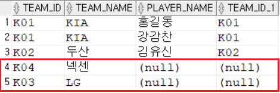   

      LEFT JOIN이기 때문에 TEAM을 기준으로 먼저 읽어 넥센과 LG가 나타나고 유관순과 최무선이 보이지 않습니다. TEAM을 먼저 읽고 TEAM_ID와 일치하는 PLAYER값들을 불러옵니다.   

1. # RIGHT OUTER JOIN
   - 오른쪽 테이블의 데이터를 모두 읽은 후 , 왼쪽 테이블에서 JOIN데이터를 가져옴   
   - 왼쪽 테이블이 JOIN조건에 해당되지 않는 경우, 해당 컬럼은 NULL로 채움   
      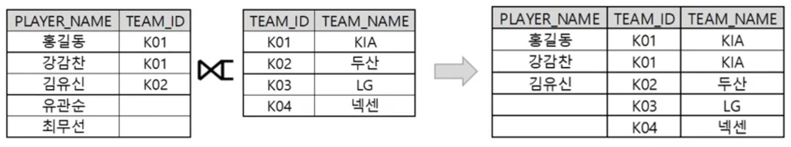   
      <hr>

      ```
         SELECT * 
         FROM PLAYER RIGHT OUTER JOIN TEAM
         ON PLAYER.TEAM_ID = TEAM.TEAM_ID;
      ```   
      결과:   

      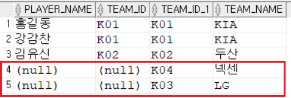   

      PLAYER테이블이 FROM절에서 먼저 나오기 때문에 PLAYER테이블이 먼저 정렬됩니다. 하지만 RIGHT JOIN으로 TEAM을 기준으로 먼저 읽고 TEAM_ID에 맞춰 PLAYER테이블에 있는 값들을 불러옵니다.
      <hr>

      ```
         SELECT * 
         FROM TEAM RIGHT OUTER JOIN PLAYER
         ON TEAM.TEAM_ID = PLAYER.TEAM_ID;
      ```   

      결과:   
      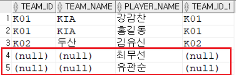   

      TEAM테이블이 FROM절에서 먼저 나오기 때문에 TEAM테이블이 먼저 정렬됩니다. 하지만 RIGHT JOIN으로 PLAYER을 기준으로 먼저 읽고 TEAM_ID에 맞춰 TEAM테이블에 있는 값들을 불러옵니다.

1. # FULL OUTER JOIN   
   - 양쪽 테이블의 데이터를 모두 읽은 후, 상대 테이블에서 JOIN데이터를 가져옴   
   - JOIN조건에 해당되지 않는 경우, 해당 컬럼은 NULL로 채움   

   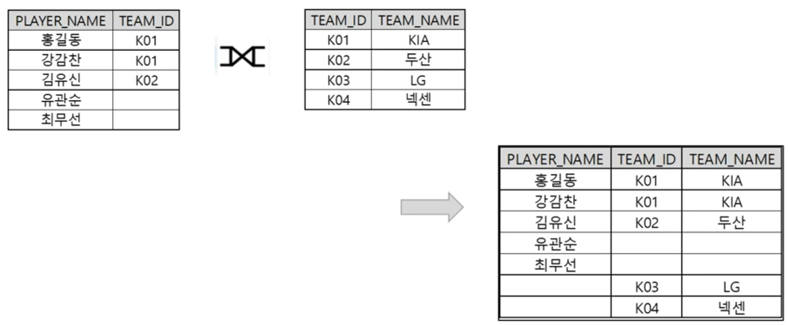   

   ```
      SELECT * 
      FROM PLAYER FULL OUTER JOIN TEAM
      ON PLAYER.TEAM_ID = TEAM.TEAM_ID;
   ```   
   결과:   
   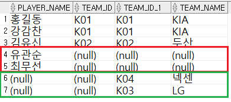   

   FROM절에 PLAYER테이블이 먼저 나왔기 때문에 PLAYER테이블이 기준으로 앞에 출력되고 이후 TEAM테이블을 기준으로 출력됩니다.

1. # UNION
   LEFT OUTER JOIN UNION RIGHT OUTER JOIN = FULL OUTER JOIN   

   - UNION(합집합=중복 제거)   
   ```
      SELECT * 
      FROM PLAYER LEFT OUTER JOIN TEAM
      ON PLAYER.TEAM_ID = TEAM.TEAM_ID
      UNION
      SELECT * 
      FROM PLAYER RIGHT OUTER JOIN TEAM
      ON PLAYER.TEAM_ID = TEAM.TEAM_ID;
   ```   
   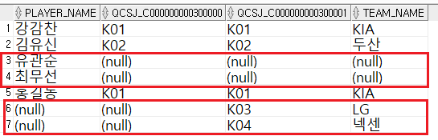   
   LEFT OUTER JOIN결과와 RIGHT OUTER JOIN결과를 합치는데 중복을 제거하고 합치기 때문에 FULL OUTER JOIN과 같은 값이 나옵니다.   
   
   <hr>
   
   - FULL OUTER JOIN   
   ```
      SELECT * 
      FROM PLAYER FULL OUTER JOIN TEAM
      ON PLAYER.TEAM_ID = TEAM.TEAM_ID;
   ```   
      
   LEFT JOIN과 RIGHT JOIN을 UNION으로 묶은 결과와 같습니다.

   <hr>

   - UNION ALL(중복제거 하지 않음)   
   ```
      SELECT * 
      FROM PLAYER LEFT OUTER JOIN TEAM
      ON PLAYER.TEAM_ID = TEAM.TEAM_ID
      UNION ALL
      SELECT * 
      FROM PLAYER RIGHT OUTER JOIN TEAM
      ON PLAYER.TEAM_ID = TEAM.TEAM_ID;
   ```   
   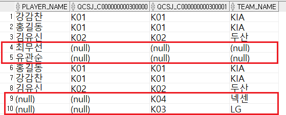   
   중복을 제거하지 않고 LEFT JOIN의 결과에 RIGHT JOIN의 결과를 그대로 붙인게 UNION ALL이 됩니다. 강감찬, 홍길동, 김유신이 2번씩 나오게 됩니다.   


