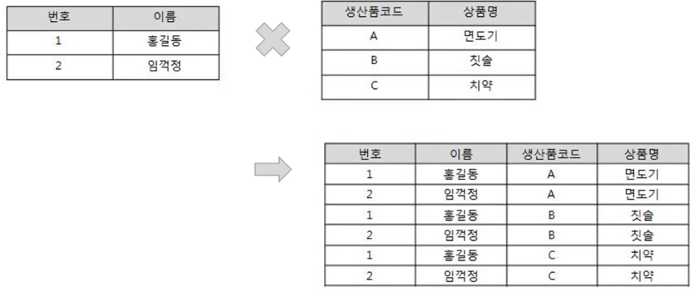
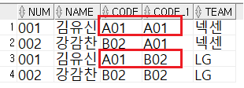
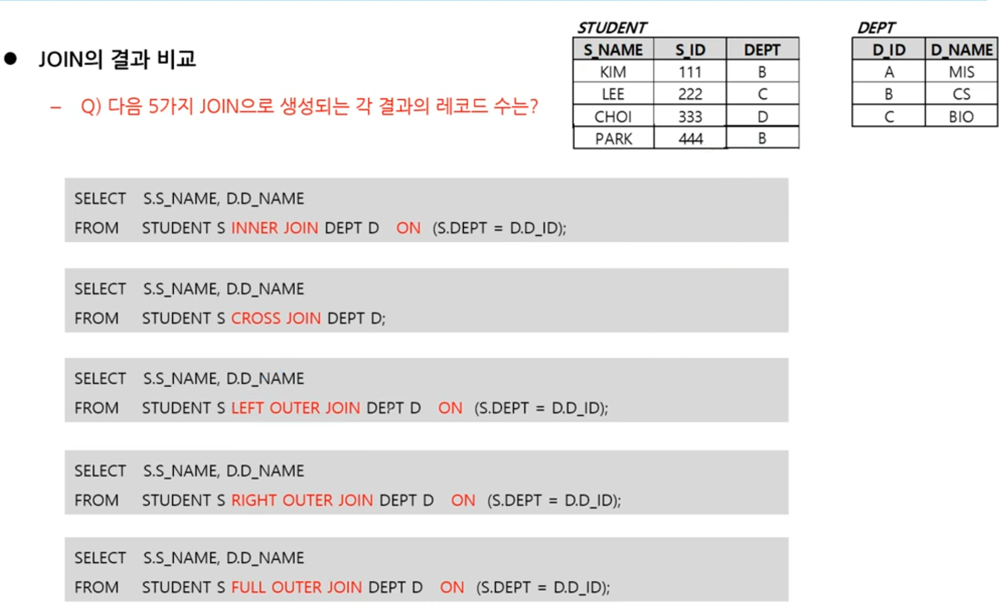

1. #  CROSS JOIN(교차 조인)
   - 두 테이블의 곱집합(Product)을 출력하는 조인   
   - 별도의 조인 조건이 없음   

      
   곱한 것만큼 다 나오는 형태입니다.   
   2 x 3 = 6, 총6개의 행이 나오게 됩니다.   

1. # 겹치는 컬럼이 있는 경우   

   MEMBER테이블   

   | 번호 | 이름 | 코드 |
   |:----:|:----:|:---:|
   |  001  | 김유신 | A01 |
   |  002  | 강감찬 | B02 |
      
   MYTEAM테이블   

   | 코드 | 팀명 | 
   |:---:|:----:|
   | A01 | 넥센 |
   | B02 | LG |
      
   ```
      SELECT *
      FROM MEMBER CROSS JOIN MYTEAM
   ```   
      

   김유신은 A01로 넥센팀이지만 ON조건절 없이 단순 곱셈으로 결과를 얻기 때문에 "김유신 A01 B02 LG"란 값도 출력이 됩니다. 따라서 CROSS JOIN은 일반적으론 잘 사용하지 않는 조인입니다. INNER JOIN은 ON에 조건을 입력하고 NATURAL JOIN은 암묵적인 동일 컬럼이 있지만 CROSS JOIN은 아무런 조건없이 Product 연산의 결과만 출력합니다.   

1. # JOIN의 결과 비교

      

   __1)INNER JOIN : 3__   
   111 B CS   
   222 C BIO   
   444 B CS   
   
   __2)CROSS JOIN : 12__   
   4 X 3   
      
   __3)LEFT OUTER JOIN : 4__   
   111 B CS   
   222 C BIO   
   333 D NULL   
   444 B CS   
   STUDENT테이블 값을 먼저 나열 후 D_ID가 일치하는 DEPT테이블 값을 삽입   
   
   __4)RIGHT OUTER JOIN : 4__   

   <table>
      <tr>
         <td rowspan=3>(1단계)</td>
         <td>A</td>
         <td>MIS</td>
      </tr>
      <tr>
         <td>B</td>
         <td>CS</td>
      </tr>
      <tr>
         <td>C</td>
         <td>BIO</td>
      </tr>
   </table>   
   RIGHT테이블 DEPT값을 먼저 나열합니다    

   <table>
      <tr>
         <td rowspan=4>(2단계)</td>
         <td>A</td>
         <td>MIS</td>
         <td>NULL</td>
      </tr>
      <tr>
         <td>B</td>
         <td>CS</td>
         <td>111</td>
      </tr>
      <tr>
         <td>B</td>
         <td>CS</td>
         <td>444</td>
      </tr>
      <tr>
         <td>C</td>
         <td>BIO</td>
         <td>222</td>
      </tr>
   </table>   
   DEPT에 D_ID값을 가기고 있는 111 __B__, 333 __D__, 444 __B__ 을 차례로 삽입합니다.   
   
   __5)FULL OUTER JOIN : 5__   
   - 먼저 INNER JOIN   
   111 B CS   
   222 C BIO   
   444 B CS   
   - 다음 INNER JOIN에 없는 LEFT OUTER JOIN 추가   
   333 D NULL   
   - 다음 위에 없는 RIGHT OUTER JOIN 추가   
   NULL A MIS   

    


