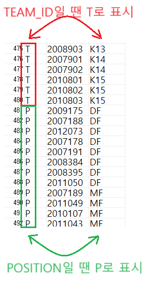

1. # Set Operator(집합 연산자)
   - 여러 질의(Select문) 결과를 하나로 결합하기 위해 사용   
   
   - 집합 연산의 대상이 되는 두 질의 조건   
      1) Select절의 컬럼 수가 동일 ☞컬럼 수가 다르면 에러발생   

      2) Select절의 동일 위치에 존재하는 컬럼의 데이터 타입이 상호 호환 가능 - 문자열과 문자열, 숫자와 숫자 등 ☞문자와 숫자가 연산될 경우 에러발생   

      3) 반드시 동일한 데이터 타입일 필요는 없음 - varchar(4)와 varchar(10) 호환 가능. 반드시 varchar(4)라고 해서 다음 컬럼도 반드시 varchar(4)일 필요는 없음. varchar(10), varchar(3),.. 역시 가능   
   
   | 집합 연산자 | 연산자 의미 |
   |:---------:|:-----------:|
   |  UNION  | 여러 SQL문의 결과에 대한 합집합<br>(중복된 행은 제거한 후 하나의 행만 출력)|
   | UNION ALL | 여러 SQL문의 결과에 대한 합집합<br>(중복된 행도 삭제하지 않고 모두 출력 → 속도가 빠르므로 우선 고려)|
   | INTERSECT | 여러 SQL문의 결과에 대한 교집합<br>(중복된 행은 제거한 후 하나의 행만 출력)|
   | MINUS(Oracle)<br>/EXCEPT(MS-SQL) | 앞의 SQL문의 결과에서 뒤의 SQL문의 결과를 뺀 차집합<br>(중복된 행은 제거한 후 하나의 행만 출력)|   
      
      

   UNION ALL을 제외하고 전부 중복 제거   
   
   R1 : 1 1 1 2 2 3 3 5 → 1 2 3 5로 미리 중복 제거 후 연산   
   R2 : 1 1 2 2 2 3 4 → 1 2 3 4로 미리 중복 제거 후 연산   
   UNION ALL만 1 1 1 2 2 3 3 5, 1 1 2 2 2 3 4 그대로 연산   

   *중복 제거 시 개별 결과집합인 __결과에서 이미 중복을 제거한 후__ UNION, INTERSPECT, MINUS(EXCEPT)연산을 합니다   

1. # ORDER BY
   
   - ORDER BY는 마지막 SELECT 이후 한 번만 사용
   ```sql
      SELECT PLAYER_NAME, BACK_NO
      FROM PLAYER
      WHERE TEAM_ID = 'K04' 
                        /* ◀ 여기에 ORDER BY 사용 불가 */
      UNION ALL
      SELECT PLAYER_NAME, BACK_NO
      WHERE TEAM_ID = 'K06'
      ORDER BY PLAYER_NAME;   /* ◀ UNION ALL을 하고 난 이후 결과에서 ORDER BY 실행*/
   ```   
   집한연산을 적용한 최종 결과에 대해 맨 마지막 줄에 한 번만 기술합니다.   
   UNION ALL 이전의 SELECT문에선 ORDER BY를 사용할 수 없습니다.   

   - 상위 컬럼만 인정
   ```sql   
      SELECT 'T' 코드, PLAYER_ID, TEAM_ID   
      FROM PLAYER
      UNION ALL
      SELECT 'P' 코드, PLAYER_ID, POSITION  
      FROM PLAYER
      ORDER BY 코드, TEAM_ID /* (O)*/
   ```   
   ORDER BY절에서 TEAM_ID 대신 밑에 SELECT 부분의 POSITION컬럼을 사용하면 ERROR발생합니다. UNION ALL은 윗쪽 SELECT 컬럼만 먼저 받아들이기 때문입니다.   
   ```sql   
      SELECT 'T' 코드, PLAYER_ID, TEAM_ID   
      FROM PLAYER
      UNION ALL
      SELECT 'P' 코드, PLAYER_ID, POSITION  
      FROM PLAYER
      ORDER BY 코드, POSITION /* (X)*/
   ```
   ORDER BY에서 TEAM_ID가 아니라 POSITION을 이용하면 ERROR   

1. # ALIAS 사용 시 ORDER BY
   SELECT절에 별명이 있을 경우 반드시 별명을 사용해야 합니다.      
   ```sql
      SELECT PLAYER_NAME, BACK_NO AS NUMBER
      FROM PLAYER
      WHERE TEAM_ID = 'K04'
      UNION ALL
      SELECT PLAYER_NAME, WIN_NO
      WHERE TEAM_ID = 'K06'
      ORDER BY BACK_NO;   /*ERROR! - 별명 미사용*/

      SELECT PLAYER_NAME, BACK_NO AS NUMBER
      FROM PLAYER
      WHERE TEAM_ID = 'K04'
      UNION ALL
      SELECT PLAYER_NAME, WIN_NO
      WHERE TEAM_ID = 'K06'
      ORDER BY WIN_NO;   /*ERROR! - 아랫쪽 컬럼 이용*/

      SELECT PLAYER_NAME, BACK_NO AS NUMBER
      FROM PLAYER
      WHERE TEAM_ID = 'K04'
      UNION ALL
      SELECT PLAYER_NAME, BACK_NO
      WHERE TEAM_ID = 'K06'
      ORDER BY NUMBER;   /*OK! - 윗쪽SELECT문의 별명 사용*/
   ```   

1. # UNION ALL
   이질적 성격의 데이터를 한꺼번에 출력하는 연산도 가능   
   ```sql      
      SELECT 'T' 코드, PLAYER_ID, TEAM_ID   
      FROM PLAYER

      UNION ALL

      SELECT 'P' 코드, PLAYER_ID, POSITION  
      FROM PLAYER
   ```   
       

   1) TEAM_ID컬럼을 사용하면 코드가 'T', POSITION컬럼을 사용하면 코드가 'P'가 됩니다 : T와 P는 상수값   

   2) TEAM_ID와 POSITION이 같은 문자 타입이기 때문에 연산이 가능   

   3) 출력 컬럼명은 첫 SELECT문의 컬럼명이 적용 : POSITION이 아니라 TEAM_ID로 출력 "코드 `|` PLAYER_ID `|` TEAM_ID" → 먼저오는 상단의 SELECT컬럼만 받아들임      

1. # INTERSECT(교집합)   
   TEAM_ID가 K06이면서 POSITION이 GK인 선수 추출하기   

   - 집합 연산으로 표현   
   ```sql
      SELECT TEAM_ID 팀코드, PLAYER_NAME 선수명, POSITION 포지션
      FROM PLAYER
      WHERE TEAM_ID = 'K06'
      INTERSECT
      SELECT TEAM_ID 팀코드, PLAYER_NAME 선수명, POSITION 포지션
      FROM PLAYER
      WHERE POSITION = 'GK' 
   ```   
   
   - AND연산으로 표현   
   ```sql
      SELECT TEAM_ID 팀코드, PLAYER_NAME 선수명, POSITION 포지션
      FROM PLAYER
      WHERE TEAM_ID='K06' AND POSITION='GK';
   ```   
   → INTERSECT 연산자는 IN 서브쿼리, EXISTS 서브쿼리로도 표현 가능   

1. # MINUS(차집합)
   TEAM_ID가 K06인 플레이어 중 POSITION이 MF인 플레이어는 제외   

   - 집합 연산으로 표현   
   ```sql
      SELECT TEAM_ID, PLAYER_NAME, POSITION
      FROM PLAYER
      WHERE TEAM_ID = 'K06'
      MINUS
      SELECT TEAM_ID, PLAYER_NAME, POSITION
      FROM PLAYER
      WHERE POSITION='MF';
   ```   

   - AND연산으로 표현   
   ```sql
      SELECT TEAM_ID, PLAYER_NAME, POSITION
      FROM PLAYER
      WHERE TEAM_ID = 'K06' AND POSITION <> 'MF'
   ```   

   - IN서브쿼리로 표현   
   ```sql
      SELECT TEAM_ID, PLAYER_NAME, POSITION
      FROM PLAYER
      WHERE TEAM_ID = 'K06' 
      AND PLAYER_ID NOT IN (SELECT PLAYER_ID FROM PLAYER WHERE POSITION = 'MF')
   ```   