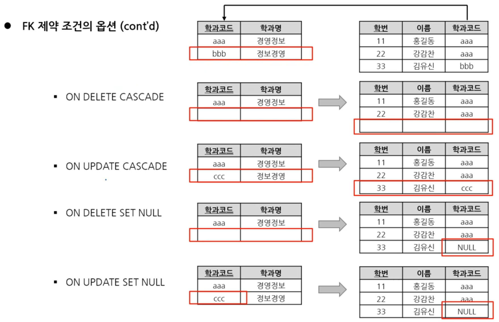

1. # 테이블 생성 규칙

   - 테이블명   
   -객체를 의미할 수 있는 이름으로, 단수형을 권고함   
   -다른 테이블의 이름과 중복되지 않아야 함   

   - 컬럼명   
   -한 테이블 내에서는 컬럼명이 중복되지 않아야 함   
   -테이블 생성시 각 컬럼들은 괄호 내에서 콤마로 구분됨   
   -컬럼 뒤에 데이터 유형이 반드시 지정되어야 함   

   - 테이블명 & 컬럼명   
   -사전에 정의된 예약어는 사용 불가   
   -테이블명과 컬럼명에는 문자, 숫자, 일부 기호(_, $, #)만 허용됨   
   -테이블명과 컬럼명은 반드시 문자로 시작해야 함(숫자, 기호 불가)

   - 제약조건명: 테이블 전체에서 다른 제약조건의 이름과 중복되지 않아야 함   

1. # Oracle 주요 데이터 타입

   - CHAR
   -고정 문자열   
   -변수에 할당된 값이 고정 길이보다 작은 경우, 나머지 공간에 공백이 채워짐   

   - VARCHAR2 : 가변 길이 문자열   
   -변수에 할당된 값이 고정 길이보다 작은 경우, 나머지 공간은 사용하지 않음   

   - NUMBER
   -정수, 실수 등의 숫자 정보   
   -NUMBER(8,2) → 전체 8자리, 소수 부분 2자리, 정수 부분 6자리   
   -NUMBER(3,0) → 전체 3자리, 소수 부분 X, 정수 부분 3자리   

   - DATE   
   -날짜와 시각 정보   

1. # 제약조건
      

   *제약 조건명을 명시적으로 부여할 수도 있고, 묵시적으로 설정할 수도 있음   

1. # 제약조건 지정
   ```sql
      DROP TABLE 테이블명 CASCADE CONSTRAINT;   /*테이블을 삭제하고 관련된 제약도 삭제*/

      /*제약조건 묵시적 생성*/
      CREATE TABLE PLAYER1(
         PLAYER_ID CHAR(7) PRIMARY KEY,   /*PK생성 제약조건명을 묵시적으로 지정*/
         PLAYER_NAME VARCHAR(20) NOT NULL,
         NICKNAME VARCHAR(20) UNIQUE,
         HEIGHT NUMBER(3) CHECK (HEIGHT>=150 AND HEIGHT<=200>),
         TEAM_ID CHAR(3) REFERENCES TEAM(TEAM_ID)   /*FK생성*/
      )

      /*제약조건 명시적 생성 - CONSTRAINT 제약조건명 */
      CREATE TABLE PLAYER2(
         PLAYER_ID CHAR(7) CONSTRAINT p2_pk_id PRIMARY KEY,   
         PLAYER_NAME VARCHAR(20) CONSTRAINT p2_nn_name NOT NULL,
         NICKNAME VARCHAR(20) CONSTRAINT p2_un_nick UNIQUE,
         HEIGHT NUMBER(3) CONSTRAINT p2_ck_height CHECK (HEIGHT>=150 AND HEIGHT<=200>),
         TEAM_ID CHAR(3) CONSTRAINT p2_fk_tid REFERENCES TEAM(TEAM_ID)   
      )

      /*CONSTRAINT 밑에 몰아서 생성*/
      CREATE TABLE PLAYER3(
         PLAYER_ID CHAR(7)
         PLAYER_NAME VARCHAR(20) NOT NULL,
         NICKNAME VARCHAR(20),
         HEIGHT NUMBER(3),
         TEAM_ID CHAR(3),

         CONSTRAINT p3_pk_id PRIMARY KEY(PLAYER_ID),
         CONSTRAINT p3_un_nick UNIQUE (NICKNAME),
         CONSTRAINT p3_ck_height CHECK(HEIGHT>=150 AND HEIGHT<=200),
         CONSTRAINT p3_fk_tid FOREIGN KEY(TEAM_ID) REFERENCES TEAM(TEAM_ID)
      )
   ```   

1. # 제약조건 확인
   ```sql
      SELECT * FROM ALL_CONSTRAINTS   /*ALL_CONSTRAINTS란 시스템 테이블을 가져옵니다.*/
      WHERE TABLE_NAME IN ('PLAYER');  /*TABLE_NAME이란 컬럼명에서 'PLAYER'란 값만 가져옵니다.*/ 
      ORDER BY TABLE_NAME
   ```   

1. # FK제약조건의 옵션

   PK테이블에서 삭제나 수정이 발생했을 때 무결성참조 에러가 발생합니다. FK테이블에서 옵션을 설정하고, PK테이블에서 삭제나 수정이 발생했을 때 이를 참조하고 있는 FK테이블에서 어떻게 동작할 것이냐를 설정하는 옵션입니다.   
   <span style="color:red">*단, 오라클에선 ON UPDATE CASCADE나 ON UPDATE SET NULL를 지원하지 않기 때문에 사용할 수 없습니다.</span>   

   FK옵션으로 ON DELETE나 ON UPDATE를 설정하면 FK가 참조하고 있는 PK의 해당 레코드가 삭제가능합니다.   
   ```sql
      CONSTRAINT fk1 FOREIGN KEY(TEMA_ID) REFERENCES TEAM(TEAM_ID)
      ON DELETE / CASCADE / ON UPDATE / RESTRICT;
   ```   

   - RESTRICT(default) : 기본값의 삭제 또는 갱신 불허   

   - NO ACTION : RESTRICT와 동일한 동작   

   - CASCADE : 종속  
      -기본키가 __삭제__ 되면 해당 값을 외래키로 갖는 레코드도 __삭제__   
      -기본키가 __갱신__ 되면 이를 참조하는 외래키를 새로운 값으로 __갱신__   

   - SET NULL : 기본키가 삭제 또는 갱신되면 이를 참조하는 외래키를 NULL로 업데이트   

   ex)   
      
   학과코드의 PK인 bbb를 삭제시 FK로 참조하고 있는 학번테이블과 PK테이블에서 할 수 있는 조치를 옵션들입니다.   
   - ON DELETE CASCADE : 학과코드도 삭제 + 학번테이블에서 bbb가 포함된 레코드를 전부 삭제   
   - ON UPDATE CASCADE : 학과코드에 새로운 값 생성 + 학번테이블의 참조 레코드에도 새로운 값 생성   
   - ON DELETE SET NULL : 학과코드는 삭제 + 학번테이블에서 bbb가 포함된 레코드 NULL로 출력   
   - ON UPDATE SET NULL : 학과코드에 새로운 값 생성 + 학번테이블에서 bbb가 포함된 레코드 NULL로 출력   

   ON DELETE/UPDATE - PK처리 방안(PK에서 삭제나 갱신을 하면)   
   CASCADE/SET NULL - FK처리 방안(FK에서 종속적으로 처리 또는 null로 셋팅)   

   예제 소스 : MYTEAM의 PK를 MYPLAYER의 FK에서 참조, MYTEAM의 PK인 TEAM_ID 중 1개를 삭제   
   ```sql  
      DROP TABLE MYPLAYER;
      DROP TABLE MYTEAM;

      CREATE TABLE MYTEAM(
          TEAM_ID VARCHAR(10) PRIMARY KEY,
          TEAM_NAME VARCHAR(20)
      );

      INSERT INTO MYTEAM VALUES('K01','KIA');
      INSERT INTO MYTEAM VALUES('K02','두산');
      INSERT INTO MYTEAM VALUES('K03','LG');
      INSERT INTO MYTEAM VALUES('K04','닉센');

      CREATE TABLE MYPLAYER(
          PLAYER_ID VARCHAR(10),
          PLAYER_NAME VARCHAR(20),
          TEAM_ID VARCHAR(10) REFERENCES MYTEAM(TEAM_ID) ON DELETE SET NULL  /*TEAM_ID 레코드 삭제시 NULL표시*/
      );

      INSERT INTO MYPLAYER VALUES('101','홍길동','K01');
      INSERT INTO MYPLAYER VALUES('102','강감찬','K01');
      INSERT INTO MYPLAYER VALUES('103','유관순','K02');
      INSERT INTO MYPLAYER VALUES('104','최무선','K03');
      INSERT INTO MYPLAYER VALUES('105','김유신','K04');

      DELETE MYTEAM WHERE TEAM_ID='K03';  /*삭제 가능하며 참조하는 FK레코드는 NULL로 표시*/
   ```   

1. # 무결성 Action
   - Delete(Modify) Action : Cascasde, Set null, Set Default, Restrict   
   1)Cascade : Master 삭제 시 Child 같이 삭제   
   2)Set Null : Master 삭제 시 Child 해당 필드 Null 입력   
   3)Set Default : Master 삭제 시 Child 해당 필드 Default 값으로 설정   
   4)Restrict : Child 테이블에 PK 값이 없는 경우만 Master 삭제 허용   
   5)No Action : 참조무결성을 위반하는 삭제/수정 액션을 취하지 않음   

   - Insert Action : Automactic, Set null, Set Default, Dependent   
   1)Cascade : Master 테이블에 PK가 없는 경우 Master PK를 생성 후 Child 입력   
   2)Set Null : Master 테이블에 PK가 없는 경우 Child 외부키를 Null 값으로 처리   
   3)Set Default : Master 테이블에 PK가 없는 경우 Child 외부키를 지정된 기본값으로 입력   
   4)Dependent : Master 테이블에 PK가 존재할 때만 Child 입력 허용   
   5)No Action : 참조무결성을 위반하는 입력 액션을 취하지 않음   

1. # 기존 테이블을 이용해서 테이블 생성
   ```sql
      CREATE TABLE PLAYER_TEMP   /*CREATE로 TABLE을 생성함*/
      AS SELECT * FROM PLAYER   /*AS SELECT로 복제할 데이터를 호출*/
      WHERE ROWNUM < 4;   /*상위 3개까지만 노출*/
   ```   

   CREATE TABLE AS로 테이블을 생성시 데이터와 NOT NULL 제약조건만 복제가 됩니다.   
   그외 <span style="color:red">PK, FK, UNIQUE, CHECK등은 __수동__ 으로 추가</span>를 해줘야 합니다.   

1. # ALTER문을 통한 테이블 변경
   테이블을 변경하는 대부분의 작업은 컬럼과 제약조건을 변경하는 것입니다.   
   컬럼을 추가/수정/삭제하고, 제약조건을 추가/삭제 등을 하는 것을 테이블을 변경한다고 합니다.   

   ```sql
      - 컬럼 추가,삭제,수정,이름변경 -
      ALTER TABLE 테이블명 ADD (컬럼명 타입);   /*컬럼 추가*/
      ALTER TABLE 테이블명 DROP COLUMN 컬럼명;   /*컬럼 삭제*/
      ALTER TABLE 테이블명 MODIFY (컬럼명 NOT NULL/NULL);   /*컬럼 속성변경*/
      ALTER TABLE 테이블명 RENAME COLUMN 변경전컬럼명 TO 변경후컬럼명;   /*컬럼명 변경*/

      - PK 추가, 삭제 -
      ALTER TABLE 테이블명 ADD CONSTRAINT 제약조건명 PRIMARY KEY (컬럼명);   /*PK 추가*/
      ALTER TABLE 테이블명 ADD CONSTRAINT 제약조건명 PRIMARY KEY (컬럼명) ON DELETE CASCADE;  /*(X) ON DELETE는 FK옵션*/   
      
      ALTER TABLE 테이블명 DROP CONSTRAINT PK제약조건명;   /*PK 삭제*/

      - FK 추가, 삭제 -
      ALTER TABLE 테이블명 ADD CONSTRAINT 제약조건명 FOREIGN KEY (컬럼명) REFERENCES 참조할테이블명(컬럼명);  /*FK 추가*/
      ALTER TABLE 테이블명 ADD CONSTRAINT 제약조건명 FOREIGN KEY (컬럼명) REFERENCES 참조할테이블명(컬럼명) ON DELETE CASCADE;
      /*옵션 ON DELETE CASCADE추가*/
      ALTER TABLE 테이블명 ADD CONSTRAINT 제약조건명 FOREIGN KEY (컬럼명) REFERENCES 참조할테이블명(컬럼명) ON DELETE SET NULL;
      /*옵션 ON DELETE SET NULL추가*/

      ALTER TABLE 테이블명 DROP CONSTRAINT FK제약조건명;   /*FK 삭제*/

      - 테이블 이름변경, 삭제 -
      RENAMNE 기존테이블명 TO 새테이블명;   /*테이블명 변경*/
      DROP TABLE 테이블명 CASCADE CONSTRAINT;   /*테이블 삭제*/   
   ```    

   1)컬럼추가 - ADD   
   ```sql
      ALTER TABLE PLAYER_TEMP ADD (ADDRESS VARCHAR(20));
   ```   
   추가된 컬럼은 제일 끝에 생성됩니다.   

   2)컬럼삭제 - DROP COLUMN   
   ```sql
      ALTER TABLE PLAYER_TEMP DROP COLUMN ADDRESS;
   ```   
   삭제 후 최소 1개 이상의 컬럼이 테이블에 존재해야됩니다.   

   3)컬럼명 변경 - RENAME COLUMN   
   ```sql
      ALTER TABLE PLAYER_TEMP RENAME COLUMN PLAYER_ID TO PLAYER_NEW_ID;
   ```   
   해당 컬럼의 모든 정의가 그대로 유지됨   

   4)컬럼의 정의 수정 - MODIFY   

   - 이미 입력되어 있는 값에 영향을 미치는 변경은 허용하지 않음   

   - 데이터 타입 변경 : 데이블에 아무 행도 없거나, 해당 컬럼이 NULL만 갖고 있을 때 가능   

   - 컬럼의 크기 변경   
   -컬럼의 크기 확대 : 항상 가능 ex)char(10) → char(15)   
   -컬럼의 크기 숙소 : 테이블에 아무 행도 없거나, 해당 컬럼이 NULL만 갖고 있거나, 현재 저장된 값을 수용할 수 있는 크기로의 축소만 가능 ex)char(15) → char(5)   
   
   - DEFAULT 값 추가 및 수정 : 추가 및 수정 이후 삽입되는 행에만 영향을 미침   
   ex)기존 값 : 12 14 null(여기 null값은 그대로) 34 |→(default 값 15 설정) 이제부터 null입력시 15로 입력 앞에 null값은 그대로 남음   
   
   - NOT NULL 제약조건 추가 : 테이블에 아무 행도 없거나, 해당 컬럼에 NULL이 없을 때 가능   
   - NOT NULL 제약조건 삭제 : 항상 가능   

   ```sql
      ALTER TABLE PLAYER_TEMP MODIFY (PLAYER_NAME NULL);   /*NOT NULL인 경우 NULL로 변경*/
      ALTER TABLE PLAYER_TEMP MODIFY (PLAYER_NAME NOT NULL);   /*NULL인 경우 NOT NULL로 변경*/
   ```   

   (5)제약 조건의 추가/삭제 - ADD/DROP CONSTRAINT   
   - 테이블 생성 후에도 제약 조건을 추가/삭제 할 수 있음   
   ```sql
      ALTER TABLE PLAYER_TEMP ADD CONSTRAINT PLAYER_TEMP_PK PRIMARY KEY (PLAYER_ID);
      /*PK 추가*/

      ALTER TABLE PLAYER_TEMP DROP CONSTRAINT PLAYER_TEMP_PK;
      /*PK 삭제*/

      ALTER TABLE PLAYER_TEMP ADD CONSTRAINT PLAYER_TEMP_FK FOREIGN KEY (TEAM_ID) REFERENCES TEAM(TEAM_ID);
      /*FK 추가*/

      ALTER TABLE PLAYER_TEMP DROP CONSTRAINT PLAYER_TEMP_FK;
      /*FK 삭제*/
   ```   

   (6)테이블명 변경 - RENAME   
   ```sql
      RENAME PLAYER_TEMP TO PLAYER_NEW;   /*PLAYER_TEMP 테이블명을 PLAYER_NEW로 변경*/
   ```   

   (7)테이블 삭제 - DROP   
   ```sql
      DROP TABLE TEAM CASCADE CONSTRAINT;  /*제약조건을 삭제하고 나서 테이블 삭제*/
   ```   

1. # DROP, TRUNCATE, DELETE 비교

   | DROP | TRUNCATE | DELETE |
   |:----:|:-------:|:------:|
   |  DDL |  DDL  |  DML  |
   | 자동 커밋 | 자동 커밋 | 사용자 커밋|
   |테이블 정의 자체를<BR>삭제|테이블을 최초 생성단계로<BR>초기화|데이터만 삭제|
   |Roll Back 불가|Roll Back 불가|Roll Back 가능|
   |처리속도 빠름|처리속도 빠름|처리속도 느림(undo생성)|