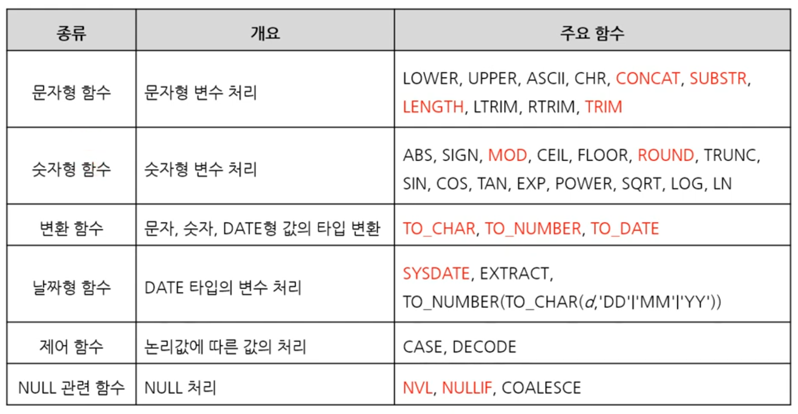

1. # 함수의 유형
   - 생성 주체   
      -사용자 정의 함수(User Defined Function) - 사용자가 정의   
      -내장 함수(Built-in Function) - 벤더가 정의   
   
   - 적용 범위   
      -단일 행 함수(Single-Row Function)   
      
      1)문자형 함수, 숫자형 함수, 날짜형 함수   
      2)제어 함수, 변환 함수, NULL 관련 함수   

      -다중 행 함수(Multi-Row Function)   

      1)그룹 함수(Group Function) - 집계함수(Aggregate Function) 포함   
      2)윈도우 함수(Window Function)   

1. # 단일 행 함수
   
   ```sql
      SELECT PLAYER_NAME, LENGTH(PLAYER_NAME) AS 길이 FROM PLAYER;
   ```   
   LENGTH: PLAYER_NAME컬럼의 데이터 길이를 가져옵니다   

   - 각 행에 대해 개별적으로 작용하고 그 결과를 반환   
      -단일 행 내에 있는 하나 또는 복수의 값을 인수로 인용   
      -여러 행에 걸친 값을 사용할 수 없음   

   - 함수 중첩(함수의 인자로 함수를 사용)이 가능함   

   - SELECT, WHERE, ORDER BY 절에 사용 가능   

   - 단일행 내장 함수   
      

1. # 문자형 함수

   - CHR(ASCII코드) : 아스키 코드 숫자를 문자로 출력.  
   ```sql
      SELECT CHR(65) FROM DUAL;   /* A */
   ```   

   - UPPER(문자열) : 문자열을 대문자로 변환.   
   ```sql
      SELECT UPPER('abcd') FROM DUAL; /* ABCD *
   ```   

   - LOWER(문자열) : 문자열을 소문자로 변환.   
   ```sql
      SELECT LOWER('ABCD') FROM DUAL; /* abcd */
   ```   

   - LTRIM(문자열,[특정 문자]) : 특정 문자가 없으면 문자열의 왼쪽 공백 제거, 특정 문자가 있으면 문자열 시작이 일치하는데까지 삭제.   
   ```sql
      SELECT LTRIM('  B L ANK  ') FROM DUAL;   /*B L ANK   */
      
      SELECT LTRIM('ABCD','ABC') FROM DUAL;   /*D*/
      SELECT LTRIM('ABCD','CBA') FROM DUAL;   /*D*/
      SELECT LTRIM('ABCD','CAB') FROM DUAL;   /*D*/
   ```   
   LTRIM('ABCD','CAB') 순서는 상관없고 일치하는 연속된 문자열   

   - RTRIM(문자열,[특정 문자]) : 특정 문자가 없으면 문자열의 오른쪽 공백 제거, 특정 문자가 있으면 문자열 끝이 일치하는데까지 삭제.   
   ```sql
      SELECT LTRIM(' B L ANK  ') FROM DUAL;   /* B L AN*/

      SELECT RTRIM('ABCD','BCD') FROM DUAL;   /*A*/
      SELECT RTRIM('ABCD','DCB') FROM DUAL;   /*A*/
      SELECT RTRIM('ABCD','DBC') FROM DUAL;   /*A*/
   ```   
   RTRIM('ABCD','DBC') 순서는 상관없고 일치하는 연속된 문자열   

   - TRIM(문자열) : 문자열만 있을 경우 가장 앞과 가장 뒤 공백 제거   
   - TRIM([LEADING or TRAILING or BOTH '한문자'],[FROM '문자열']) : 
   LEADING : 앞에서부터 일치하는 문자 제거   
   TRAILING : 뒤에서부터 일치하는 문자 제거   
   ```sql
      SELECT TRIM('  B L AN K  ') FROM DUAL;   /*B L AN K*/

      SELECT TRIM(LEADING 'A' FROM 'ABCDE') FROM DUAL;   /*BCDE*/
      SELECT TRIM(TRAILING 'E' FROM 'ABCDE') FROM DUAL;   /*ABCD*/
      SELECT TRIM(BOTH 'B' FROM 'BCDEB') FROM DUAL;   /*CDE*/
   ```  

   - SUBSTRING(문자열, 시작점, 개수) : 개수가 없을 경우 문자열을 시작점부터 끝까지 선택, 개수가 있을 경우 문자열을 시작점부터 개수만큼 선택   
   ```sql
      SELECT SUBSTR('ABCD',2) FROM DUAL;   /*BCD : A가 1, B부터 끝까지 선택*/
      SELECT SUBSTR('ABCD',2,2) FROM DUAL;   /*BC : B부터 2개 선택*/
   ```   

   - LENGTH(문자열) : 공백포함 문자열 길이 반환.   
   ```sql
      SELECT LENGTH('L E N') FROM DUAL;   /*5 : 공백 포함*/
   ```   

   - REPLACE(문자열, 변경 전 문자열, 변경 후 문자열) : 변경 후 문자열이 없으면 변경 전 문자열을 삭제, 변경 후 문자열이 있으면 교체.
   ```sql
      SELECT REPLACE('ORACLE','ORA') FROM DUAL;   /*CLE*/
      SELECT REPLACE('ORACLE','ORA','MY') FROM DUAL;   /*MYCLE*/
   ```   

   - CONCAT과 ||(파이프 라인) :문자열과 문자열을 연결함       
   방법1: CONCAT(str1, str2) ☜ CONCAT 함수   
   방법2: str1 || str2 ☜ || 연산자   
   ```sql
      SELECT CONCAT(HEIGHT,'Cm') FROM PERSON;
      SELECT HEIGHT || 'Cm' FROM PERSON;
   ```   
   PERSON이란 테이블에서 키 HEIGHT컬럼을 가져와 Cm란 단위를 붙였습니다.   
   CONCAT(str1, str2, str3) : ERROR발생 - CONCAT함수의 인자는 2개   
   str1 || str2 || str3 : 정상실행 - 파이프라인은 str1과 str2 연산 후 str3을 연산, 더 많은 수의 인자 가능   
   ```sql
      SELECT PLAYER_NAME || ' 선수: ' || HEIGHT || 'Cm' AS '선수 신장' FROM PLAYER;
   ```   
   결과 - 윤희준 선수: 180Cm   
   
   *함수와 연산자는 동일한 것   
   어떤 기능을 만들고 싶을 때 그것을 구현한 함수를 만들게 되는 것이고 이 함수를 자주 사용하게되면 편의를 위해 함수의 기능을 하는 기호를 만들게 되고 이것이 연산자가 됩니다.   

1. # 숫자함수   

   - ABS(숫자) : 절대값 반환   
   ```sql
      SELECT ABS(-5) FROM DUAL;   /*5*/
   ```   

   - SIGN(숫자) : 부호를 반환. 양수이면 1, 음수이면 -1, 0이면 0 반환.
   ```sql
      SELECT SIGN(-2) FROM DUAL;   /*-1*/
      SELECT SIGN(0) FROM DUAL;   /*0*/
      SELECT SIGN(2) FROM DUAL;   /*2*/
   ```   

   -  ROUND(숫자, [자릿수]) :  반올림 
   ```sql
      SELECT ROUND(23.35) FROM DUAL;   /*23*/
      SELECT ROUND(23.65) FROM DUAL;   /*24*/
      
      SELECT ROUND(23.25467, 0) FROM DUAL; /*23*/
      SELECT ROUND(23.75467, 0) FROM DUAL; /*24*/

      SELECT ROUND(23.65875, 1) FROM DUAL;   /*23.7*/
      SELECT ROUND(23.6533, 2) FROM DUAL;   /*23.65*/
      SELECT ROUND(23.6533, 3) FROM DUAL;   /*23.653*/

      SELECT ROUND(4523.65875, -1) FROM DUAL;   /*4520*/
      SELECT ROUND(4563.6568, -2) FROM DUAL;   /*4600*/
      SELECT ROUND(4123.6568, -3) FROM DUAL;   /*4000*/
   ```   

   - TRUNC(숫자, [자릿수]) : 버림   
   ```sql
      SELECT TRUNC(54.379) FROM DUAL;  /*54*/
      SELECT TRUNC(54.679) FROM DUAL;  /*54*/

      SELECT TRUNC(54.679,0) FROM DUAL;  /*54   0자리에서 버림*/
      SELECT TRUNC(54.679,1) FROM DUAL;  /*54.6   1자리에서 버림*/
      SELECT TRUNC(54.679,2) FROM DUAL;  /*54.67   2자리에서 버림*/

      SELECT TRUNC(854.679,-1) FROM DUAL;  /*850   -1자리에서 버림*/
      SELECT TRUNC(854.679,-2) FROM DUAL;  /*800   -2자리에서 버림*/
   ```   

   - CEIL(숫자) : 올림(음수는 소수를 버리는 게 올림)   
   ```sql
      SELECT CEIL(23.154) FROM DUAL;  /*24*/       
      SELECT CEIL(-23.154) FROM DUAL;  /*-23*/       
   ```   

   - FLOOR(숫자) : 내림   
   ```sql
      SELECT FLOOR(34.26) FROM DUAL;   /*34*/
      SELECT FLOOR(34.76) FROM DUAL;   /*34*/

      SELECT FLOOR(-34.26) FROM DUAL;   /*35*/
      SELECT FLOOR(-34.76) FROM DUAL;   /*35*/
   ```   

   - MOD(num1, num2) : num2를 num1로 나눈 __나머지__ 를 반환. *부호는 피제수를 따라갑니다.   
   ```sql
      SELECT MOD(5,3) FROM DUAL;   /*2*/
      SELECT MOD(-5,3) FROM DUAL;   /*-2*/
      SELECT MOD(5,-3) FROM DUAL;   /*2*/
      SELECT MOD(-5,-3) FROM DUAL;   /*-2*/
   ```   

1. # 날짜 함수   
   ex)YYYY.MM.DD.HH.MI.SS : 2023.04.28.05.34.23   
   YYYY.MM.DD.HH24.MI.SS : 2023.04.28.17.34.23   

   - SYSDATE   
   ```sql
      SELECT SYSDATE FROM DUAL;   /*23/10/06*/
      SELECT 
   ```   
   *SYSDATE는 DUAL값과 아무런 관계가 없습니다. SYSDATE는 DBMS에서 제공하는 시스템변수입니다.   

   - EXTRACT('YEAR'|'MONTH'|'DYA' FROM 날짜) : 날짜에서 특정 단위(YEAR, MONTH DAY, HOUR, MINUTE, SECOND)를 추출   
   ```sql
      SELECT EXTRACT(YEAR FROM SYSDATE) FROM DUAL;    /*2023*/
      SELECT EXTRACT(MONTH FROM SYSDATE) FROM DUAL;   /*10*/
   ```   
   EXTRACT함수 사용이유   
   ```sql
      SELECT 
         TO_NUMBER(TO_CHAR(BIRTH,'YYYY')) AS 년,
         TO_NUMBER(TO_CHAR(BIRTH,'MM')) AS 월,
         TO_NUMBER(TO_CHAR(BIRTH,'DD')) AS 일
      FROM MEMBERS;

      /*
      BIRTH 데이터에서 년,월,일을 추출하는데 문자로 바꾼 후 다시 숫자로 바꿔져야 하는 불편함이 있음
      이 불편을 없애기 위해서 밑에 EXTRACT사용
      */

      SELECT 
         EXTRACT(YEAR FROM BIRTH) AS 년,
         EXTRACT(MONTH FORM BIRTH) AS 월,
         EXTRACT(DAY FROM BIRTH) AS 일
      FROM MEMBERS
   ```   
   - TRUNC(날짜,'DD') : 날짜 데이터에서 시/분/초를 잘라냄   
   ```sql   
      SELECT TRUNC(SYSDATE,'DD') FROM DUAL;  /*23/10/14 DD밑으로 짜름*/
      SELECT PLAYER_NAME, BIRTH_DATE, TRUNC(SYSDATE-BIRTH_DATE,0) FROM PLAYER; 
      /*BIRTH_DATE 생일 데이터에서 오늘 날짜를 빼는데 뒤에 시분초를 뺀 부분은 전부 삭제*/
   ```   
   
1. # 형변환

   1) 암시적 형변환   
   BIRTHDAY타입이 문자형(VARCHAR 또는 CHAR)인데 20040203이란 숫자와 비교를 할 경우 DBMS에서 자동으로 BIRTHDAY타입을 숫자로 변환시켜줍니다. 이걸 암시적 형변환 이라고 합니다.   

   - 암시적 형변환 예시   
   ```sql
      SELECT SYSDATE+2 FROM DUAL;  
      /*날짜 일에 숫자2를 더함. 날짜를 숫자로 암시적 형변환*/

      SELECT * FROM MEMBER WHERE NUM='001';
      SELECT * FROM MEMBER WHERE NUM=001;
      /*NUM타입은 문자열인데 숫자를 비교해도 가능*/

      MOD(PLAYER_ID, 4); /*PLAYER_ID가 문자열이라도 숫자로 인식*/
   ```

    => 문자열만 숫자나 날짜로 바꿀 수 있습니다.(날짜를 숫자로 못 바꾸고 숫자를 날짜로 못 바꿉니다.)   
   숫자나 날짜는 문자열로 바꿀 수 있습니다.   
   VARCHAR2 ↔ NUMBER   
   VARCHAR2 ↔ DATE   

   암시적 변환은 성능 저하를 가져오고 에러가 발생되는 경우도 있기 때문에 되도록 명시적 형변환을 해야 합니다.   

   2) 명시적 형변환 → (변환형 함수)   
   데이터 타입을 변환해 주는 함수. 명시적 형변환을 해주는 함수만 변환형 함수라고 합니다.    

   - TO_CHAR(숫자|날짜, [FORMAT]) : 숫자나 날짜 를 문자열로 변환, FORMAT이 있으면 FORAMT형식으로 변환   
   ```sql
      SELECT TO_CHAR(SYSDATE, 'YYYY-MM-DD') FROM DUAL;  /*2023-10-13*/ 
      SELECT TO_CHAR(SYSDATE, 'YYYY/MM/DD') FROM DUAL;  /*2023/10/13*/
      SELECT TO_CHAR(SYSDATE, 'YYYY.MM.DD.HH24.MI.SS') FROM DUAL;  /*2023.10.13.23.54.16*/
      SELECT TO_CHAR(SYSDATE) FROM DUAL;  /*23/10/13*/
   ```   

   - TO_NUMBER(문자열) : 문자열을 숫자로 변환    
   ```sql
      SELECT TO_NUMBER('234') FROM DUAL;   /*234*/
      SELECT TO_NUMBER('23A') FROM DUAL;   /*에러 발생*/ 

      SELECT '1' + '1' FROM DUAL; /*결과:2 암시적 변환*/
      SELECT TO_NUMBER('1') + TO_NUMBER('1') FROM DUAL; /*결과:2 명시적 변환*/
   ```   

   - TO_DATE(문자열, [FORMAT]) : 문자열을 날짜로 변환, FORMAT이 있으면 FORMAT형식으로 변환
   ```sql
      SELECT TO_DATE('20230312','YYMMDD') FROM DUAL;  /*230312*/

      SELECT  EXTRACT (YEAR FROM sysdate) FROM dual;  /*2023 오늘 날짜에서 year만 추출*/

      SELECT EXTRACT (YEAR FROM '2020/03/03') FROM dual;  
      /*2020/03/03은 문자열이고 EXTRACT는 날짜타입에서 추출하기 때문에 ERROR발생*/
      SELECT EXTRACT (YEAR FROM TO_DATE('2020/03/03')) FROM dual;  /*'2020-03-03을 날짜 타입으로 변환 후 추출*/      
   ```   
   TO_DATE(210303) → 2021월3월3일   
   TO_DATE(20210303) → 2021월3월3일   
   TO_DATE(2021-03-03) → 2021월3월3일   
   TO_DATE(2021/03/03) → 2021월3월3일   

1. # CASE
   - 표현식이지만 함수의 성격을 갖고 있음.   
   - 프로그래밍에서 SWITCH와 비슷한 논리 흐름.   

   __일반 프로그램__   
   switch(tmp){   
   &nbsp;&nbsp;&nbsp;&nbsp;case "A" : println("1") break;   
   &nbsp;&nbsp;&nbsp;&nbsp;case "B" : println("2") break;   
   &nbsp;&nbsp;&nbsp;&nbsp;case "C" : println("3") break;   
   &nbsp;&nbsp;&nbsp;&nbsp;default : println("default");   
   }   

   ```sql
      /*Searched Case Expression*/
      SELECT SUBWAY_LINE,
         CASE 
            WHEN SUBWAY_LINE='1' THEN 'BLUE' 
            WHEN SUBWAY_LINE='2' THEN 'GREEN'
            WHEN SUBWAY_LINE='3' THEN 'ORANGE'
            ELSE 'BLACK' 
         END AS VALUE
      FROM SUBWAY_INFO;

      /*Simple Case Expression*/
      SELECT SUBWAY_LINE,
         CASE SUBWAY_LINE  /*CASE 다음 바로 변수가 나오면 simple*/
            WHEN 1 THEN 'BLUE'
            WHEN 2 THEN 'GREEN'
            WHEN 3 THEN 'ORANGE'
            ELSE 'BLACK'
         END AS VALUE
      FROM SUBWAY_INFO;
   ```   
   :만약 A가 1이면 B를 하고, A가 2이면 C를 하고, A가 3이면 D를 하고, 나머지는 E를 해라.   
   
   SUBWAY_INFO 테이블   

   |      |SUBWAY_LINE|
   |:----:|:----:|
   |  1  |  3  |
   |  2  |  1  |
   |  3  |  5  |
   |  4  |  2  |
   |  5  |  4  |   

   CASE 결과 값:   
   
   |      |SUBWAY_LINE|VALUE|
   |:----:|:----:|:----:|
   |  1  |  3  | ORANGE  |
   |  2  |  1  |  BLUE |
   |  3  |  5  |  BLACK  |
   |  4  |  2  |  GREEN  |
   |  5  |  4  |  BLACK  |   
   
   - Searched Case Expression CASE만 가능한 경우   
      동등(= equal) 이외의 조건(부등호나 BETWEEN.. 등)은 Simple Case로 나타낼 수 없습니다.   
      ```sql
         SELECT PLAYER_NAME,
            CASE
               WHEN HEIGHT > 185 THEN '장신' /*부등호*/
               WHEN HEIGHT BETWEEN 175 AND 185 THEN '평균'  /*BETWEEN*/
               ELSE '단신'
            END AS 신장
         FROM PLAYER;
      ```   
    
    - CASE 중첩   
      ```sql
         SELECT PLAYER_NAME,
            CASE 
               WHEN HEIGTH > 185 THEN '정산' 
               ELSE(
                  CASE
                     WHEN HEIGHT BETWEEN 175 AND 185 THEN '평균'
                     ELSE '단신'
                  END
               )
            END AS 신장
         FROM PLAYER;
      ```   