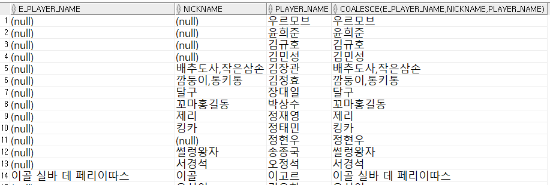

1. # NULL이란?
   - 비어있는 값   
   - 공백(space), 0과 다른 의미   
   - NULL을 포함하는 모든 산술 연산의 결과는 NULL   
      -NULL+0, NULL-1, NULL*0, NULL/0 → NULL   
   - NULL과 공집합도 역시 다른 의미   

      

1.  # NVL    
   NULL값을 특정 값으로 변환할 때 사용   

   NVL(인수1, 인수2) : 인수1이 NULL이 아닌 경우 인수1 그대로 출력, 인수1이 NULL인 경우 인수2 출력   
   인수1과 인수2의 타입이 같아야합니다.     

   ```
      SELECT NVL(HEIGHT,1) FROM DUAL;  
      /*(O) HEIGHT는 키기 때문에 숫자타입. 대체값도 1로 숫자타입*/

      SELECT NVL(HEIGHT,'작다') FROM DUAL;  
      /*(X) HEIGHT는 키로 숫자타입인데 대체값으로 '작다'란 문자열이 와서 ERROR!*/

      SELECT NVL('FULL','EMPTY') FROM DUAL;  /*FULL 인수1이 NULL이 아니기 때문에 인수1 그대로 출력*/
      SELECT NVL(NULL,'EMPTY') FROM DUAL;   /*EMPTY 인수1이 NULL이기 때문에 인수2가 출력*/
   ```   

1. # NULLIF
   NULLIF(인수1, 인수2) : 인수1과 인수2가 같으면 NULL 반환, 다르면 인수1을 반환   

   특정 값을 NULL로 변환할 때 사용   
   
   ``` 
      SELECT NULLIF('A','A') FROM DUAL;   /*NULL*/
      SELECT NULLIF('A','B') FROM DUAL;   /*A*/
   ```   
 
1. # COALESCE
   임의의 개수의 표현식에서 NULL이 아닌 최초의 표현식을 반환할 때 사용
   ```
      SELECT E_PLAYER_NAME, NICKNAME, PLAYER_NAME, COALESCE(E_PLAYER_NAME, NICKNAME, PLAYER_NAME) FROM PLAYER;
   ```   
      
